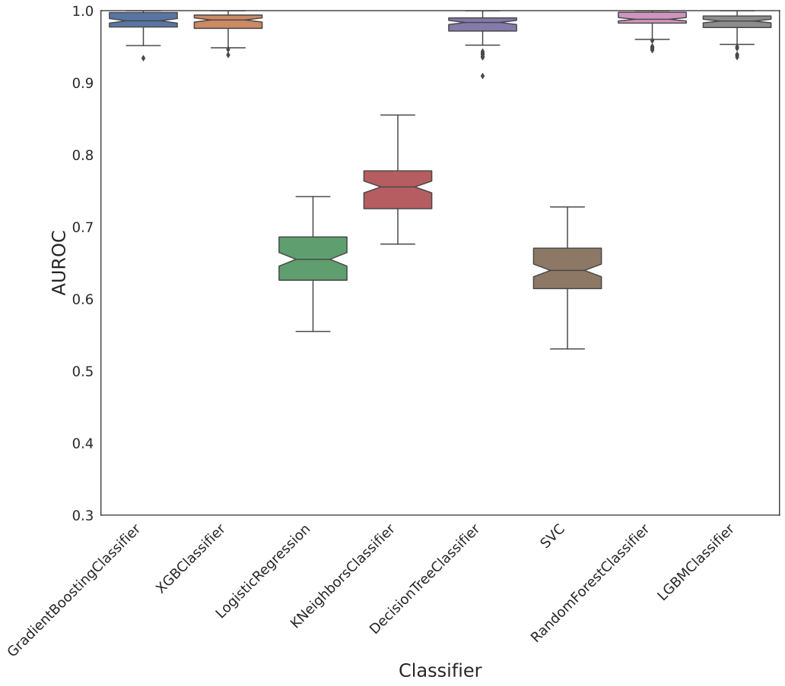
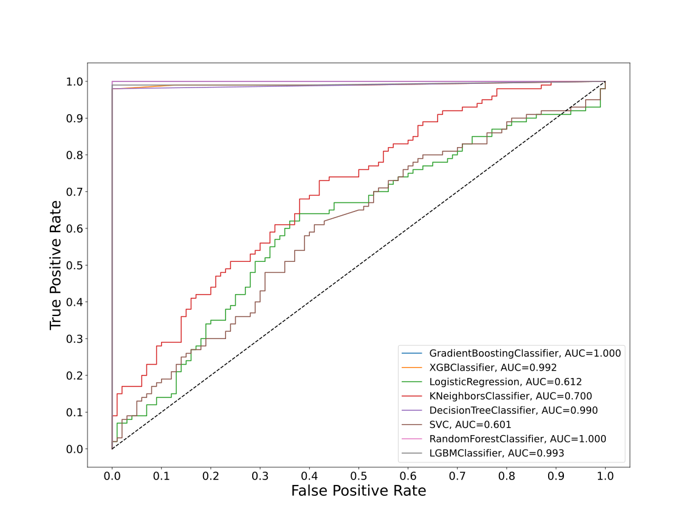
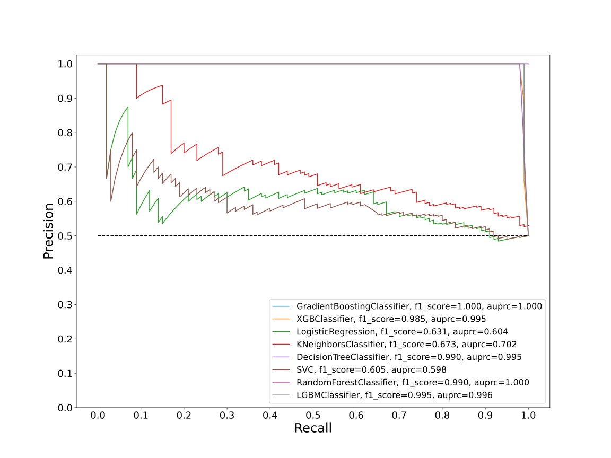
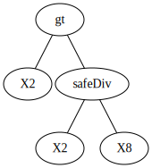
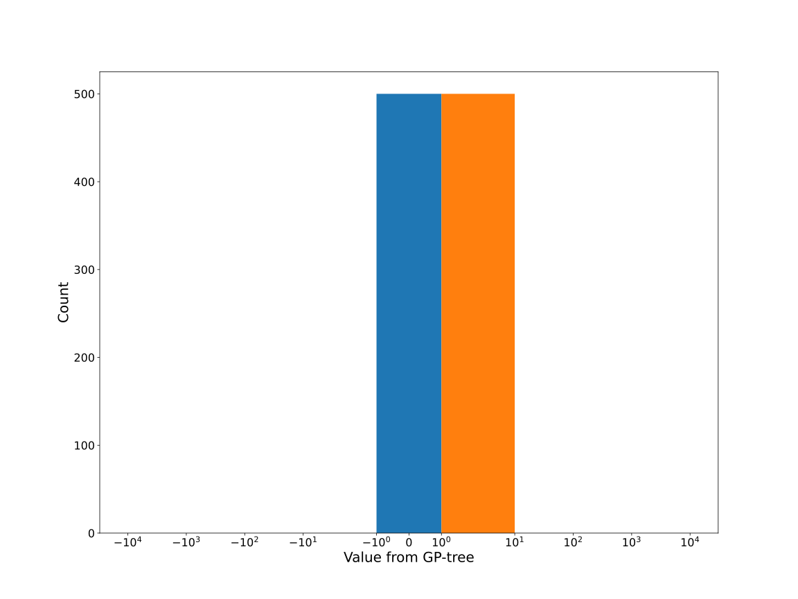
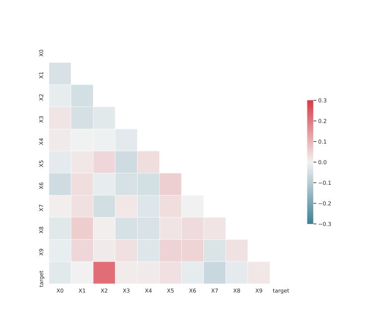

# Dataset F-GLXDKRS_0.175_0.861_5191

|    | classifiers                |   auroc |    auprc |   f1_score |   rank_auroc |   rank_auprc |   rank_f1 |
|---:|:---------------------------|--------:|---------:|-----------:|-------------:|-------------:|----------:|
|  0 | GradientBoostingClassifier | 1       | 1        |   1        |            1 |            1 |         1 |
|  1 | XGBClassifier              | 0.99175 | 0.995169 |   0.984925 |            4 |            4 |         5 |
|  2 | LogisticRegression         | 0.6122  | 0.603715 |   0.630542 |            7 |            7 |         7 |
|  3 | KNeighborsClassifier       | 0.7003  | 0.701751 |   0.672897 |            6 |            6 |         6 |
|  4 | DecisionTreeClassifier     | 0.99    | 0.995    |   0.989899 |            5 |            4 |         3 |
|  5 | SVC                        | 0.60135 | 0.597949 |   0.604878 |            8 |            8 |         8 |
|  6 | RandomForestClassifier     | 1       | 1        |   0.989899 |            1 |            1 |         3 |
|  7 | LGBMClassifier             | 0.99305 | 0.996087 |   0.994975 |            3 |            3 |         2 |


<details>
<summary>Parameters of tuned ML methods</summary>


```
GradientBoostingClassifier(ccp_alpha=0.0, criterion='friedman_mse', init=None,
                           learning_rate=0.8421388500418374, loss='deviance',
                           max_depth=8, max_features=None, max_leaf_nodes=None,
                           min_impurity_decrease=0.0, min_impurity_split=None,
                           min_samples_leaf=2, min_samples_split=2,
                           min_weight_fraction_leaf=0.0, n_estimators=100,
                           n_iter_no_change=10, presort='deprecated',
                           random_state=5191, subsample=1.0, tol=1e-07,
                           validation_fraction=0.09, verbose=0,
                           warm_start=False)
XGBClassifier(alpha=4.187996657395839e-05, base_score=0.5, booster='dart',
              colsample_bylevel=1, colsample_bynode=1, colsample_bytree=1,
              eta=0.004365134454140454, eval_metric='logloss',
              gamma=0.30000000000000004, gpu_id=-1, importance_type='gain',
              interaction_constraints=None, learning_rate=0.00436513452,
              max_delta_step=0, max_depth=6, min_child_weight=1, missing=nan,
              monotone_constraints=None, n_estimators=15, n_jobs=0,
              num_parallel_tree=1, objective='binary:logistic',
              random_state=5191, reg_alpha=4.18799682e-05,
              reg_lambda=0.001530984580446695, scale_pos_weight=1, subsample=1,
              tree_method=None, validate_parameters=False, verbosity=None)
LogisticRegression(C=0.019323335326773414, class_weight=None, dual=False,
                   fit_intercept=True, intercept_scaling=1, l1_ratio=None,
                   max_iter=100, multi_class='auto', n_jobs=None, penalty='l1',
                   random_state=5191, solver='liblinear', tol=0.0001, verbose=0,
                   warm_start=False)
KNeighborsClassifier(algorithm='auto', leaf_size=30, metric='minkowski',
                     metric_params=None, n_jobs=None, n_neighbors=14, p=1,
                     weights='distance')
DecisionTreeClassifier(ccp_alpha=0.0, class_weight=None, criterion='entropy',
                       max_depth=6, max_features=None, max_leaf_nodes=None,
                       min_impurity_decrease=0.0, min_impurity_split=None,
                       min_samples_leaf=1, min_samples_split=15,
                       min_weight_fraction_leaf=0.0, presort='deprecated',
                       random_state=5191, splitter='best')
SVC(C=52992.18589250249, break_ties=False, cache_size=200, class_weight=None,
    coef0=4.800000000000001, decision_function_shape='ovr', degree=4,
    gamma='scale', kernel='linear', max_iter=-1, probability=True,
    random_state=5191, shrinking=True, tol=7.061727669639546e-05,
    verbose=False)
RandomForestClassifier(bootstrap=True, ccp_alpha=0.0, class_weight=None,
                       criterion='entropy', max_depth=10, max_features=None,
                       max_leaf_nodes=None, max_samples=None,
                       min_impurity_decrease=0.0, min_impurity_split=None,
                       min_samples_leaf=1, min_samples_split=2,
                       min_weight_fraction_leaf=0.0, n_estimators=65,
                       n_jobs=None, oob_score=False, random_state=5191,
                       verbose=0, warm_start=False)
LGBMClassifier(boosting_type='dart', class_weight=None, colsample_bytree=1.0,
               importance_type='split', learning_rate=0.1, max_depth=7,
               metric='binary_logloss', min_child_samples=20,
               min_child_weight=0.001, min_split_gain=0.0, n_estimators=59,
               n_jobs=-1, num_leaves=6, objective='binary', random_state=5191,
               reg_alpha=0.0, reg_lambda=0.0, silent=True, subsample=1.0,
               subsample_for_bin=200000, subsample_freq=0)
```

</details>

<details>
<summary>Expected performance (100 different random seeds)</summary>

</details>

<details>
<summary>Receiver Operating Characteristics (ROC) curve</summary>

</details>

<details>
<summary>Precision-Recall Curve</summary>

</details>

<details>
<summary>Model (GP-tree)</summary>

</details>

<details>
<summary>Endpoint histogram</summary>

</details>

<details>
<summary>Feature correlations</summary>

</details>

[**Pandas Profiling Report**](https://epistasislab.github.io/digen/docs/profile/F-GLXDKRS_0.175_0.861_5191.html)