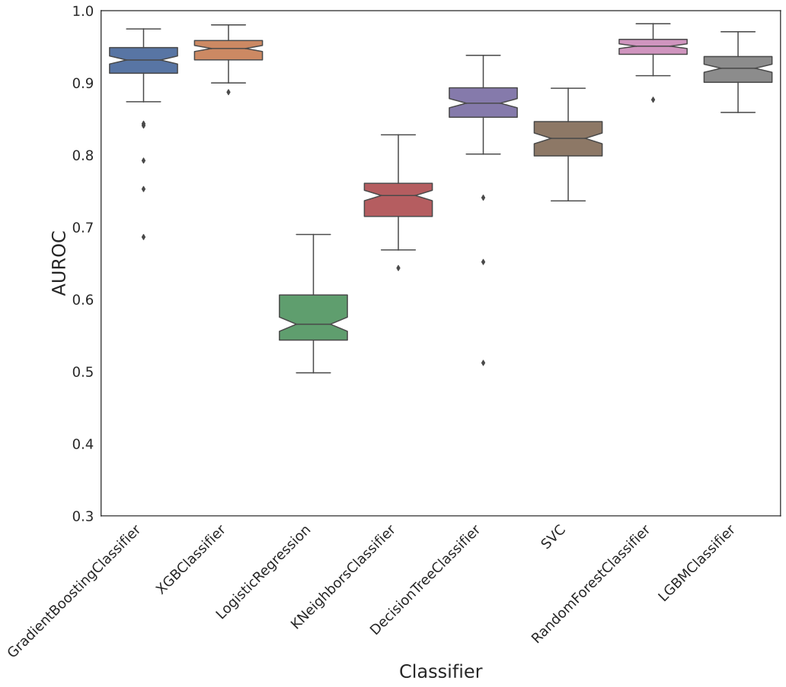
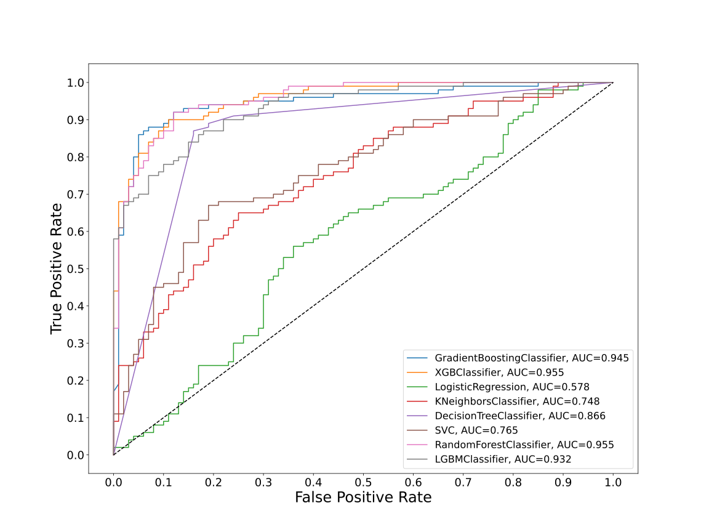
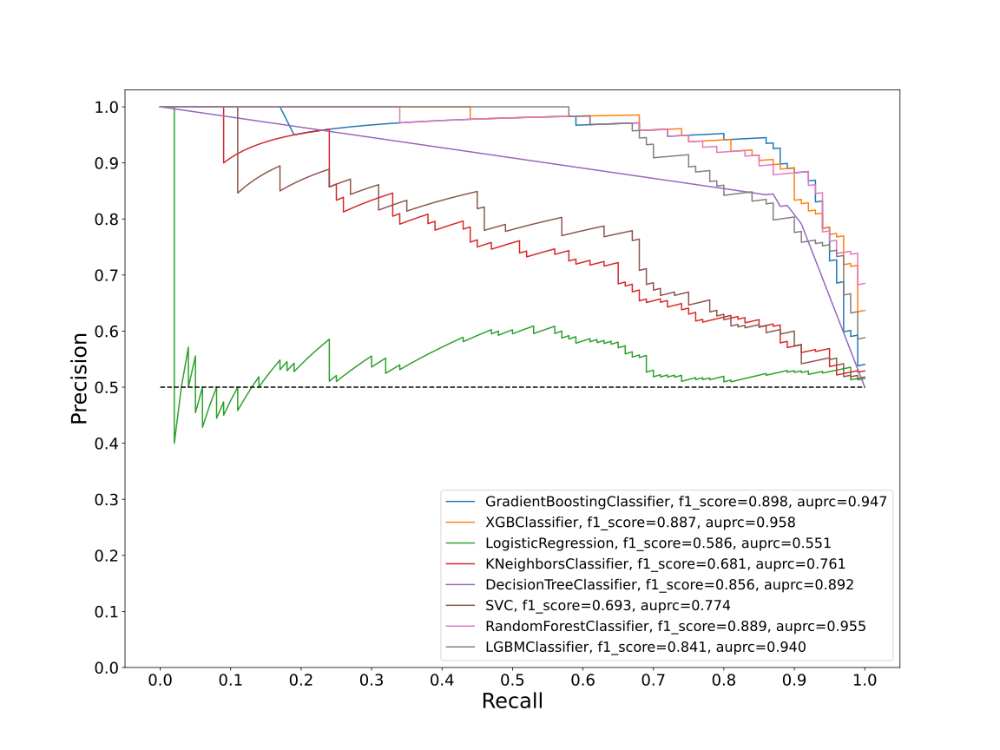
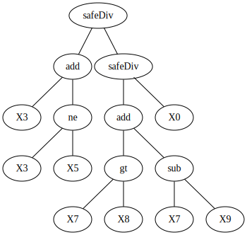
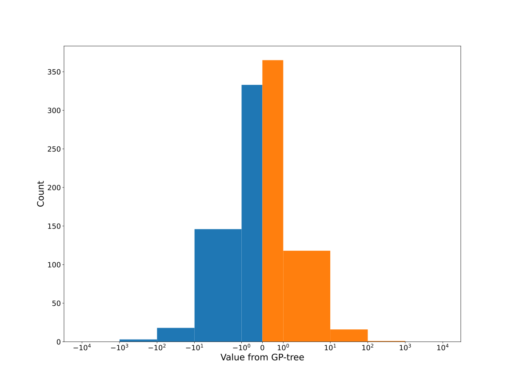
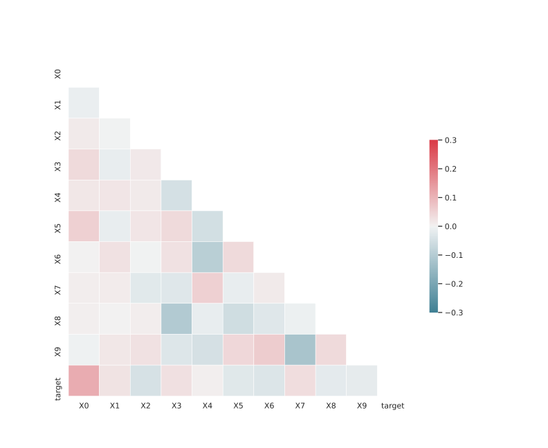

# Dataset F-XGLDSKR_0.127_0.843_7270

|    | classifiers                |   auroc |    auprc |   f1_score |   rank_auroc |   rank_auprc |   rank_f1 |
|---:|:---------------------------|--------:|---------:|-----------:|-------------:|-------------:|----------:|
|  0 | GradientBoostingClassifier | 0.9452  | 0.94715  |   0.897561 |            3 |            3 |         1 |
|  1 | XGBClassifier              | 0.9548  | 0.957681 |   0.8867   |            1 |            1 |         3 |
|  2 | LogisticRegression         | 0.5782  | 0.550618 |   0.585859 |            8 |            8 |         8 |
|  3 | KNeighborsClassifier       | 0.7481  | 0.761153 |   0.680628 |            7 |            7 |         7 |
|  4 | DecisionTreeClassifier     | 0.86585 | 0.891818 |   0.855769 |            5 |            5 |         4 |
|  5 | SVC                        | 0.765   | 0.774288 |   0.692683 |            6 |            6 |         6 |
|  6 | RandomForestClassifier     | 0.9551  | 0.954879 |   0.888889 |            1 |            2 |         2 |
|  7 | LGBMClassifier             | 0.9317  | 0.940026 |   0.84058  |            4 |            4 |         5 |


<details>
<summary>Parameters of tuned ML methods</summary>


```
GradientBoostingClassifier(ccp_alpha=0.0, criterion='friedman_mse', init=None,
                           learning_rate=0.16440114781797308,
                           loss='exponential', max_depth=9, max_features=None,
                           max_leaf_nodes=None, min_impurity_decrease=0.0,
                           min_impurity_split=None, min_samples_leaf=5,
                           min_samples_split=2, min_weight_fraction_leaf=0.0,
                           n_estimators=100, n_iter_no_change=1,
                           presort='deprecated', random_state=7270,
                           subsample=1.0, tol=1e-07, validation_fraction=0.13,
                           verbose=0, warm_start=False)
XGBClassifier(alpha=3.512658784975537e-05, base_score=0.5, booster='gbtree',
              colsample_bylevel=1, colsample_bynode=1, colsample_bytree=1,
              eta=0.0698705190477826, eval_metric='logloss', gamma=0.0,
              gpu_id=-1, importance_type='gain', interaction_constraints=None,
              learning_rate=0.0698705167, max_delta_step=0, max_depth=10,
              min_child_weight=1, missing=nan, monotone_constraints=None,
              n_estimators=55, n_jobs=0, num_parallel_tree=1,
              objective='binary:logistic', random_state=7270,
              reg_alpha=3.5126588e-05, reg_lambda=0.0003544685898512032,
              scale_pos_weight=1, subsample=1, tree_method=None,
              validate_parameters=False, verbosity=None)
LogisticRegression(C=0.03635500734624883, class_weight=None, dual=False,
                   fit_intercept=True, intercept_scaling=1, l1_ratio=None,
                   max_iter=100, multi_class='auto', n_jobs=None, penalty='l1',
                   random_state=7270, solver='liblinear', tol=0.0001, verbose=0,
                   warm_start=False)
KNeighborsClassifier(algorithm='auto', leaf_size=30, metric='euclidean',
                     metric_params=None, n_jobs=None, n_neighbors=50, p=4,
                     weights='distance')
DecisionTreeClassifier(ccp_alpha=0.0, class_weight=None, criterion='gini',
                       max_depth=8, max_features=None, max_leaf_nodes=None,
                       min_impurity_decrease=0.0, min_impurity_split=None,
                       min_samples_leaf=3, min_samples_split=7,
                       min_weight_fraction_leaf=0.0, presort='deprecated',
                       random_state=7270, splitter='best')
SVC(C=1646.8960570596303, break_ties=False, cache_size=200,
    class_weight='balanced', coef0=4.800000000000001,
    decision_function_shape='ovr', degree=3, gamma='scale', kernel='poly',
    max_iter=-1, probability=True, random_state=7270, shrinking=True,
    tol=0.00023083235113587893, verbose=False)
RandomForestClassifier(bootstrap=True, ccp_alpha=0.0, class_weight=None,
                       criterion='entropy', max_depth=9, max_features=None,
                       max_leaf_nodes=None, max_samples=None,
                       min_impurity_decrease=0.0, min_impurity_split=None,
                       min_samples_leaf=2, min_samples_split=3,
                       min_weight_fraction_leaf=0.0, n_estimators=42,
                       n_jobs=None, oob_score=False, random_state=7270,
                       verbose=0, warm_start=False)
LGBMClassifier(boosting_type='gbdt', class_weight=None, colsample_bytree=1.0,
               importance_type='split', learning_rate=0.1, max_depth=10,
               metric='binary_logloss', min_child_samples=20,
               min_child_weight=0.001, min_split_gain=0.0, n_estimators=22,
               n_jobs=-1, num_leaves=154, objective='binary', random_state=7270,
               reg_alpha=0.0, reg_lambda=0.0, silent=True, subsample=1.0,
               subsample_for_bin=200000, subsample_freq=0)
```

</details>

<details>
<summary>Expected performance (100 different random seeds)</summary>

</details>

<details>
<summary>Receiver Operating Characteristics (ROC) curve</summary>

</details>

<details>
<summary>Precision-Recall Curve</summary>

</details>

<details>
<summary>Model (GP-tree)</summary>

</details>

<details>
<summary>Endpoint histogram</summary>

</details>

<details>
<summary>Feature correlations</summary>

</details>

[**Pandas Profiling Report**](https://epistasislab.github.io/digen/docs/profile/F-XGLDSKR_0.127_0.843_7270.html)