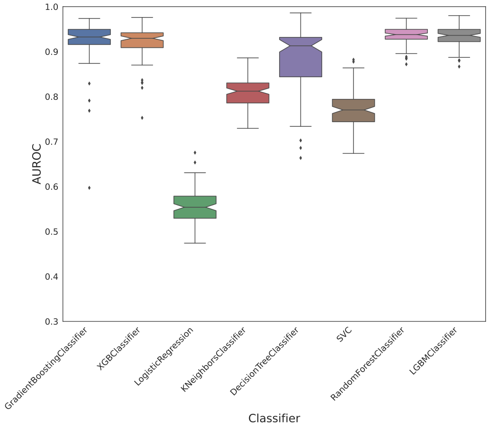
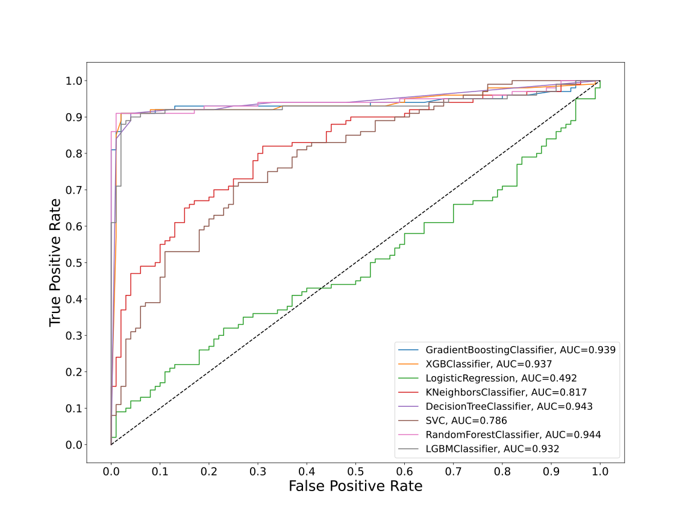
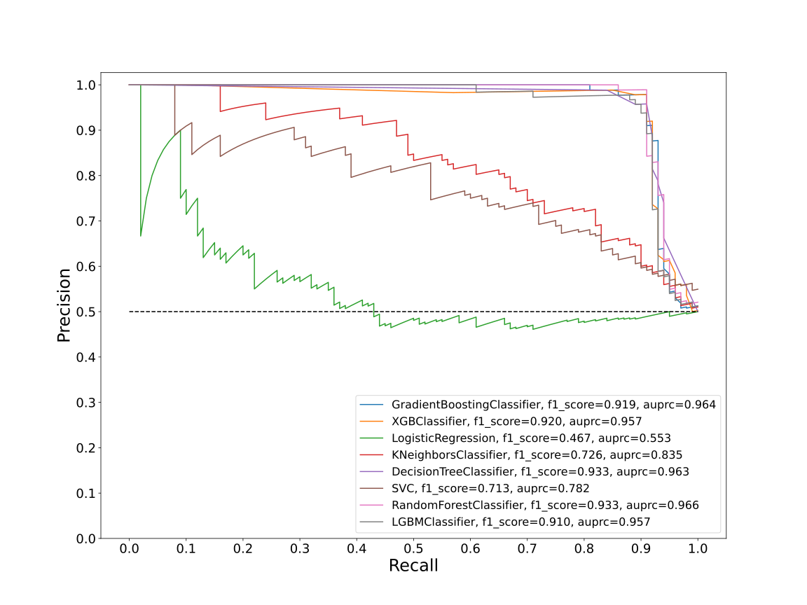
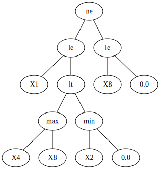
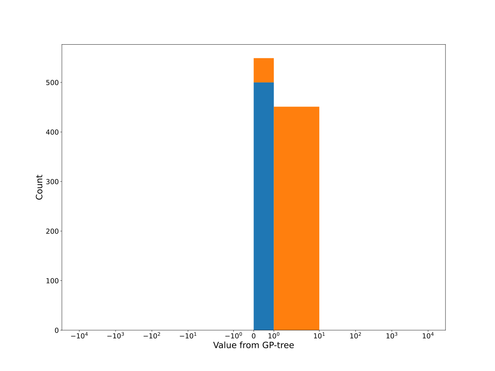
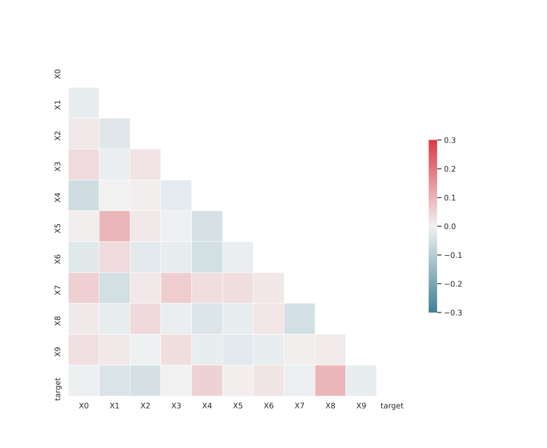

# Dataset FDGXLKSR_0.147_0.849_5311

|    | classifiers                |   auroc |    auprc |   f1_score |   rank_auroc |   rank_auprc |   rank_f1 |
|---:|:---------------------------|--------:|---------:|-----------:|-------------:|-------------:|----------:|
|  0 | GradientBoostingClassifier | 0.93925 | 0.964431 |   0.919192 |            3 |            2 |         4 |
|  1 | XGBClassifier              | 0.9371  | 0.956924 |   0.92     |            4 |            4 |         3 |
|  2 | LogisticRegression         | 0.4921  | 0.552774 |   0.467005 |            8 |            8 |         8 |
|  3 | KNeighborsClassifier       | 0.8166  | 0.83495  |   0.726316 |            6 |            6 |         6 |
|  4 | DecisionTreeClassifier     | 0.9433  | 0.96253  |   0.933333 |            2 |            3 |         1 |
|  5 | SVC                        | 0.7861  | 0.78229  |   0.712871 |            7 |            7 |         7 |
|  6 | RandomForestClassifier     | 0.9438  | 0.966429 |   0.933333 |            1 |            1 |         1 |
|  7 | LGBMClassifier             | 0.9318  | 0.956956 |   0.91     |            5 |            4 |         5 |


<details>
<summary>Parameters of tuned ML methods</summary>


```
GradientBoostingClassifier(ccp_alpha=0.0, criterion='friedman_mse', init=None,
                           learning_rate=0.04981894085987711, loss='deviance',
                           max_depth=5, max_features=None, max_leaf_nodes=None,
                           min_impurity_decrease=0.0, min_impurity_split=None,
                           min_samples_leaf=11, min_samples_split=2,
                           min_weight_fraction_leaf=0.0, n_estimators=100,
                           n_iter_no_change=1, presort='deprecated',
                           random_state=5311, subsample=1.0, tol=1e-07,
                           validation_fraction=0.09, verbose=0,
                           warm_start=False)
XGBClassifier(alpha=0.0002760516447892699, base_score=0.5, booster='dart',
              colsample_bylevel=1, colsample_bynode=1, colsample_bytree=1,
              eta=0.023348759404363796, eval_metric='logloss',
              gamma=0.30000000000000004, gpu_id=-1, importance_type='gain',
              interaction_constraints=None, learning_rate=0.0233487599,
              max_delta_step=0, max_depth=5, min_child_weight=1, missing=nan,
              monotone_constraints=None, n_estimators=36, n_jobs=0,
              num_parallel_tree=1, objective='binary:logistic',
              random_state=5311, reg_alpha=0.000276051636,
              reg_lambda=0.003067678026849101, scale_pos_weight=1, subsample=1,
              tree_method=None, validate_parameters=False, verbosity=None)
LogisticRegression(C=0.0030196375905349195, class_weight=None, dual=False,
                   fit_intercept=True, intercept_scaling=1, l1_ratio=None,
                   max_iter=100, multi_class='auto', n_jobs=None, penalty='l2',
                   random_state=5311, solver='newton-cg', tol=0.0001, verbose=0,
                   warm_start=False)
KNeighborsClassifier(algorithm='auto', leaf_size=30, metric='minkowski',
                     metric_params=None, n_jobs=None, n_neighbors=77, p=1,
                     weights='distance')
DecisionTreeClassifier(ccp_alpha=0.0, class_weight=None, criterion='entropy',
                       max_depth=7, max_features=None, max_leaf_nodes=None,
                       min_impurity_decrease=0.0, min_impurity_split=None,
                       min_samples_leaf=12, min_samples_split=13,
                       min_weight_fraction_leaf=0.0, presort='deprecated',
                       random_state=5311, splitter='best')
SVC(C=7130.81407016688, break_ties=False, cache_size=200, class_weight=None,
    coef0=5.4, decision_function_shape='ovr', degree=4, gamma='auto',
    kernel='poly', max_iter=-1, probability=True, random_state=5311,
    shrinking=True, tol=1.4690678431688795e-05, verbose=False)
RandomForestClassifier(bootstrap=True, ccp_alpha=0.0, class_weight=None,
                       criterion='entropy', max_depth=10, max_features=None,
                       max_leaf_nodes=None, max_samples=None,
                       min_impurity_decrease=0.0, min_impurity_split=None,
                       min_samples_leaf=6, min_samples_split=11,
                       min_weight_fraction_leaf=0.0, n_estimators=90,
                       n_jobs=None, oob_score=False, random_state=5311,
                       verbose=0, warm_start=False)
LGBMClassifier(boosting_type='gbdt', class_weight=None, colsample_bytree=1.0,
               importance_type='split', learning_rate=0.1, max_depth=5,
               metric='binary_logloss', min_child_samples=20,
               min_child_weight=0.001, min_split_gain=0.0, n_estimators=36,
               n_jobs=-1, num_leaves=12, objective='binary', random_state=5311,
               reg_alpha=0.0, reg_lambda=0.0, silent=True, subsample=1.0,
               subsample_for_bin=200000, subsample_freq=0)
```

</details>

<details>
<summary>Expected performance (100 different random seeds)</summary>

</details>

<details>
<summary>Receiver Operating Characteristics (ROC) curve</summary>

</details>

<details>
<summary>Precision-Recall Curve</summary>

</details>

<details>
<summary>Model (GP-tree)</summary>

</details>

<details>
<summary>Endpoint histogram</summary>

</details>

<details>
<summary>Feature correlations</summary>

</details>

[**Pandas Profiling Report**](https://epistasislab.github.io/digen/profile/FDGXLKSR_0.147_0.849_5311.html)