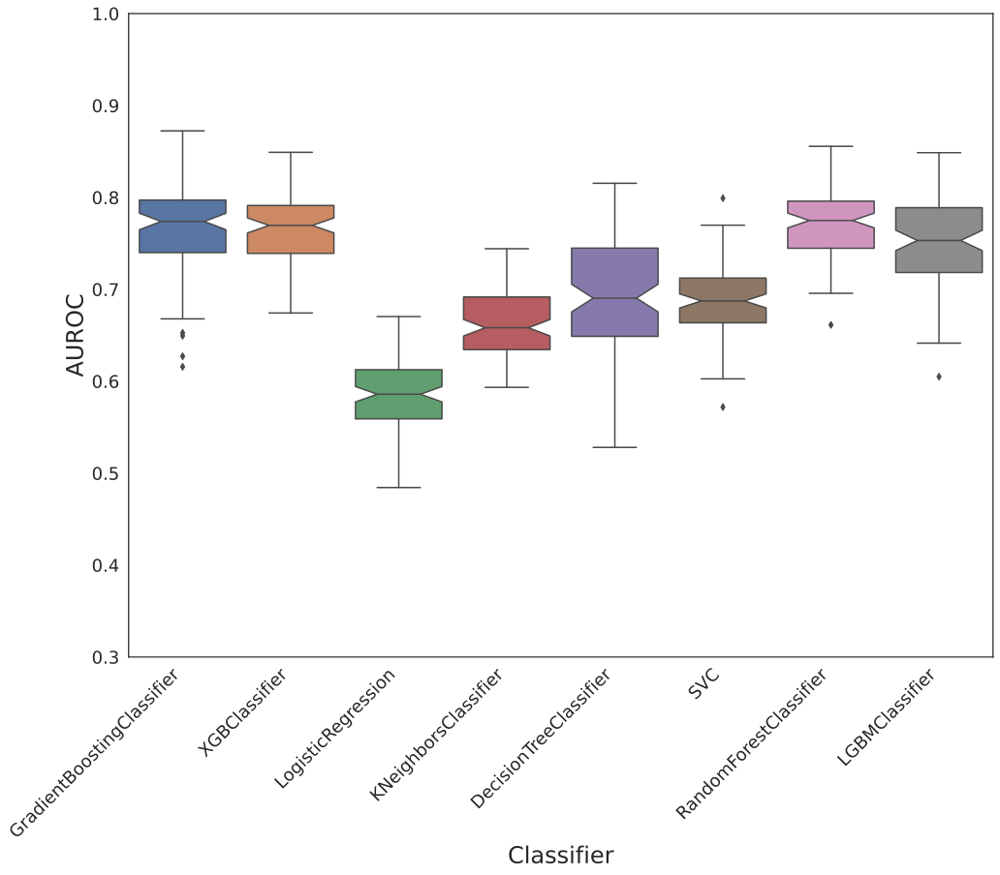
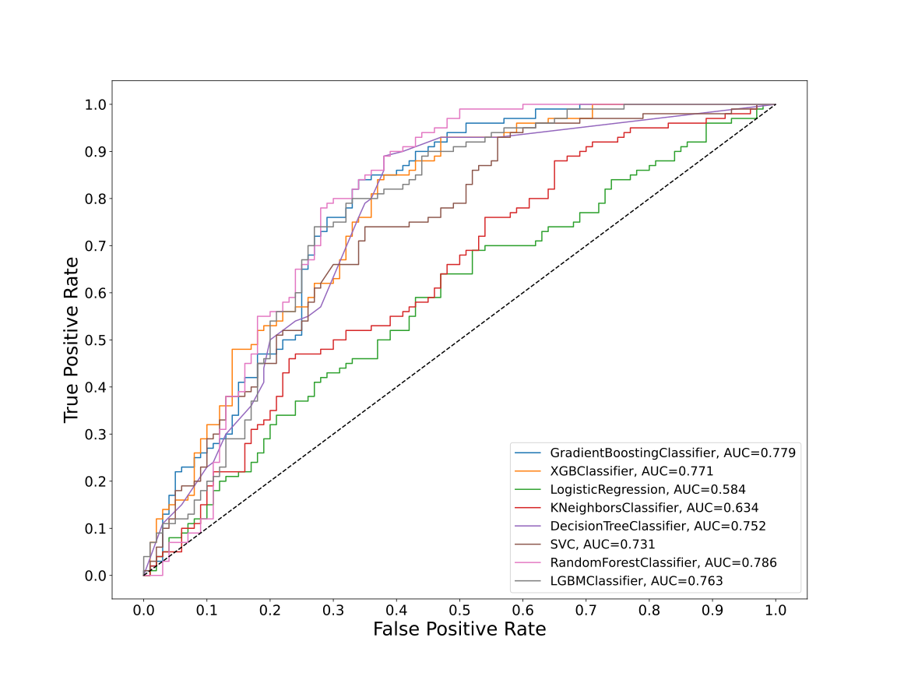
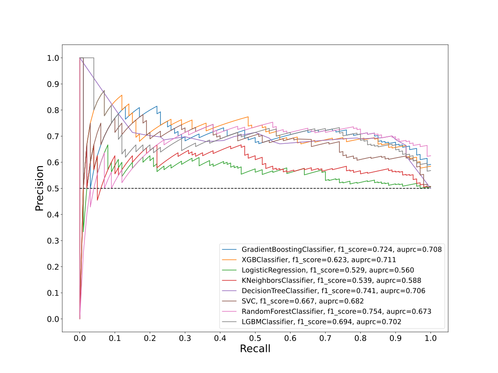
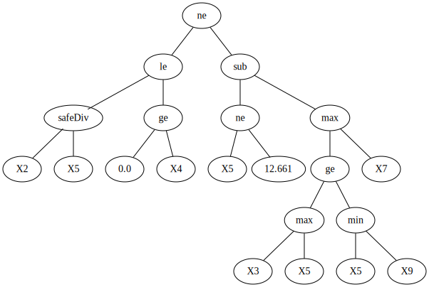
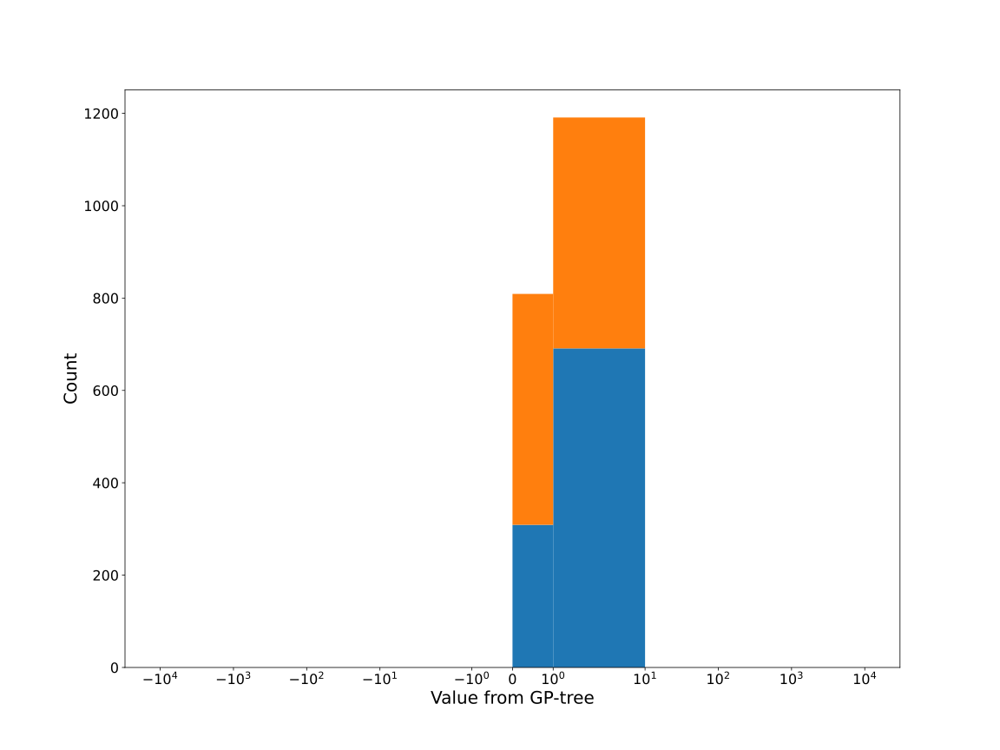
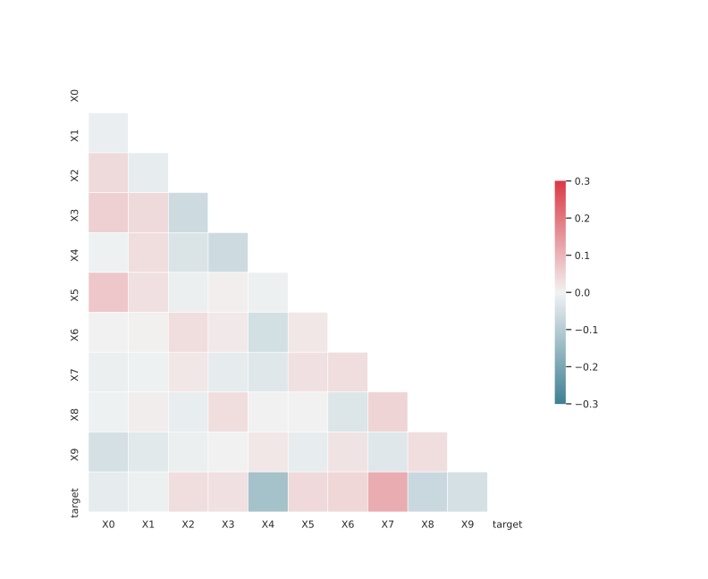

# Dataset FGXLDSKR_0.07_0.725_8322

|    | classifiers                |   auroc |    auprc |   f1_score |   rank_auroc |   rank_auprc |   rank_f1 |
|---:|:---------------------------|--------:|---------:|-----------:|-------------:|-------------:|----------:|
|  0 | GradientBoostingClassifier | 0.7794  | 0.708354 |   0.723618 |            2 |            2 |         3 |
|  1 | XGBClassifier              | 0.7714  | 0.710773 |   0.622951 |            3 |            1 |         6 |
|  2 | LogisticRegression         | 0.5836  | 0.559564 |   0.529101 |            8 |            8 |         8 |
|  3 | KNeighborsClassifier       | 0.6343  | 0.587777 |   0.539326 |            7 |            7 |         7 |
|  4 | DecisionTreeClassifier     | 0.75165 | 0.705945 |   0.740741 |            5 |            3 |         2 |
|  5 | SVC                        | 0.7308  | 0.681597 |   0.666667 |            6 |            5 |         5 |
|  6 | RandomForestClassifier     | 0.7861  | 0.673252 |   0.753623 |            1 |            6 |         1 |
|  7 | LGBMClassifier             | 0.763   | 0.702366 |   0.694301 |            4 |            4 |         4 |


<details>
<summary>Parameters of tuned ML methods</summary>


```
GradientBoostingClassifier(ccp_alpha=0.0, criterion='friedman_mse', init=None,
                           learning_rate=0.03857611329205581,
                           loss='exponential', max_depth=9, max_features=None,
                           max_leaf_nodes=None, min_impurity_decrease=0.0,
                           min_impurity_split=None, min_samples_leaf=44,
                           min_samples_split=2, min_weight_fraction_leaf=0.0,
                           n_estimators=100, n_iter_no_change=8,
                           presort='deprecated', random_state=8322,
                           subsample=1.0, tol=1e-07, validation_fraction=0.05,
                           verbose=0, warm_start=False)
XGBClassifier(alpha=1.4572066808818134, base_score=0.5, booster='dart',
              colsample_bylevel=1, colsample_bynode=1, colsample_bytree=1,
              eta=0.1843549437979609, eval_metric='logloss', gamma=0.0,
              gpu_id=-1, importance_type='gain', interaction_constraints=None,
              learning_rate=0.184354946, max_delta_step=0, max_depth=3,
              min_child_weight=1, missing=nan, monotone_constraints=None,
              n_estimators=40, n_jobs=0, num_parallel_tree=1,
              objective='binary:logistic', random_state=8322,
              reg_alpha=1.45720673, reg_lambda=5.500790903148928,
              scale_pos_weight=1, subsample=1, tree_method=None,
              validate_parameters=False, verbosity=None)
LogisticRegression(C=0.0008719016860731732, class_weight=None, dual=False,
                   fit_intercept=True, intercept_scaling=1, l1_ratio=None,
                   max_iter=100, multi_class='auto', n_jobs=None, penalty='l2',
                   random_state=8322, solver='lbfgs', tol=0.0001, verbose=0,
                   warm_start=False)
KNeighborsClassifier(algorithm='auto', leaf_size=30, metric='euclidean',
                     metric_params=None, n_jobs=None, n_neighbors=66, p=2,
                     weights='distance')
DecisionTreeClassifier(ccp_alpha=0.0, class_weight=None, criterion='entropy',
                       max_depth=7, max_features=None, max_leaf_nodes=None,
                       min_impurity_decrease=0.0, min_impurity_split=None,
                       min_samples_leaf=18, min_samples_split=9,
                       min_weight_fraction_leaf=0.0, presort='deprecated',
                       random_state=8322, splitter='best')
SVC(C=79611.69522329033, break_ties=False, cache_size=200,
    class_weight='balanced', coef0=4.0, decision_function_shape='ovr', degree=2,
    gamma='auto', kernel='poly', max_iter=-1, probability=True,
    random_state=8322, shrinking=True, tol=0.0007548761162901196,
    verbose=False)
RandomForestClassifier(bootstrap=True, ccp_alpha=0.0, class_weight=None,
                       criterion='gini', max_depth=8, max_features=None,
                       max_leaf_nodes=None, max_samples=None,
                       min_impurity_decrease=0.0, min_impurity_split=None,
                       min_samples_leaf=14, min_samples_split=6,
                       min_weight_fraction_leaf=0.0, n_estimators=78,
                       n_jobs=None, oob_score=False, random_state=8322,
                       verbose=0, warm_start=False)
LGBMClassifier(boosting_type='gbdt', class_weight=None, colsample_bytree=1.0,
               importance_type='split', learning_rate=0.1, max_depth=4,
               metric='binary_logloss', min_child_samples=20,
               min_child_weight=0.001, min_split_gain=0.0, n_estimators=31,
               n_jobs=-1, num_leaves=25, objective='binary', random_state=8322,
               reg_alpha=0.0, reg_lambda=0.0, silent=True, subsample=1.0,
               subsample_for_bin=200000, subsample_freq=0)
```

</details>

<details>
<summary>Expected performance (100 different random seeds)</summary>

</details>

<details>
<summary>Receiver Operating Characteristics (ROC) curve</summary>

</details>

<details>
<summary>Precision-Recall Curve</summary>

</details>

<details>
<summary>Model (GP-tree)</summary>

</details>

<details>
<summary>Endpoint histogram</summary>

</details>

<details>
<summary>Feature correlations</summary>

</details>

[**Pandas Profiling Report**](https://epistasislab.github.io/digen/profile/FGXLDSKR_0.07_0.725_8322.html)