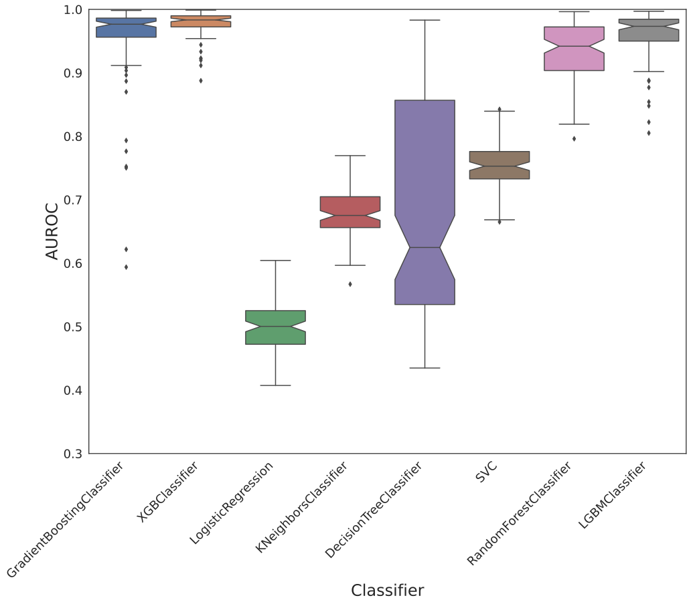
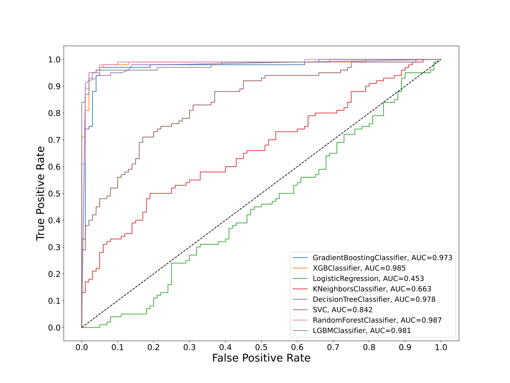
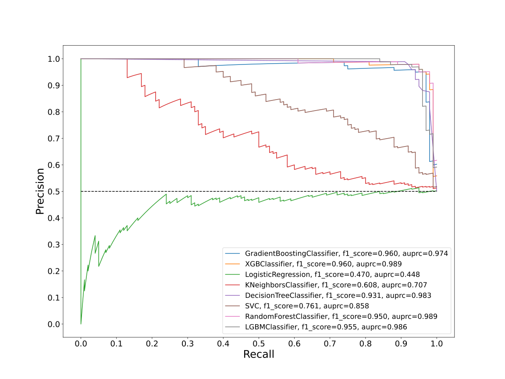
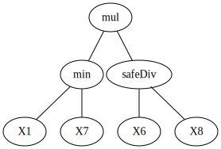
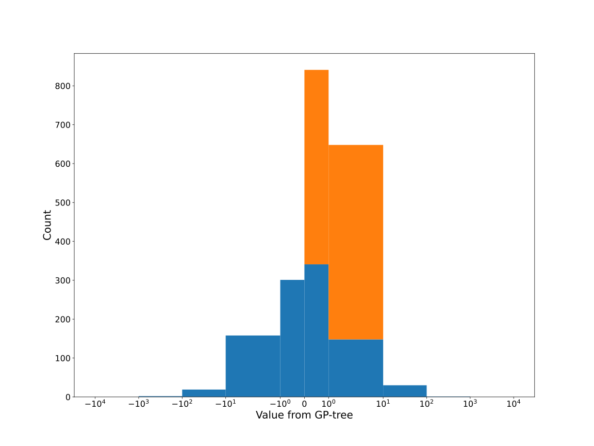
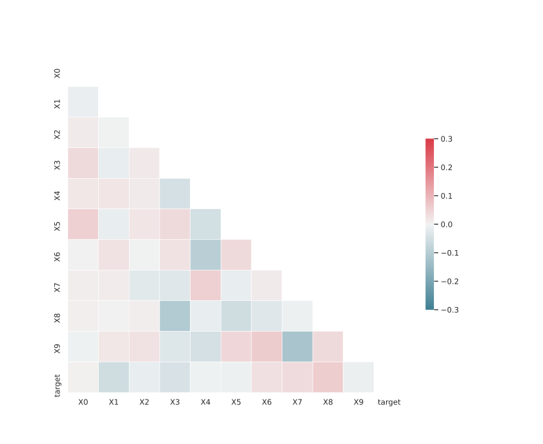

# Dataset FXLDGSKR_0.186_0.858_7270

|    | classifiers                |   auroc |    auprc |   f1_score |   rank_auroc |   rank_auprc |   rank_f1 |
|---:|:---------------------------|--------:|---------:|-----------:|-------------:|-------------:|----------:|
|  0 | GradientBoostingClassifier |  0.9732 | 0.9737   |   0.960396 |            5 |            5 |         1 |
|  1 | XGBClassifier              |  0.9855 | 0.988516 |   0.96     |            2 |            1 |         1 |
|  2 | LogisticRegression         |  0.4532 | 0.447703 |   0.47     |            8 |            8 |         8 |
|  3 | KNeighborsClassifier       |  0.663  | 0.707264 |   0.608295 |            7 |            7 |         7 |
|  4 | DecisionTreeClassifier     |  0.9776 | 0.98278  |   0.930693 |            4 |            4 |         5 |
|  5 | SVC                        |  0.8425 | 0.857572 |   0.761421 |            6 |            6 |         6 |
|  6 | RandomForestClassifier     |  0.9873 | 0.988757 |   0.95     |            1 |            1 |         4 |
|  7 | LGBMClassifier             |  0.981  | 0.985912 |   0.954774 |            3 |            3 |         3 |


<details>
<summary>Parameters of tuned ML methods</summary>


```
GradientBoostingClassifier(ccp_alpha=0.0, criterion='friedman_mse', init=None,
                           learning_rate=0.08919597653371727, loss='deviance',
                           max_depth=8, max_features=None, max_leaf_nodes=None,
                           min_impurity_decrease=0.0, min_impurity_split=None,
                           min_samples_leaf=8, min_samples_split=2,
                           min_weight_fraction_leaf=0.0, n_estimators=100,
                           n_iter_no_change=15, presort='deprecated',
                           random_state=7270, subsample=1.0, tol=1e-07,
                           validation_fraction=0.15000000000000002, verbose=0,
                           warm_start=False)
XGBClassifier(alpha=0.09088296948689145, base_score=0.5, booster='dart',
              colsample_bylevel=1, colsample_bynode=1, colsample_bytree=1,
              eta=0.11166597142000237, eval_metric='logloss', gamma=0.5,
              gpu_id=-1, importance_type='gain', interaction_constraints=None,
              learning_rate=0.111665972, max_delta_step=0, max_depth=10,
              min_child_weight=1, missing=nan, monotone_constraints=None,
              n_estimators=54, n_jobs=0, num_parallel_tree=1,
              objective='binary:logistic', random_state=7270,
              reg_alpha=0.0908829719, reg_lambda=0.20745251174254173,
              scale_pos_weight=1, subsample=1, tree_method=None,
              validate_parameters=False, verbosity=None)
LogisticRegression(C=0.0006459201176744771, class_weight=None, dual=False,
                   fit_intercept=True, intercept_scaling=1, l1_ratio=None,
                   max_iter=100, multi_class='auto', n_jobs=None, penalty='l2',
                   random_state=7270, solver='lbfgs', tol=0.0001, verbose=0,
                   warm_start=False)
KNeighborsClassifier(algorithm='auto', leaf_size=30, metric='euclidean',
                     metric_params=None, n_jobs=None, n_neighbors=20, p=4,
                     weights='distance')
DecisionTreeClassifier(ccp_alpha=0.0, class_weight=None, criterion='entropy',
                       max_depth=8, max_features=None, max_leaf_nodes=None,
                       min_impurity_decrease=0.0, min_impurity_split=None,
                       min_samples_leaf=8, min_samples_split=2,
                       min_weight_fraction_leaf=0.0, presort='deprecated',
                       random_state=7270, splitter='best')
SVC(C=14523.342117658023, break_ties=False, cache_size=200, class_weight=None,
    coef0=2.9000000000000004, decision_function_shape='ovr', degree=3,
    gamma='auto', kernel='poly', max_iter=-1, probability=True,
    random_state=7270, shrinking=True, tol=6.854329765345464e-05,
    verbose=False)
RandomForestClassifier(bootstrap=True, ccp_alpha=0.0, class_weight=None,
                       criterion='gini', max_depth=10, max_features=None,
                       max_leaf_nodes=None, max_samples=None,
                       min_impurity_decrease=0.0, min_impurity_split=None,
                       min_samples_leaf=1, min_samples_split=10,
                       min_weight_fraction_leaf=0.0, n_estimators=58,
                       n_jobs=None, oob_score=False, random_state=7270,
                       verbose=0, warm_start=False)
LGBMClassifier(boosting_type='dart', class_weight=None, colsample_bytree=1.0,
               importance_type='split', learning_rate=0.1, max_depth=10,
               metric='binary_logloss', min_child_samples=20,
               min_child_weight=0.001, min_split_gain=0.0, n_estimators=86,
               n_jobs=-1, num_leaves=183, objective='binary', random_state=7270,
               reg_alpha=0.0, reg_lambda=0.0, silent=True, subsample=1.0,
               subsample_for_bin=200000, subsample_freq=0)
```

</details>

<details>
<summary>Expected performance (100 different random seeds)</summary>

</details>

<details>
<summary>Receiver Operating Characteristics (ROC) curve</summary>

</details>

<details>
<summary>Precision-Recall Curve</summary>

</details>

<details>
<summary>Model (GP-tree)</summary>

</details>

<details>
<summary>Endpoint histogram</summary>

</details>

<details>
<summary>Feature correlations</summary>

</details>

[**Pandas Profiling Report**](https://epistasislab.github.io/digen/docs/profile/FXLDGSKR_0.186_0.858_7270.html)