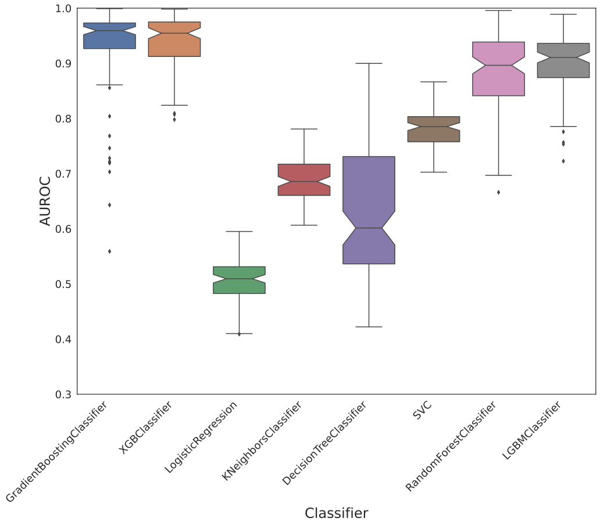
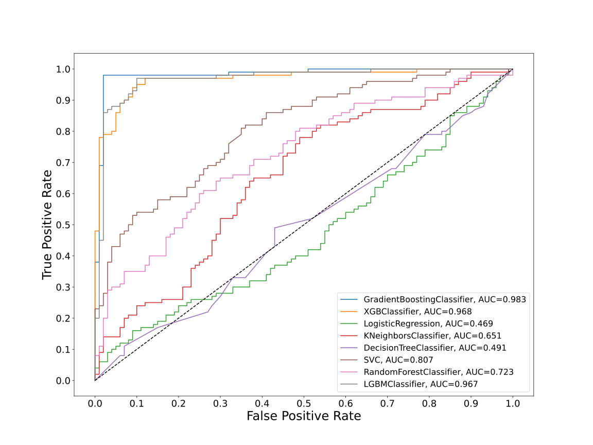
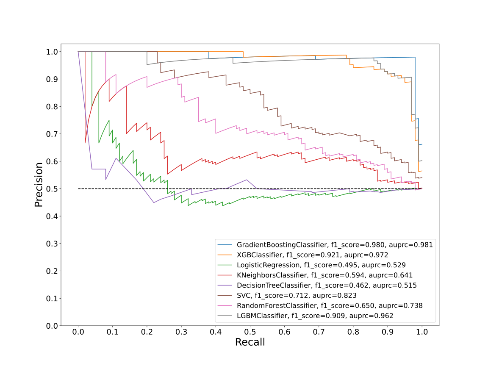
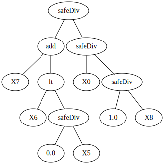
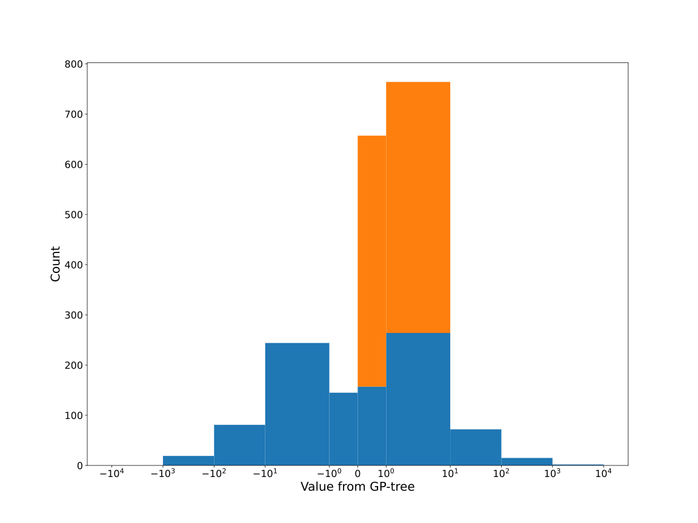
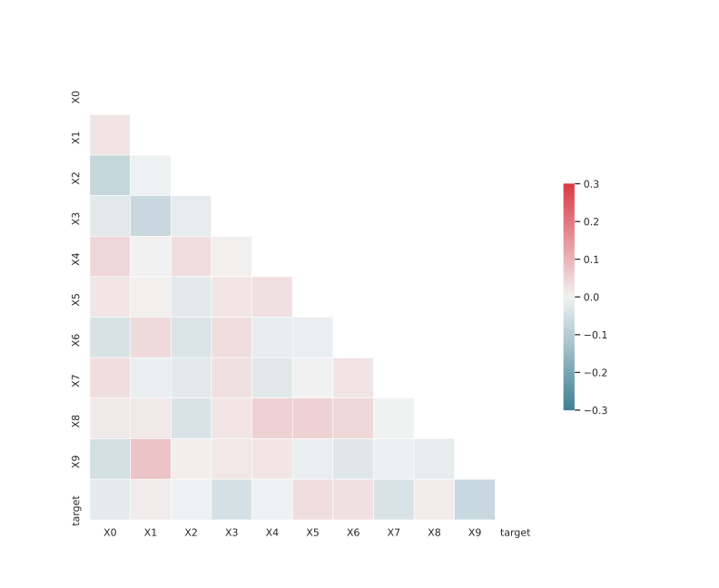

# Dataset GXLSFKDR_0.196_0.757_4426

|    | classifiers                |   auroc |    auprc |   f1_score |   rank_auroc |   rank_auprc |   rank_f1 |
|---:|:---------------------------|--------:|---------:|-----------:|-------------:|-------------:|----------:|
|  0 | GradientBoostingClassifier | 0.9828  | 0.981459 |   0.98     |            1 |            1 |         1 |
|  1 | XGBClassifier              | 0.9683  | 0.971661 |   0.920792 |            2 |            2 |         2 |
|  2 | LogisticRegression         | 0.469   | 0.528613 |   0.495238 |            8 |            7 |         7 |
|  3 | KNeighborsClassifier       | 0.6512  | 0.640978 |   0.59375  |            6 |            6 |         6 |
|  4 | DecisionTreeClassifier     | 0.49115 | 0.51497  |   0.462366 |            7 |            8 |         8 |
|  5 | SVC                        | 0.80715 | 0.822735 |   0.712195 |            4 |            4 |         4 |
|  6 | RandomForestClassifier     | 0.7228  | 0.737675 |   0.650246 |            5 |            5 |         5 |
|  7 | LGBMClassifier             | 0.9675  | 0.962103 |   0.909091 |            3 |            3 |         3 |


<details>
<summary>Parameters of tuned ML methods</summary>


```
GradientBoostingClassifier(ccp_alpha=0.0, criterion='friedman_mse', init=None,
                           learning_rate=0.17967097582090538,
                           loss='exponential', max_depth=9, max_features=None,
                           max_leaf_nodes=None, min_impurity_decrease=0.0,
                           min_impurity_split=None, min_samples_leaf=1,
                           min_samples_split=2, min_weight_fraction_leaf=0.0,
                           n_estimators=100, n_iter_no_change=18,
                           presort='deprecated', random_state=4426,
                           subsample=1.0, tol=1e-07, validation_fraction=0.01,
                           verbose=0, warm_start=False)
XGBClassifier(alpha=0.02441581262828071, base_score=0.5, booster='dart',
              colsample_bylevel=1, colsample_bynode=1, colsample_bytree=1,
              eta=0.13629679062864236, eval_metric='logloss',
              gamma=0.30000000000000004, gpu_id=-1, importance_type='gain',
              interaction_constraints=None, learning_rate=0.136296794,
              max_delta_step=0, max_depth=7, min_child_weight=1, missing=nan,
              monotone_constraints=None, n_estimators=87, n_jobs=0,
              num_parallel_tree=1, objective='binary:logistic',
              random_state=4426, reg_alpha=0.0244158134,
              reg_lambda=0.05124517244758788, scale_pos_weight=1, subsample=1,
              tree_method=None, validate_parameters=False, verbosity=None)
LogisticRegression(C=0.00015739486731396478, class_weight=None, dual=False,
                   fit_intercept=True, intercept_scaling=1, l1_ratio=None,
                   max_iter=100, multi_class='auto', n_jobs=None, penalty='l2',
                   random_state=4426, solver='sag', tol=0.0001, verbose=0,
                   warm_start=False)
KNeighborsClassifier(algorithm='auto', leaf_size=30, metric='minkowski',
                     metric_params=None, n_jobs=None, n_neighbors=10, p=1,
                     weights='distance')
DecisionTreeClassifier(ccp_alpha=0.0, class_weight=None, criterion='gini',
                       max_depth=9, max_features='log2', max_leaf_nodes=None,
                       min_impurity_decrease=0.0, min_impurity_split=None,
                       min_samples_leaf=5, min_samples_split=10,
                       min_weight_fraction_leaf=0.0, presort='deprecated',
                       random_state=4426, splitter='best')
SVC(C=15617.749122087587, break_ties=False, cache_size=200, class_weight=None,
    coef0=8.0, decision_function_shape='ovr', degree=3, gamma='auto',
    kernel='poly', max_iter=-1, probability=True, random_state=4426,
    shrinking=True, tol=0.008975445300308034, verbose=False)
RandomForestClassifier(bootstrap=True, ccp_alpha=0.0, class_weight=None,
                       criterion='gini', max_depth=10, max_features=None,
                       max_leaf_nodes=None, max_samples=None,
                       min_impurity_decrease=0.0, min_impurity_split=None,
                       min_samples_leaf=2, min_samples_split=7,
                       min_weight_fraction_leaf=0.0, n_estimators=88,
                       n_jobs=None, oob_score=False, random_state=4426,
                       verbose=0, warm_start=False)
LGBMClassifier(boosting_type='gbdt', class_weight=None, colsample_bytree=1.0,
               importance_type='split', learning_rate=0.1, max_depth=7,
               metric='binary_logloss', min_child_samples=20,
               min_child_weight=0.001, min_split_gain=0.0, n_estimators=71,
               n_jobs=-1, num_leaves=86, objective='binary', random_state=4426,
               reg_alpha=0.0, reg_lambda=0.0, silent=True, subsample=1.0,
               subsample_for_bin=200000, subsample_freq=0)
```

</details>

<details>
<summary>Expected performance (200 experiments per ML method)</summary>

</details>

<details>
<summary>Receiver Operating Characteristics (ROC) curve</summary>

</details>

<details>
<summary>Precision-Recall Curve</summary>

</details>

<details>
<summary>Model (GP-tree)</summary>

</details>

<details>
<summary>Endpoint histogram</summary>

</details>

<details>
<summary>Feature correlations</summary>

</details>

[**Pandas Profiling Report**](https://github.io/athril/digen-test/docs/profile/GXLSFKDR_0.196_0.757_4426.html)