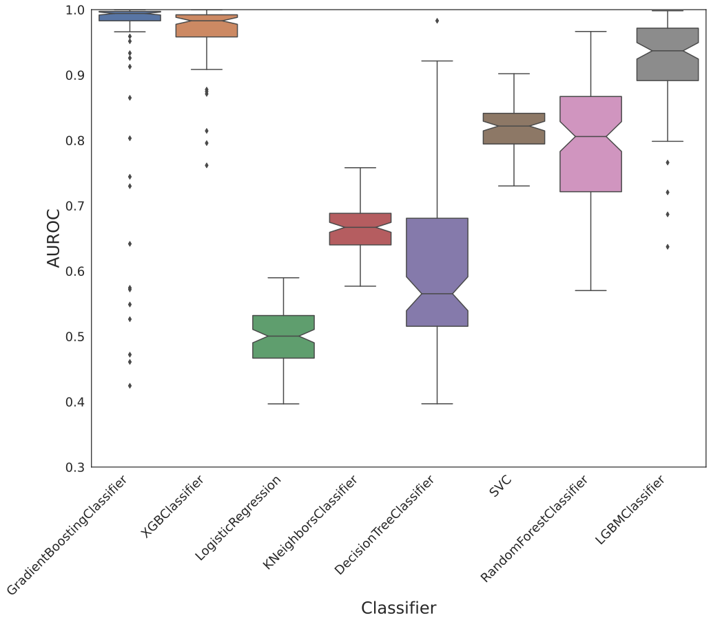
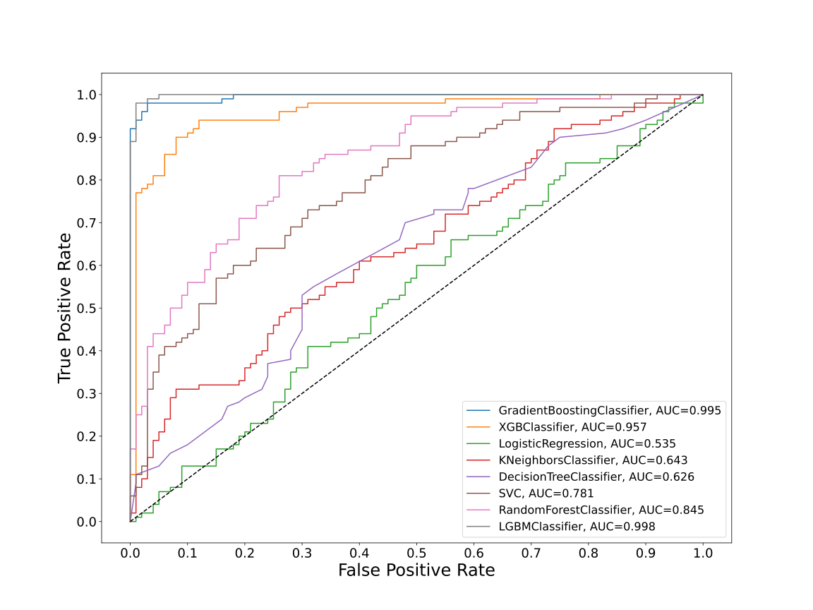
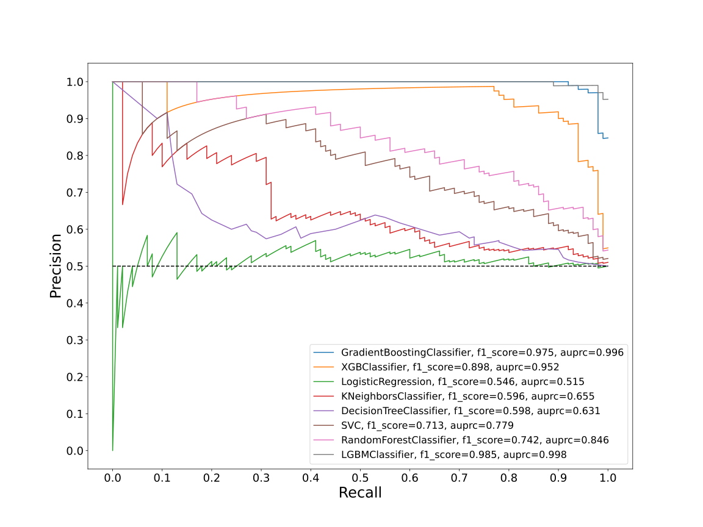
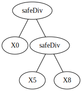
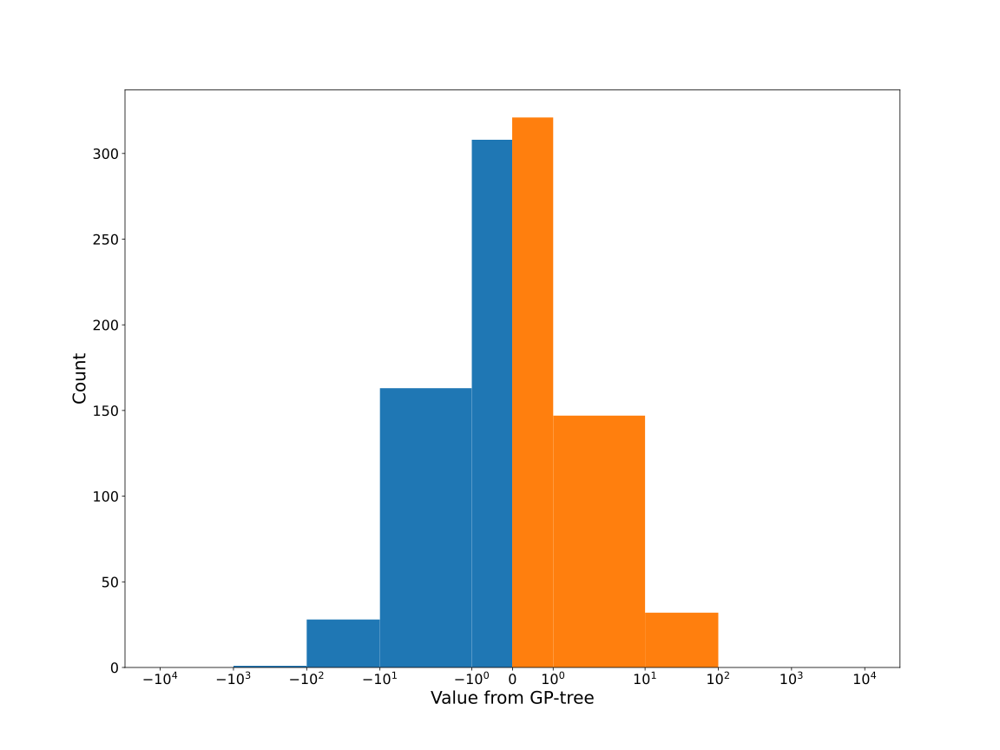
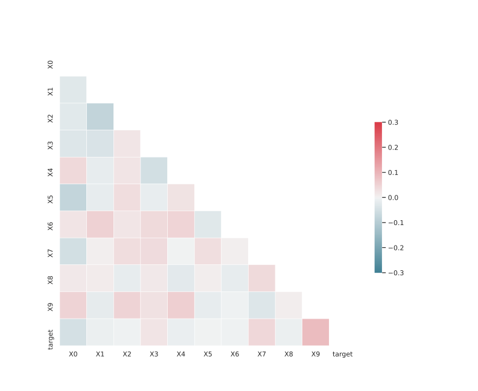

# Dataset LGXFSKDR_0.169_0.797_6949

|    | classifiers                |   auroc |    auprc |   f1_score |   rank_auroc |   rank_auprc |   rank_f1 |
|---:|:---------------------------|--------:|---------:|-----------:|-------------:|-------------:|----------:|
|  0 | GradientBoostingClassifier |  0.9954 | 0.995845 |   0.975124 |            2 |            2 |         2 |
|  1 | XGBClassifier              |  0.9565 | 0.951541 |   0.897959 |            3 |            3 |         3 |
|  2 | LogisticRegression         |  0.5347 | 0.514911 |   0.546341 |            8 |            8 |         8 |
|  3 | KNeighborsClassifier       |  0.643  | 0.654997 |   0.59596  |            6 |            6 |         7 |
|  4 | DecisionTreeClassifier     |  0.6262 | 0.631257 |   0.597938 |            7 |            7 |         6 |
|  5 | SVC                        |  0.7812 | 0.778716 |   0.712963 |            5 |            5 |         5 |
|  6 | RandomForestClassifier     |  0.8446 | 0.845761 |   0.742268 |            4 |            4 |         4 |
|  7 | LGBMClassifier             |  0.9983 | 0.998273 |   0.984925 |            1 |            1 |         1 |


<details>
<summary>Parameters of tuned ML methods</summary>


```
GradientBoostingClassifier(ccp_alpha=0.0, criterion='friedman_mse', init=None,
                           learning_rate=0.6117220191324084, loss='exponential',
                           max_depth=9, max_features=None, max_leaf_nodes=None,
                           min_impurity_decrease=0.0, min_impurity_split=None,
                           min_samples_leaf=74, min_samples_split=2,
                           min_weight_fraction_leaf=0.0, n_estimators=100,
                           n_iter_no_change=18, presort='deprecated',
                           random_state=6949, subsample=1.0, tol=1e-07,
                           validation_fraction=0.02, verbose=0,
                           warm_start=False)
XGBClassifier(alpha=2.25630795492791, base_score=0.5, booster='gbtree',
              colsample_bylevel=1, colsample_bynode=1, colsample_bytree=1,
              eta=0.1827841599205589, eval_metric='logloss', gamma=0.5,
              gpu_id=-1, importance_type='gain', interaction_constraints=None,
              learning_rate=0.182784155, max_delta_step=0, max_depth=7,
              min_child_weight=1, missing=nan, monotone_constraints=None,
              n_estimators=91, n_jobs=0, num_parallel_tree=1,
              objective='binary:logistic', random_state=6949,
              reg_alpha=2.25630808, reg_lambda=0.00021176199764084532,
              scale_pos_weight=1, subsample=1, tree_method=None,
              validate_parameters=False, verbosity=None)
LogisticRegression(C=0.07218078104739543, class_weight=None, dual=False,
                   fit_intercept=True, intercept_scaling=1, l1_ratio=None,
                   max_iter=100, multi_class='auto', n_jobs=None, penalty='l1',
                   random_state=6949, solver='liblinear', tol=0.0001, verbose=0,
                   warm_start=False)
KNeighborsClassifier(algorithm='auto', leaf_size=30, metric='euclidean',
                     metric_params=None, n_jobs=None, n_neighbors=15, p=5,
                     weights='distance')
DecisionTreeClassifier(ccp_alpha=0.0, class_weight=None, criterion='gini',
                       max_depth=10, max_features=None, max_leaf_nodes=None,
                       min_impurity_decrease=0.0, min_impurity_split=None,
                       min_samples_leaf=12, min_samples_split=19,
                       min_weight_fraction_leaf=0.0, presort='deprecated',
                       random_state=6949, splitter='best')
SVC(C=2191.8701406276523, break_ties=False, cache_size=200,
    class_weight='balanced', coef0=7.300000000000001,
    decision_function_shape='ovr', degree=3, gamma='scale', kernel='poly',
    max_iter=-1, probability=True, random_state=6949, shrinking=True,
    tol=3.0296986834583433e-05, verbose=False)
RandomForestClassifier(bootstrap=True, ccp_alpha=0.0, class_weight=None,
                       criterion='gini', max_depth=9, max_features=None,
                       max_leaf_nodes=None, max_samples=None,
                       min_impurity_decrease=0.0, min_impurity_split=None,
                       min_samples_leaf=2, min_samples_split=6,
                       min_weight_fraction_leaf=0.0, n_estimators=89,
                       n_jobs=None, oob_score=False, random_state=6949,
                       verbose=0, warm_start=False)
LGBMClassifier(boosting_type='gbdt', class_weight=None, colsample_bytree=1.0,
               importance_type='split', learning_rate=0.1, max_depth=8,
               metric='binary_logloss', min_child_samples=20,
               min_child_weight=0.001, min_split_gain=0.0, n_estimators=99,
               n_jobs=-1, num_leaves=219, objective='binary', random_state=6949,
               reg_alpha=0.0, reg_lambda=0.0, silent=True, subsample=1.0,
               subsample_for_bin=200000, subsample_freq=0)
```

</details>

<details>
<summary>Expected performance (100 different random seeds)</summary>

</details>

<details>
<summary>Receiver Operating Characteristics (ROC) curve</summary>

</details>

<details>
<summary>Precision-Recall Curve</summary>

</details>

<details>
<summary>Model (GP-tree)</summary>

</details>

<details>
<summary>Endpoint histogram</summary>

</details>

<details>
<summary>Feature correlations</summary>

</details>

[**Pandas Profiling Report**](https://epistasislab.github.io/digen/docs/profile/LGXFSKDR_0.169_0.797_6949.html)