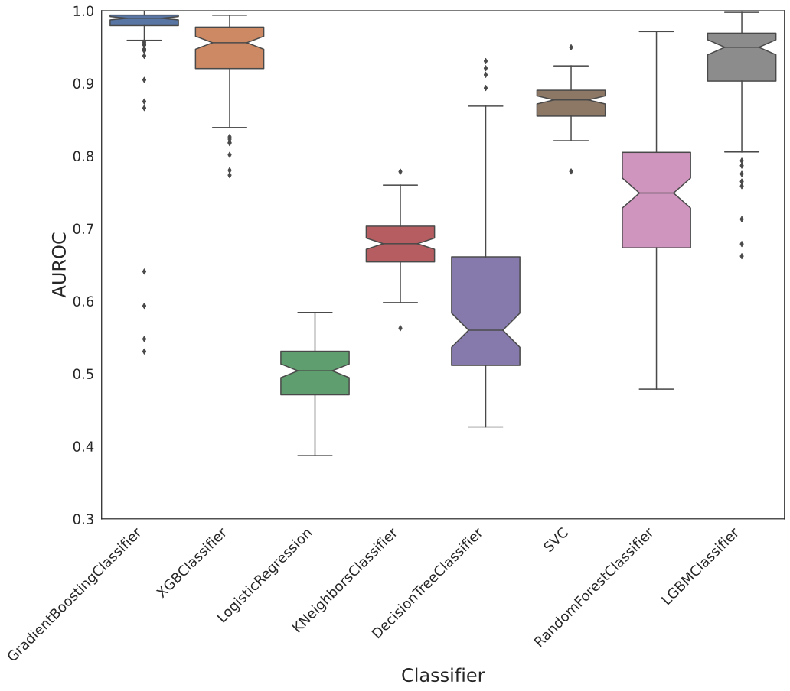
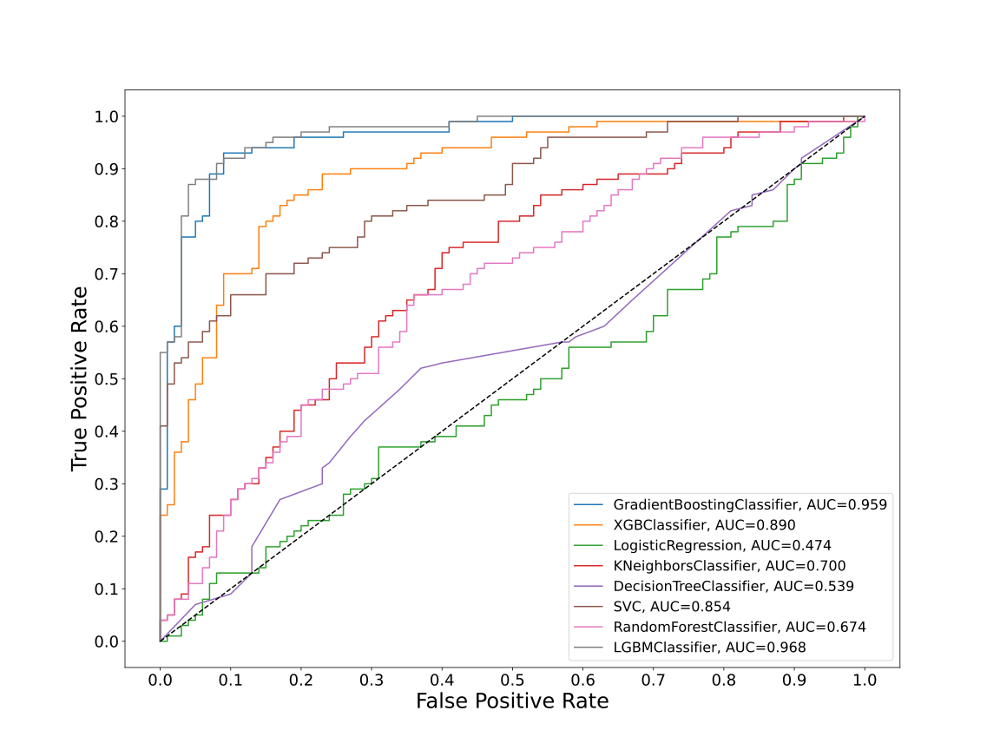
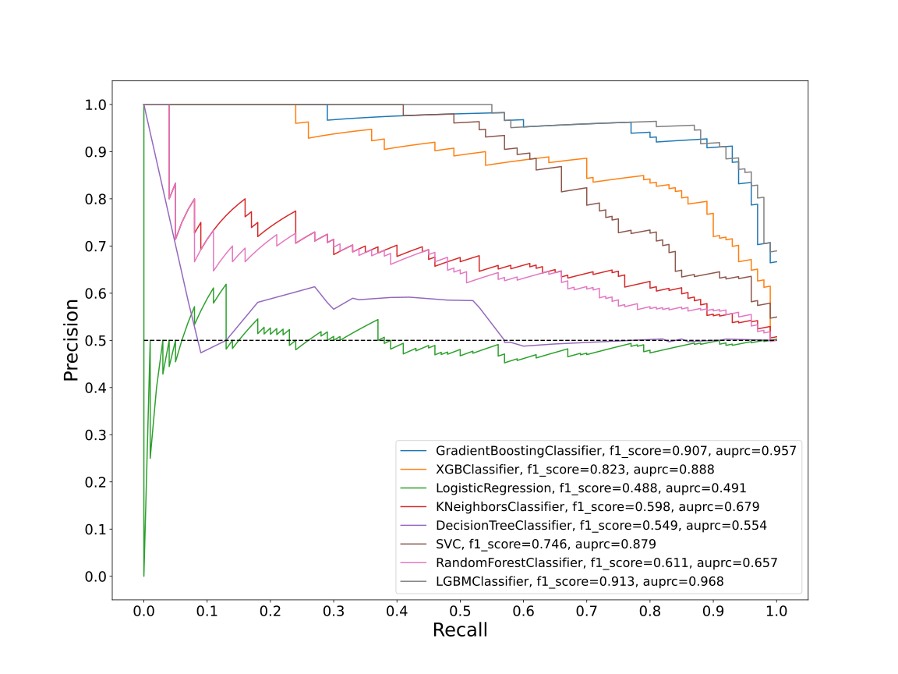
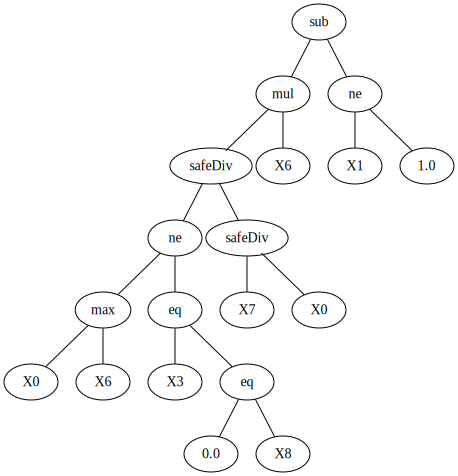
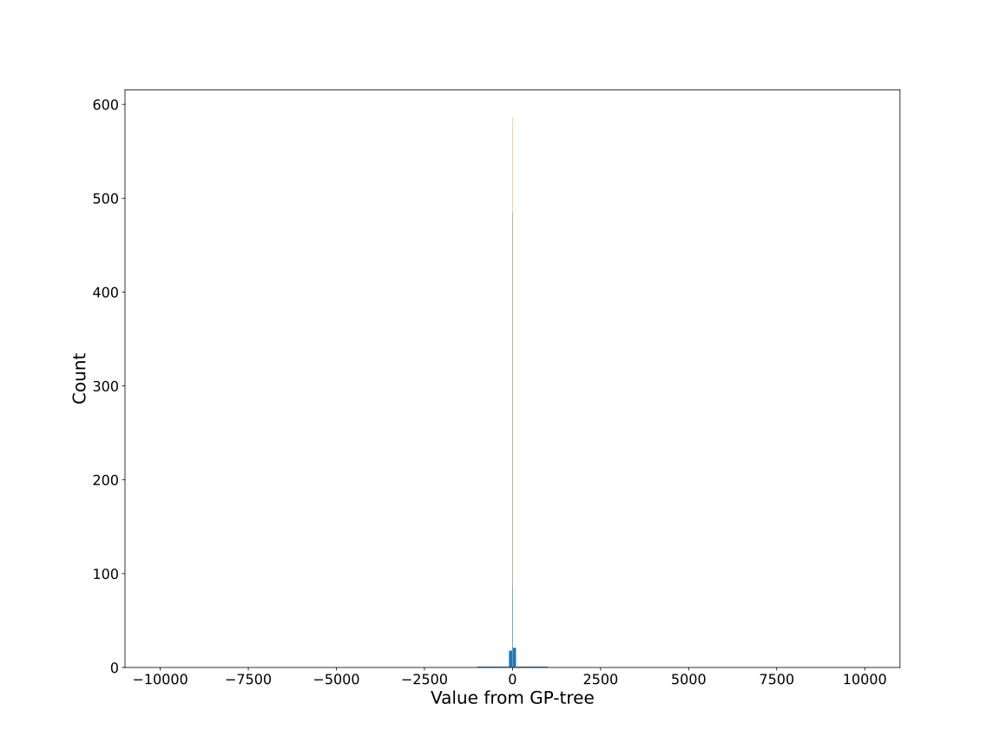
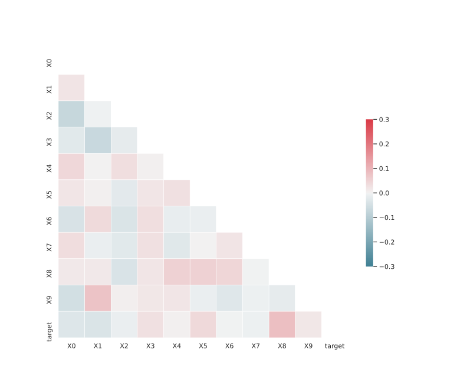

# Dataset LGXSKFDR_0.177_0.757_4426

|    | classifiers                |   auroc |    auprc |   f1_score |   rank_auroc |   rank_auprc |   rank_f1 |
|---:|:---------------------------|--------:|---------:|-----------:|-------------:|-------------:|----------:|
|  0 | GradientBoostingClassifier |  0.9593 | 0.957146 |   0.907317 |            2 |            2 |         2 |
|  1 | XGBClassifier              |  0.8904 | 0.888354 |   0.822967 |            3 |            3 |         3 |
|  2 | LogisticRegression         |  0.4739 | 0.490869 |   0.487805 |            8 |            8 |         8 |
|  3 | KNeighborsClassifier       |  0.7001 | 0.678612 |   0.597826 |            5 |            5 |         6 |
|  4 | DecisionTreeClassifier     |  0.5395 | 0.554107 |   0.549223 |            7 |            7 |         7 |
|  5 | SVC                        |  0.854  | 0.879293 |   0.746114 |            4 |            4 |         4 |
|  6 | RandomForestClassifier     |  0.6741 | 0.656746 |   0.611399 |            6 |            6 |         5 |
|  7 | LGBMClassifier             |  0.968  | 0.968252 |   0.912621 |            1 |            1 |         1 |


<details>
<summary>Parameters of tuned ML methods</summary>


```
GradientBoostingClassifier(ccp_alpha=0.0, criterion='friedman_mse', init=None,
                           learning_rate=0.7178054811949757, loss='deviance',
                           max_depth=10, max_features=None, max_leaf_nodes=None,
                           min_impurity_decrease=0.0, min_impurity_split=None,
                           min_samples_leaf=67, min_samples_split=2,
                           min_weight_fraction_leaf=0.0, n_estimators=100,
                           n_iter_no_change=18, presort='deprecated',
                           random_state=4426, subsample=1.0, tol=1e-07,
                           validation_fraction=0.01, verbose=0,
                           warm_start=False)
XGBClassifier(alpha=1.8457194723336208, base_score=0.5, booster='gbtree',
              colsample_bylevel=1, colsample_bynode=1, colsample_bytree=1,
              eta=0.9142376986640744, eval_metric='logloss', gamma=0.1,
              gpu_id=-1, importance_type='gain', interaction_constraints=None,
              learning_rate=0.914237678, max_delta_step=0, max_depth=7,
              min_child_weight=1, missing=nan, monotone_constraints=None,
              n_estimators=42, n_jobs=0, num_parallel_tree=1,
              objective='binary:logistic', random_state=4426,
              reg_alpha=1.84571946, reg_lambda=0.0026540175157487604,
              scale_pos_weight=1, subsample=1, tree_method=None,
              validate_parameters=False, verbosity=None)
LogisticRegression(C=0.00023191696926744233, class_weight=None, dual=False,
                   fit_intercept=True, intercept_scaling=1, l1_ratio=None,
                   max_iter=100, multi_class='auto', n_jobs=None, penalty='l2',
                   random_state=4426, solver='sag', tol=0.0001, verbose=0,
                   warm_start=False)
KNeighborsClassifier(algorithm='auto', leaf_size=30, metric='minkowski',
                     metric_params=None, n_jobs=None, n_neighbors=16, p=1,
                     weights='distance')
DecisionTreeClassifier(ccp_alpha=0.0, class_weight=None, criterion='gini',
                       max_depth=9, max_features=None, max_leaf_nodes=None,
                       min_impurity_decrease=0.0, min_impurity_split=None,
                       min_samples_leaf=10, min_samples_split=18,
                       min_weight_fraction_leaf=0.0, presort='deprecated',
                       random_state=4426, splitter='best')
SVC(C=4400.956148401358, break_ties=False, cache_size=200,
    class_weight='balanced', coef0=0.0, decision_function_shape='ovr', degree=3,
    gamma='scale', kernel='poly', max_iter=-1, probability=True,
    random_state=4426, shrinking=True, tol=0.0005047078124683485,
    verbose=False)
RandomForestClassifier(bootstrap=True, ccp_alpha=0.0, class_weight=None,
                       criterion='gini', max_depth=10, max_features=None,
                       max_leaf_nodes=None, max_samples=None,
                       min_impurity_decrease=0.0, min_impurity_split=None,
                       min_samples_leaf=8, min_samples_split=13,
                       min_weight_fraction_leaf=0.0, n_estimators=40,
                       n_jobs=None, oob_score=False, random_state=4426,
                       verbose=0, warm_start=False)
LGBMClassifier(boosting_type='gbdt', class_weight=None, colsample_bytree=1.0,
               importance_type='split', learning_rate=0.1, max_depth=10,
               metric='binary_logloss', min_child_samples=20,
               min_child_weight=0.001, min_split_gain=0.0, n_estimators=90,
               n_jobs=-1, num_leaves=48, objective='binary', random_state=4426,
               reg_alpha=0.0, reg_lambda=0.0, silent=True, subsample=1.0,
               subsample_for_bin=200000, subsample_freq=0)
```

</details>

<details>
<summary>Expected performance (200 experiments per ML method)</summary>

</details>

<details>
<summary>Receiver Operating Characteristics (ROC) curve</summary>

</details>

<details>
<summary>Precision-Recall Curve</summary>

</details>

<details>
<summary>Model (GP-tree)</summary>

</details>

<details>
<summary>Endpoint histogram</summary>

</details>

<details>
<summary>Feature correlations</summary>

</details>

[**Pandas Profiling Report**](https://github.io/athril/digen-test/docs/profile/LGXSKFDR_0.177_0.757_4426.html)