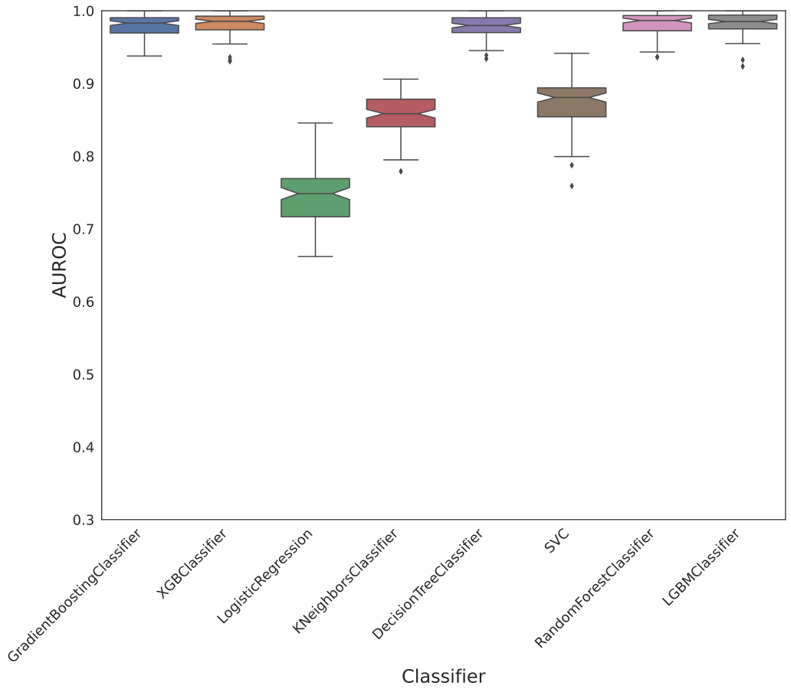
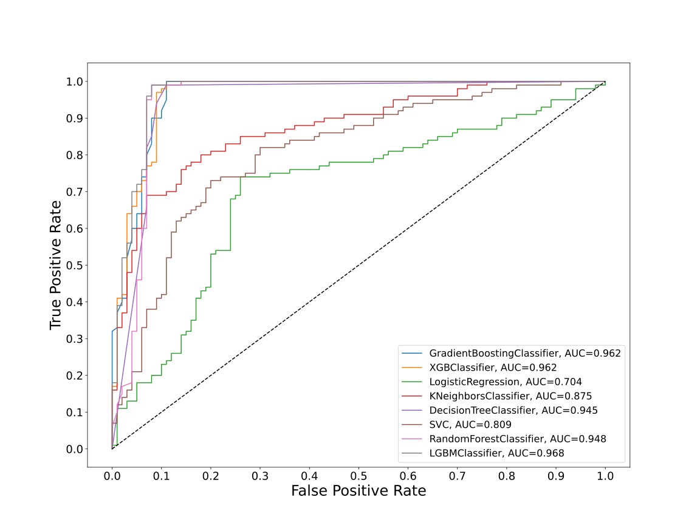
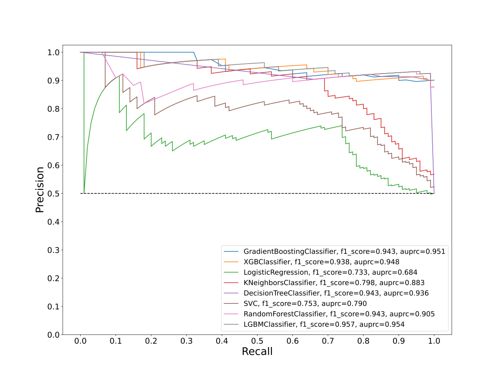
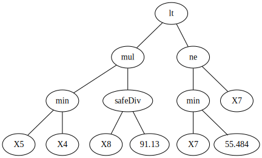
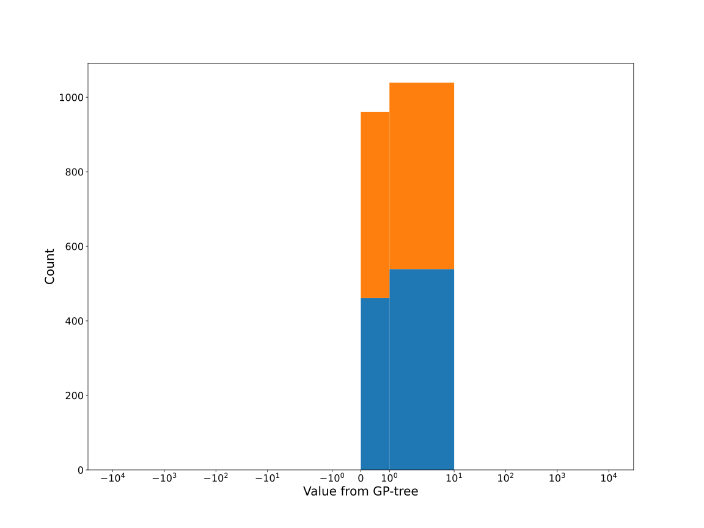
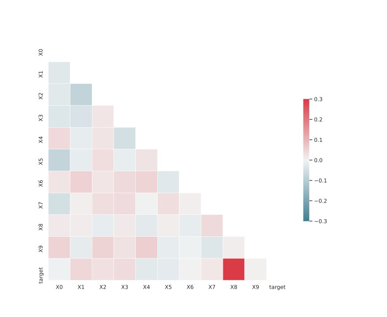

# Dataset LX-GFDKSR_0.089_0.896_6949

|    | classifiers                |   auroc |    auprc |   f1_score |   rank_auroc |   rank_auprc |   rank_f1 |
|---:|:---------------------------|--------:|---------:|-----------:|-------------:|-------------:|----------:|
|  0 | GradientBoostingClassifier | 0.96195 | 0.95101  |   0.942857 |            2 |            2 |         2 |
|  1 | XGBClassifier              | 0.962   | 0.947603 |   0.937799 |            2 |            3 |         5 |
|  2 | LogisticRegression         | 0.7038  | 0.683776 |   0.732673 |            8 |            8 |         8 |
|  3 | KNeighborsClassifier       | 0.8745  | 0.882948 |   0.79803  |            6 |            6 |         6 |
|  4 | DecisionTreeClassifier     | 0.94515 | 0.936439 |   0.942857 |            5 |            4 |         2 |
|  5 | SVC                        | 0.8086  | 0.78956  |   0.752577 |            7 |            7 |         7 |
|  6 | RandomForestClassifier     | 0.94835 | 0.905497 |   0.942857 |            4 |            5 |         2 |
|  7 | LGBMClassifier             | 0.9676  | 0.95385  |   0.956522 |            1 |            1 |         1 |


<details>
<summary>Parameters of tuned ML methods</summary>


```
GradientBoostingClassifier(ccp_alpha=0.0, criterion='friedman_mse', init=None,
                           learning_rate=0.015529483184002293, loss='deviance',
                           max_depth=5, max_features=None, max_leaf_nodes=None,
                           min_impurity_decrease=0.0, min_impurity_split=None,
                           min_samples_leaf=42, min_samples_split=2,
                           min_weight_fraction_leaf=0.0, n_estimators=100,
                           n_iter_no_change=8, presort='deprecated',
                           random_state=6949, subsample=1.0, tol=1e-07,
                           validation_fraction=0.09999999999999999, verbose=0,
                           warm_start=False)
XGBClassifier(alpha=0.00043479025436697627, base_score=0.5, booster='dart',
              colsample_bylevel=1, colsample_bynode=1, colsample_bytree=1,
              eta=0.3308440841787278, eval_metric='logloss',
              gamma=0.30000000000000004, gpu_id=-1, importance_type='gain',
              interaction_constraints=None, learning_rate=0.330844074,
              max_delta_step=0, max_depth=5, min_child_weight=1, missing=nan,
              monotone_constraints=None, n_estimators=88, n_jobs=0,
              num_parallel_tree=1, objective='binary:logistic',
              random_state=6949, reg_alpha=0.000434790243,
              reg_lambda=0.4402438365695435, scale_pos_weight=1, subsample=1,
              tree_method=None, validate_parameters=False, verbosity=None)
LogisticRegression(C=0.036680421081707715, class_weight=None, dual=False,
                   fit_intercept=True, intercept_scaling=1, l1_ratio=None,
                   max_iter=100, multi_class='auto', n_jobs=None, penalty='l1',
                   random_state=6949, solver='liblinear', tol=0.0001, verbose=0,
                   warm_start=False)
KNeighborsClassifier(algorithm='auto', leaf_size=30, metric='minkowski',
                     metric_params=None, n_jobs=None, n_neighbors=24, p=1,
                     weights='distance')
DecisionTreeClassifier(ccp_alpha=0.0, class_weight=None, criterion='entropy',
                       max_depth=6, max_features=None, max_leaf_nodes=None,
                       min_impurity_decrease=0.0, min_impurity_split=None,
                       min_samples_leaf=16, min_samples_split=17,
                       min_weight_fraction_leaf=0.0, presort='deprecated',
                       random_state=6949, splitter='best')
SVC(C=22.456907577256228, break_ties=False, cache_size=200, class_weight=None,
    coef0=8.0, decision_function_shape='ovr', degree=3, gamma='auto',
    kernel='poly', max_iter=-1, probability=True, random_state=6949,
    shrinking=True, tol=1.9208180553186774e-05, verbose=False)
RandomForestClassifier(bootstrap=True, ccp_alpha=0.0, class_weight=None,
                       criterion='gini', max_depth=4, max_features=None,
                       max_leaf_nodes=None, max_samples=None,
                       min_impurity_decrease=0.0, min_impurity_split=None,
                       min_samples_leaf=3, min_samples_split=10,
                       min_weight_fraction_leaf=0.0, n_estimators=27,
                       n_jobs=None, oob_score=False, random_state=6949,
                       verbose=0, warm_start=False)
LGBMClassifier(boosting_type='goss', class_weight=None, colsample_bytree=1.0,
               importance_type='split', learning_rate=0.1, max_depth=9,
               metric='binary_logloss', min_child_samples=20,
               min_child_weight=0.001, min_split_gain=0.0, n_estimators=69,
               n_jobs=-1, num_leaves=243, objective='binary', random_state=6949,
               reg_alpha=0.0, reg_lambda=0.0, silent=True, subsample=1.0,
               subsample_for_bin=200000, subsample_freq=0)
```

</details>

<details>
<summary>Expected performance (200 experiments per ML method)</summary>

</details>

<details>
<summary>Receiver Operating Characteristics (ROC) curve</summary>

</details>

<details>
<summary>Precision-Recall Curve</summary>

</details>

<details>
<summary>Model (GP-tree)</summary>

</details>

<details>
<summary>Endpoint histogram</summary>

</details>

<details>
<summary>Feature correlations</summary>

</details>

[**Pandas Profiling Report**](https://github.io/athril/digen-test/docs/profile/LX-GFDKSR_0.089_0.896_6949.html)