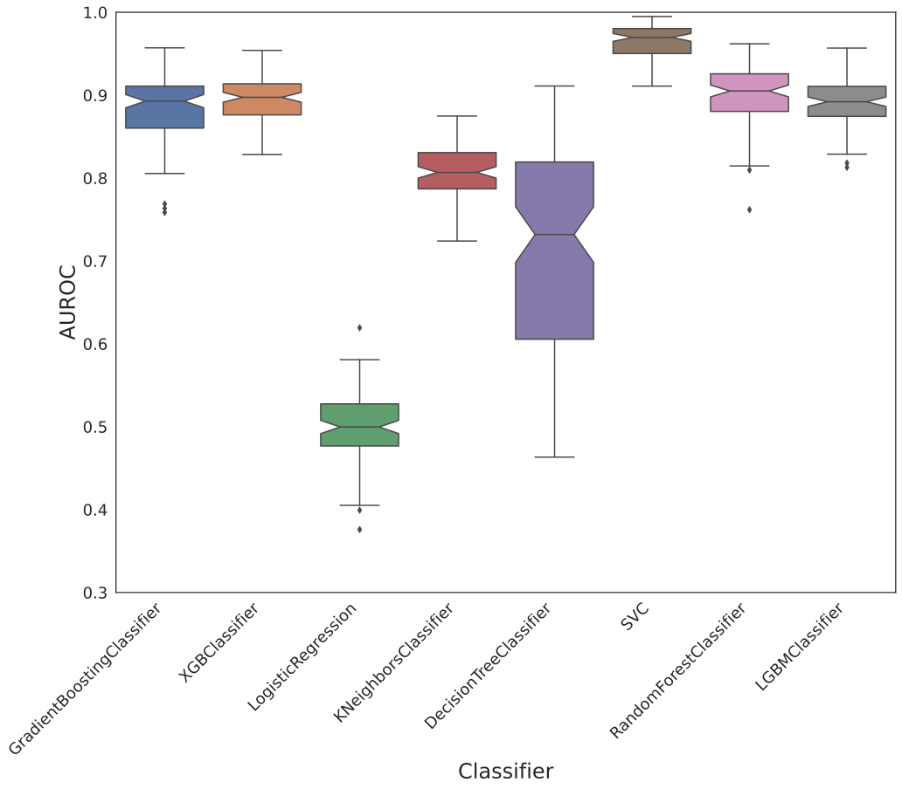
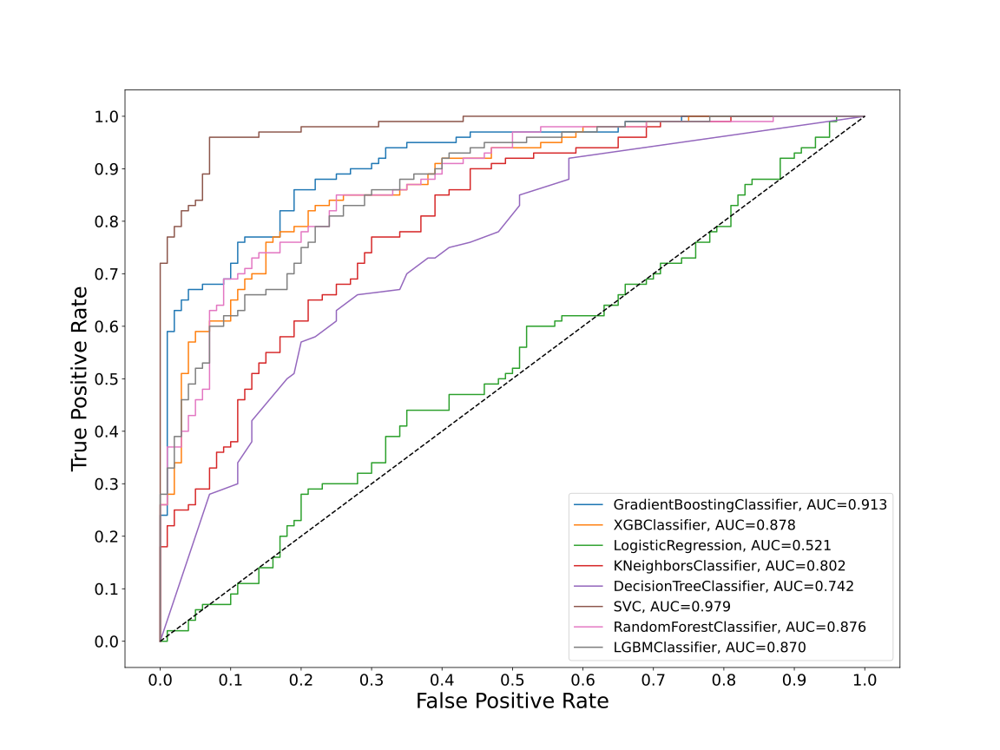
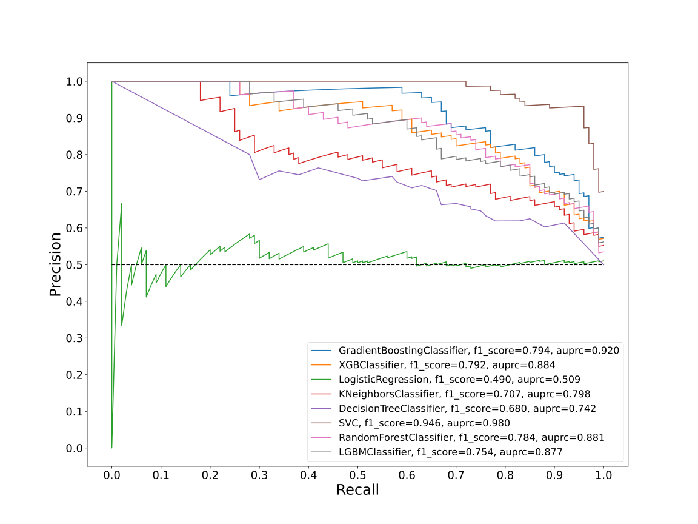
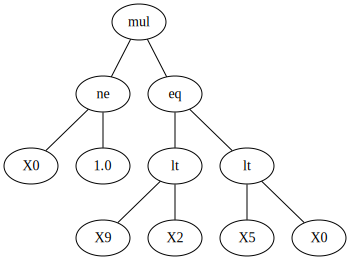
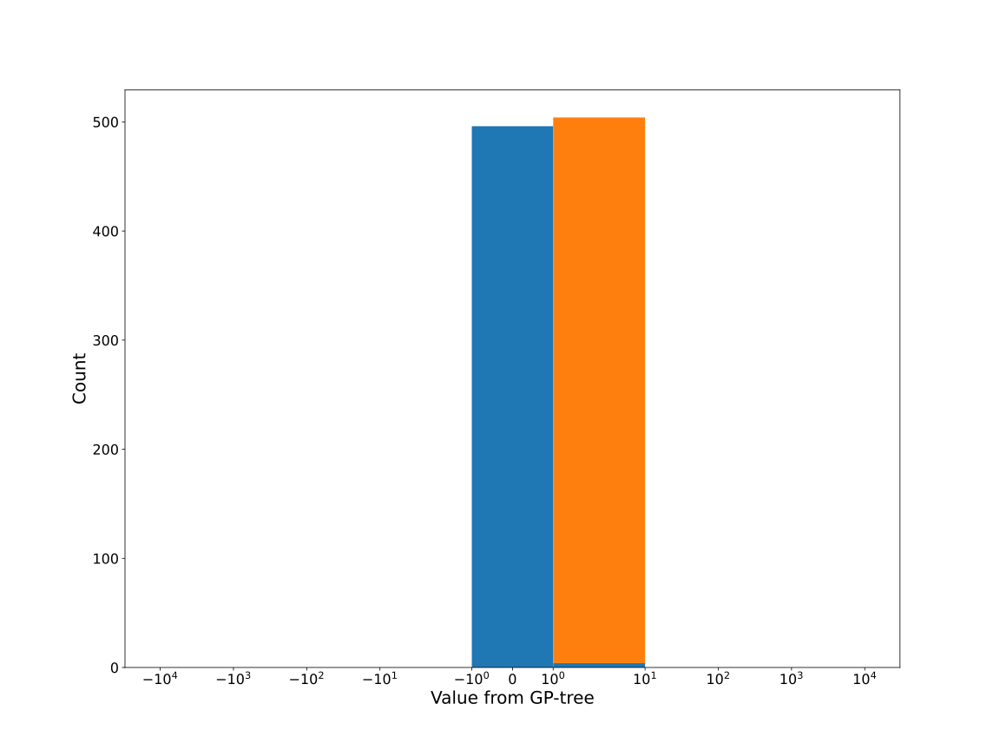
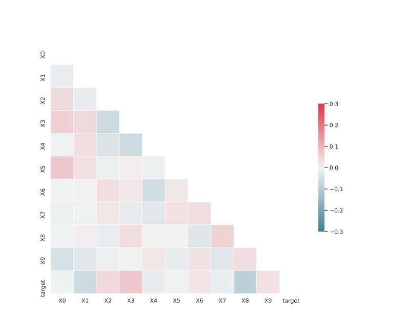

# Dataset SGXFLKDR_0.132_0.823_8322

|    | classifiers                |   auroc |    auprc |   f1_score |   rank_auroc |   rank_auprc |   rank_f1 |
|---:|:---------------------------|--------:|---------:|-----------:|-------------:|-------------:|----------:|
|  0 | GradientBoostingClassifier |  0.9134 | 0.919643 |   0.793814 |            2 |            2 |         2 |
|  1 | XGBClassifier              |  0.878  | 0.883998 |   0.791667 |            3 |            3 |         3 |
|  2 | LogisticRegression         |  0.5211 | 0.509256 |   0.489583 |            8 |            8 |         8 |
|  3 | KNeighborsClassifier       |  0.8021 | 0.797823 |   0.707071 |            6 |            6 |         6 |
|  4 | DecisionTreeClassifier     |  0.7424 | 0.742178 |   0.680412 |            7 |            7 |         7 |
|  5 | SVC                        |  0.9786 | 0.980181 |   0.945813 |            1 |            1 |         1 |
|  6 | RandomForestClassifier     |  0.8758 | 0.880927 |   0.783505 |            4 |            4 |         4 |
|  7 | LGBMClassifier             |  0.8704 | 0.876632 |   0.753927 |            5 |            5 |         5 |


<details>
<summary>Parameters of tuned ML methods</summary>


```
GradientBoostingClassifier(ccp_alpha=0.0, criterion='friedman_mse', init=None,
                           learning_rate=0.49827452742718953, loss='deviance',
                           max_depth=9, max_features=None, max_leaf_nodes=None,
                           min_impurity_decrease=0.0, min_impurity_split=None,
                           min_samples_leaf=1, min_samples_split=2,
                           min_weight_fraction_leaf=0.0, n_estimators=100,
                           n_iter_no_change=14, presort='deprecated',
                           random_state=8322, subsample=1.0, tol=1e-07,
                           validation_fraction=0.05, verbose=0,
                           warm_start=False)
XGBClassifier(alpha=0.0036211023202279524, base_score=0.5, booster='dart',
              colsample_bylevel=1, colsample_bynode=1, colsample_bytree=1,
              eta=0.31445127262491906, eval_metric='logloss', gamma=0.1,
              gpu_id=-1, importance_type='gain', interaction_constraints=None,
              learning_rate=0.314451277, max_delta_step=0, max_depth=8,
              min_child_weight=1, missing=nan, monotone_constraints=None,
              n_estimators=66, n_jobs=0, num_parallel_tree=1,
              objective='binary:logistic', random_state=8322,
              reg_alpha=0.00362110231, reg_lambda=0.01176782245332927,
              scale_pos_weight=1, subsample=1, tree_method=None,
              validate_parameters=False, verbosity=None)
LogisticRegression(C=0.00031539423361280275, class_weight=None, dual=False,
                   fit_intercept=True, intercept_scaling=1, l1_ratio=None,
                   max_iter=100, multi_class='auto', n_jobs=None, penalty='l2',
                   random_state=8322, solver='sag', tol=0.0001, verbose=0,
                   warm_start=False)
KNeighborsClassifier(algorithm='auto', leaf_size=30, metric='minkowski',
                     metric_params=None, n_jobs=None, n_neighbors=87, p=4,
                     weights='distance')
DecisionTreeClassifier(ccp_alpha=0.0, class_weight=None, criterion='entropy',
                       max_depth=10, max_features=None, max_leaf_nodes=None,
                       min_impurity_decrease=0.0, min_impurity_split=None,
                       min_samples_leaf=9, min_samples_split=6,
                       min_weight_fraction_leaf=0.0, presort='deprecated',
                       random_state=8322, splitter='best')
SVC(C=244.03571585185682, break_ties=False, cache_size=200,
    class_weight='balanced', coef0=1.3, decision_function_shape='ovr', degree=2,
    gamma='scale', kernel='poly', max_iter=-1, probability=True,
    random_state=8322, shrinking=True, tol=0.0007923255497112999,
    verbose=False)
RandomForestClassifier(bootstrap=True, ccp_alpha=0.0, class_weight=None,
                       criterion='entropy', max_depth=10, max_features=None,
                       max_leaf_nodes=None, max_samples=None,
                       min_impurity_decrease=0.0, min_impurity_split=None,
                       min_samples_leaf=1, min_samples_split=7,
                       min_weight_fraction_leaf=0.0, n_estimators=85,
                       n_jobs=None, oob_score=False, random_state=8322,
                       verbose=0, warm_start=False)
LGBMClassifier(boosting_type='gbdt', class_weight=None, colsample_bytree=1.0,
               importance_type='split', learning_rate=0.1, max_depth=10,
               metric='binary_logloss', min_child_samples=20,
               min_child_weight=0.001, min_split_gain=0.0, n_estimators=87,
               n_jobs=-1, num_leaves=176, objective='binary', random_state=8322,
               reg_alpha=0.0, reg_lambda=0.0, silent=True, subsample=1.0,
               subsample_for_bin=200000, subsample_freq=0)
```

</details>

<details>
<summary>Expected performance (200 experiments per ML method)</summary>

</details>

<details>
<summary>Receiver Operating Characteristics (ROC) curve</summary>

</details>

<details>
<summary>Precision-Recall Curve</summary>

</details>

<details>
<summary>Model (GP-tree)</summary>

</details>

<details>
<summary>Endpoint histogram</summary>

</details>

<details>
<summary>Feature correlations</summary>

</details>

[**Pandas Profiling Report**](https://github.io/athril/digen-test/docs/profile/SGXFLKDR_0.132_0.823_8322.html)