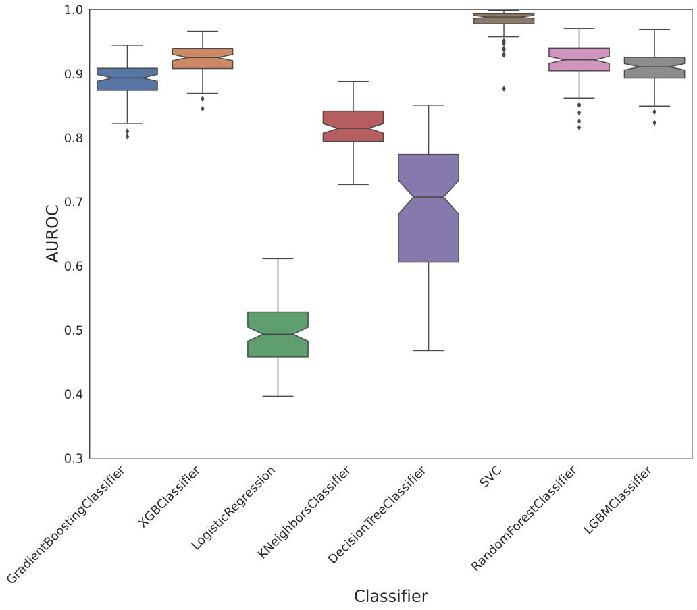
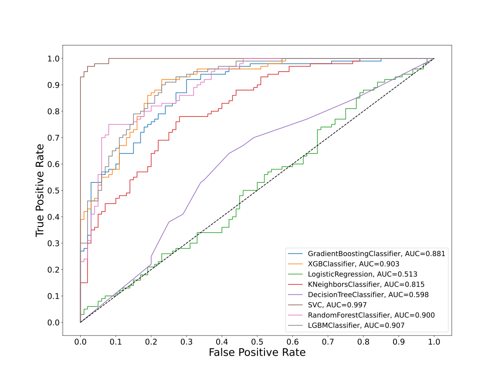
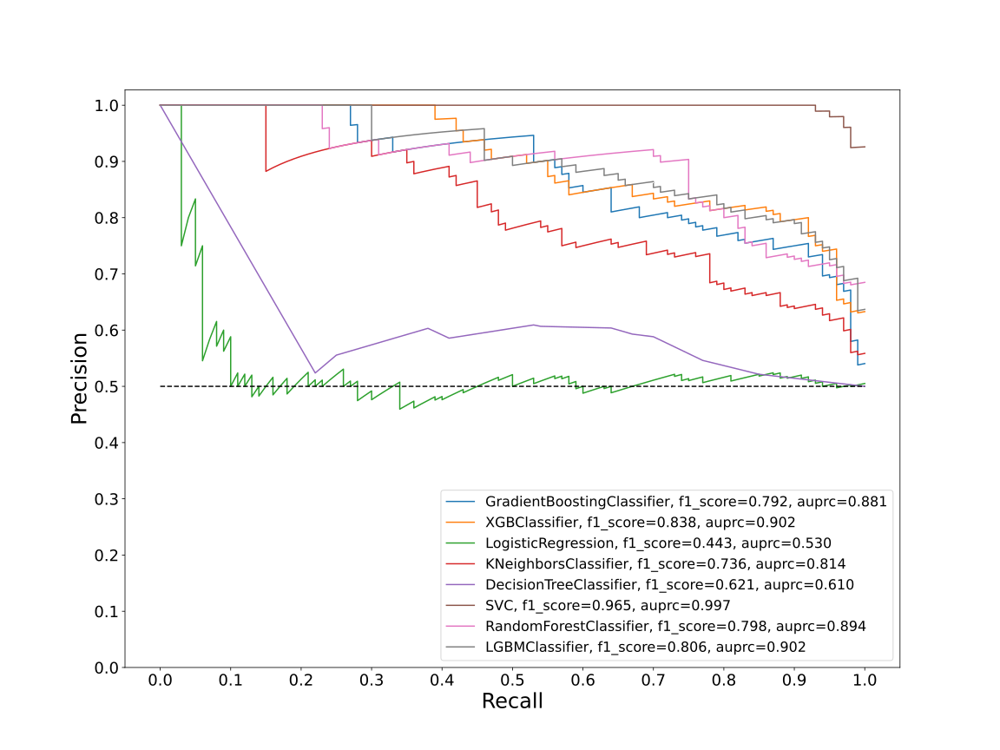
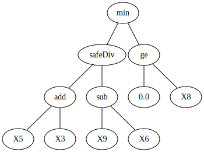
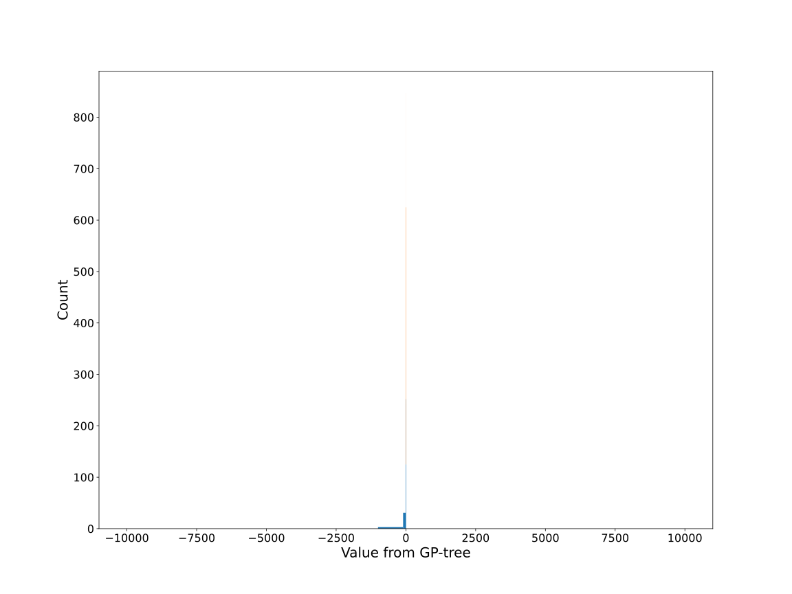
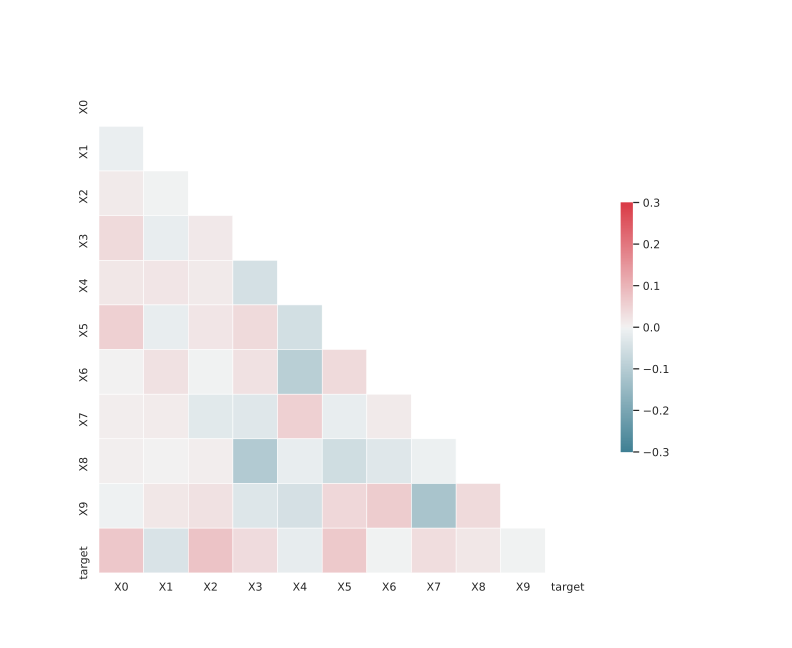

# Dataset SLXFGKDR_0.158_0.814_7270

|    | classifiers                |   auroc |    auprc |   f1_score |   rank_auroc |   rank_auprc |   rank_f1 |
|---:|:---------------------------|--------:|---------:|-----------:|-------------:|-------------:|----------:|
|  0 | GradientBoostingClassifier |  0.8808 | 0.881023 |   0.792271 |            5 |            5 |         5 |
|  1 | XGBClassifier              |  0.9028 | 0.901608 |   0.838095 |            3 |            2 |         2 |
|  2 | LogisticRegression         |  0.5134 | 0.529706 |   0.443243 |            8 |            8 |         8 |
|  3 | KNeighborsClassifier       |  0.8145 | 0.814121 |   0.736318 |            6 |            6 |         6 |
|  4 | DecisionTreeClassifier     |  0.5976 | 0.609943 |   0.621359 |            7 |            7 |         7 |
|  5 | SVC                        |  0.9974 | 0.997492 |   0.965174 |            1 |            1 |         1 |
|  6 | RandomForestClassifier     |  0.9004 | 0.893929 |   0.798122 |            4 |            4 |         4 |
|  7 | LGBMClassifier             |  0.9075 | 0.902085 |   0.806122 |            2 |            2 |         3 |


<details>
<summary>Parameters of tuned ML methods</summary>


```
GradientBoostingClassifier(ccp_alpha=0.0, criterion='friedman_mse', init=None,
                           learning_rate=0.31715555754965596,
                           loss='exponential', max_depth=7, max_features=None,
                           max_leaf_nodes=None, min_impurity_decrease=0.0,
                           min_impurity_split=None, min_samples_leaf=37,
                           min_samples_split=2, min_weight_fraction_leaf=0.0,
                           n_estimators=100, n_iter_no_change=20,
                           presort='deprecated', random_state=7270,
                           subsample=1.0, tol=1e-07, validation_fraction=0.09,
                           verbose=0, warm_start=False)
XGBClassifier(alpha=0.0004180671494397974, base_score=0.5, booster='gbtree',
              colsample_bylevel=1, colsample_bynode=1, colsample_bytree=1,
              eta=0.33292468605377246, eval_metric='logloss', gamma=0.4,
              gpu_id=-1, importance_type='gain', interaction_constraints=None,
              learning_rate=0.332924694, max_delta_step=0, max_depth=9,
              min_child_weight=1, missing=nan, monotone_constraints=None,
              n_estimators=84, n_jobs=0, num_parallel_tree=1,
              objective='binary:logistic', random_state=7270,
              reg_alpha=0.000418067153, reg_lambda=12.639734781186462,
              scale_pos_weight=1, subsample=1, tree_method=None,
              validate_parameters=False, verbosity=None)
LogisticRegression(C=490.37583890348236, class_weight=None, dual=True,
                   fit_intercept=True, intercept_scaling=1, l1_ratio=None,
                   max_iter=100, multi_class='auto', n_jobs=None, penalty='l2',
                   random_state=7270, solver='liblinear', tol=0.0001, verbose=0,
                   warm_start=False)
KNeighborsClassifier(algorithm='auto', leaf_size=30, metric='minkowski',
                     metric_params=None, n_jobs=None, n_neighbors=22, p=3,
                     weights='distance')
DecisionTreeClassifier(ccp_alpha=0.0, class_weight=None, criterion='gini',
                       max_depth=10, max_features=None, max_leaf_nodes=None,
                       min_impurity_decrease=0.0, min_impurity_split=None,
                       min_samples_leaf=1, min_samples_split=3,
                       min_weight_fraction_leaf=0.0, presort='deprecated',
                       random_state=7270, splitter='best')
SVC(C=3729.091823404957, break_ties=False, cache_size=200, class_weight=None,
    coef0=0.8, decision_function_shape='ovr', degree=2, gamma='auto',
    kernel='poly', max_iter=-1, probability=True, random_state=7270,
    shrinking=True, tol=0.0003150474392650176, verbose=False)
RandomForestClassifier(bootstrap=True, ccp_alpha=0.0, class_weight=None,
                       criterion='gini', max_depth=10, max_features=None,
                       max_leaf_nodes=None, max_samples=None,
                       min_impurity_decrease=0.0, min_impurity_split=None,
                       min_samples_leaf=2, min_samples_split=5,
                       min_weight_fraction_leaf=0.0, n_estimators=86,
                       n_jobs=None, oob_score=False, random_state=7270,
                       verbose=0, warm_start=False)
LGBMClassifier(boosting_type='gbdt', class_weight=None, colsample_bytree=1.0,
               importance_type='split', learning_rate=0.1, max_depth=9,
               metric='binary_logloss', min_child_samples=20,
               min_child_weight=0.001, min_split_gain=0.0, n_estimators=92,
               n_jobs=-1, num_leaves=95, objective='binary', random_state=7270,
               reg_alpha=0.0, reg_lambda=0.0, silent=True, subsample=1.0,
               subsample_for_bin=200000, subsample_freq=0)
```

</details>

<details>
<summary>Expected performance (100 different random seeds)</summary>

</details>

<details>
<summary>Receiver Operating Characteristics (ROC) curve</summary>

</details>

<details>
<summary>Precision-Recall Curve</summary>

</details>

<details>
<summary>Model (GP-tree)</summary>

</details>

<details>
<summary>Endpoint histogram</summary>

</details>

<details>
<summary>Feature correlations</summary>

</details>

[**Pandas Profiling Report**](https://epistasislab.github.io/digen/profile/SLXFGKDR_0.158_0.814_7270.html)