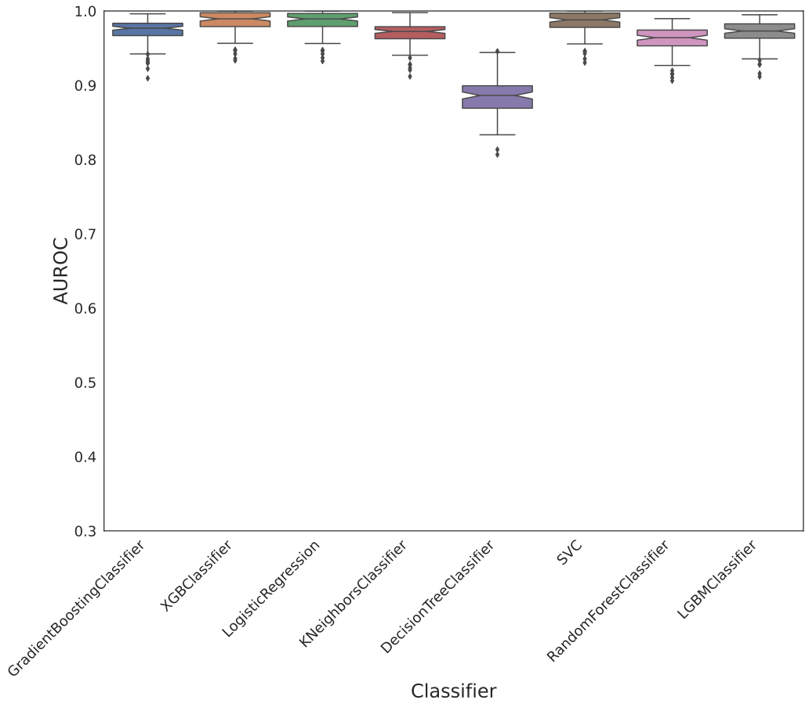
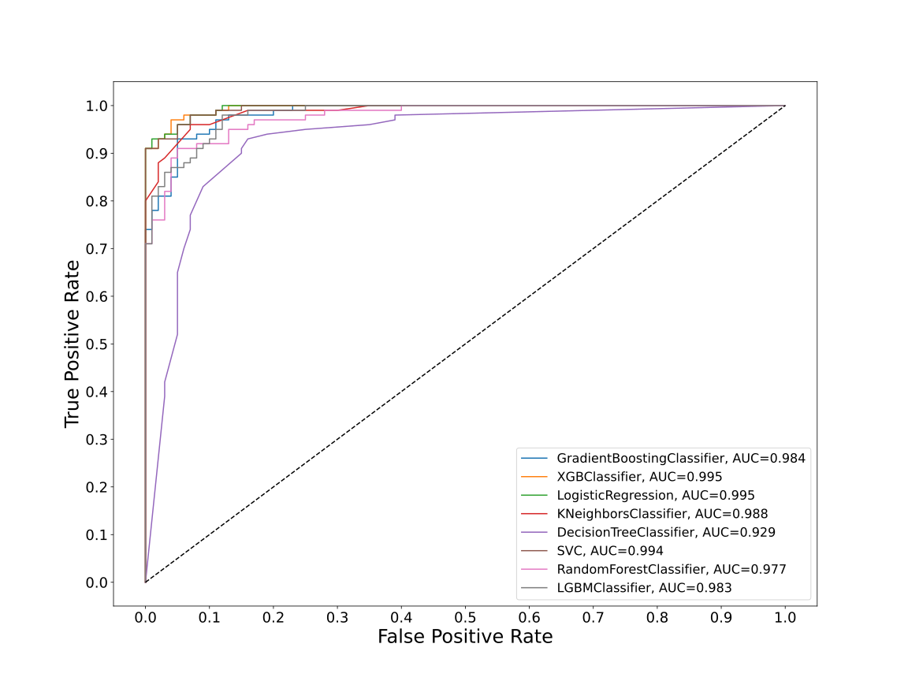
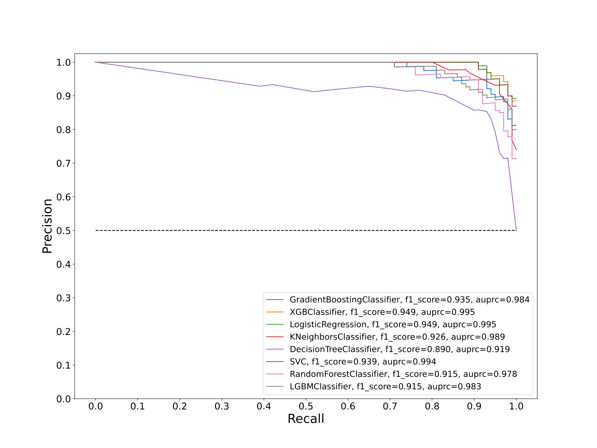
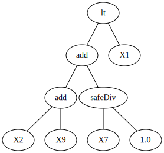
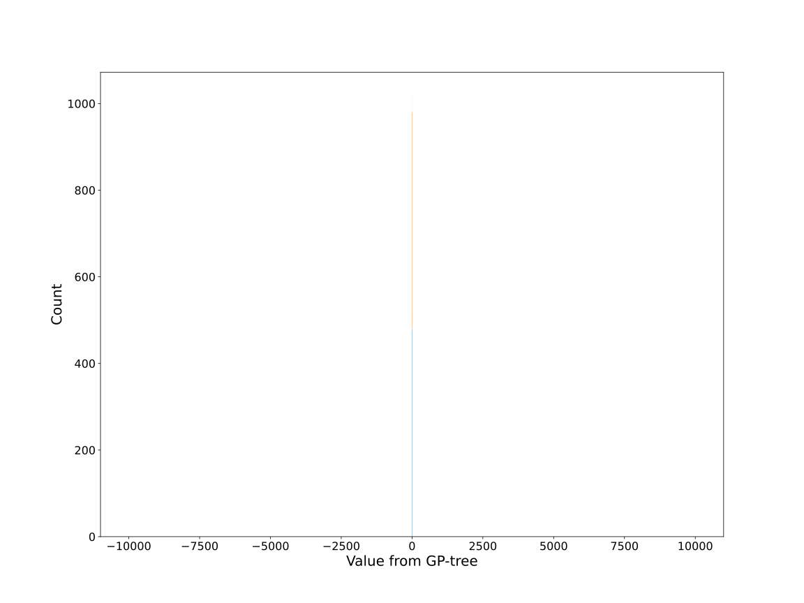
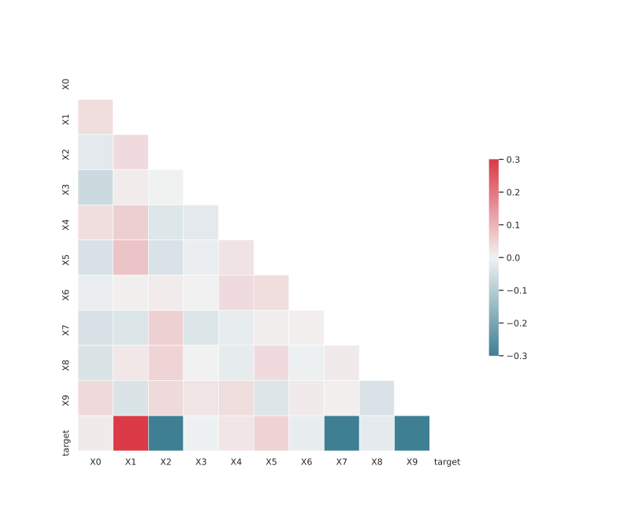

# Dataset X-RSKGLFD_0.02_0.98_6265

|    | classifiers                |   auroc |    auprc |   f1_score |   rank_auroc |   rank_auprc |   rank_f1 |
|---:|:---------------------------|--------:|---------:|-----------:|-------------:|-------------:|----------:|
|  0 | GradientBoostingClassifier | 0.9838  | 0.984103 |   0.934673 |            5 |            5 |         4 |
|  1 | XGBClassifier              | 0.9951  | 0.995318 |   0.949495 |            1 |            1 |         1 |
|  2 | LogisticRegression         | 0.9948  | 0.995047 |   0.949495 |            1 |            1 |         1 |
|  3 | KNeighborsClassifier       | 0.9877  | 0.988642 |   0.926316 |            4 |            4 |         5 |
|  4 | DecisionTreeClassifier     | 0.92905 | 0.918892 |   0.889952 |            8 |            8 |         8 |
|  5 | SVC                        | 0.9941  | 0.994406 |   0.939394 |            3 |            3 |         3 |
|  6 | RandomForestClassifier     | 0.9766  | 0.978429 |   0.914573 |            7 |            7 |         6 |
|  7 | LGBMClassifier             | 0.9826  | 0.983055 |   0.915423 |            6 |            6 |         6 |


<details>
<summary>Parameters of tuned ML methods</summary>


```
GradientBoostingClassifier(ccp_alpha=0.0, criterion='friedman_mse', init=None,
                           learning_rate=0.3513655395793175, loss='deviance',
                           max_depth=1, max_features=None, max_leaf_nodes=None,
                           min_impurity_decrease=0.0, min_impurity_split=None,
                           min_samples_leaf=51, min_samples_split=2,
                           min_weight_fraction_leaf=0.0, n_estimators=100,
                           n_iter_no_change=18, presort='deprecated',
                           random_state=6265, subsample=1.0, tol=1e-07,
                           validation_fraction=0.02, verbose=0,
                           warm_start=False)
XGBClassifier(alpha=0.008400571572503452, base_score=0.5, booster='gblinear',
              colsample_bylevel=None, colsample_bynode=None,
              colsample_bytree=None, eta=0.0985235950711793,
              eval_metric='logloss', gamma=0.1, gpu_id=-1,
              importance_type='gain', interaction_constraints=None,
              learning_rate=0.0985235944, max_delta_step=None, max_depth=8,
              min_child_weight=None, missing=nan, monotone_constraints=None,
              n_estimators=92, n_jobs=0, num_parallel_tree=None,
              objective='binary:logistic', random_state=6265,
              reg_alpha=0.00840057153, reg_lambda=0.0005278624387477173,
              scale_pos_weight=1, subsample=None, tree_method=None,
              validate_parameters=False, verbosity=None)
LogisticRegression(C=0.04772427264344593, class_weight=None, dual=False,
                   fit_intercept=True, intercept_scaling=1, l1_ratio=None,
                   max_iter=100, multi_class='auto', n_jobs=None, penalty='l1',
                   random_state=6265, solver='liblinear', tol=0.0001, verbose=0,
                   warm_start=False)
KNeighborsClassifier(algorithm='auto', leaf_size=30, metric='euclidean',
                     metric_params=None, n_jobs=None, n_neighbors=74, p=5,
                     weights='uniform')
DecisionTreeClassifier(ccp_alpha=0.0, class_weight=None, criterion='gini',
                       max_depth=8, max_features=None, max_leaf_nodes=None,
                       min_impurity_decrease=0.0, min_impurity_split=None,
                       min_samples_leaf=14, min_samples_split=17,
                       min_weight_fraction_leaf=0.0, presort='deprecated',
                       random_state=6265, splitter='best')
SVC(C=0.35693954178128084, break_ties=False, cache_size=200, class_weight=None,
    coef0=3.6, decision_function_shape='ovr', degree=2, gamma='scale',
    kernel='linear', max_iter=-1, probability=True, random_state=6265,
    shrinking=True, tol=0.00019920245674574745, verbose=False)
RandomForestClassifier(bootstrap=True, ccp_alpha=0.0, class_weight=None,
                       criterion='entropy', max_depth=8, max_features='auto',
                       max_leaf_nodes=None, max_samples=None,
                       min_impurity_decrease=0.0, min_impurity_split=None,
                       min_samples_leaf=1, min_samples_split=5,
                       min_weight_fraction_leaf=0.0, n_estimators=84,
                       n_jobs=None, oob_score=False, random_state=6265,
                       verbose=0, warm_start=False)
LGBMClassifier(boosting_type='goss', class_weight=None, colsample_bytree=1.0,
               importance_type='split', learning_rate=0.1, max_depth=3,
               metric='binary_logloss', min_child_samples=20,
               min_child_weight=0.001, min_split_gain=0.0, n_estimators=91,
               n_jobs=-1, num_leaves=98, objective='binary', random_state=6265,
               reg_alpha=0.0, reg_lambda=0.0, silent=True, subsample=1.0,
               subsample_for_bin=200000, subsample_freq=0)
```

</details>

<details>
<summary>Expected performance (100 different random seeds)</summary>

</details>

<details>
<summary>Receiver Operating Characteristics (ROC) curve</summary>

</details>

<details>
<summary>Precision-Recall Curve</summary>

</details>

<details>
<summary>Model (GP-tree)</summary>

</details>

<details>
<summary>Endpoint histogram</summary>

</details>

<details>
<summary>Feature correlations</summary>

</details>

[**Pandas Profiling Report**](https://epistasislab.github.io/digen/profile/X-RSKGLFD_0.02_0.98_6265.html)