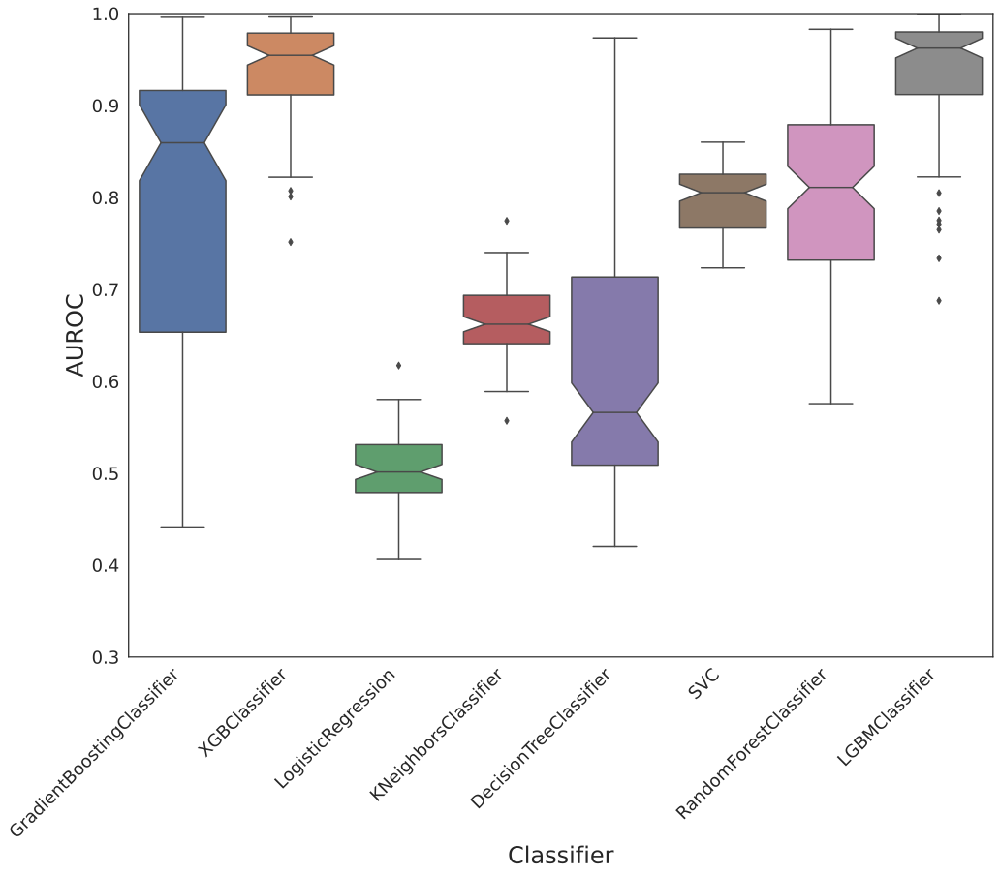
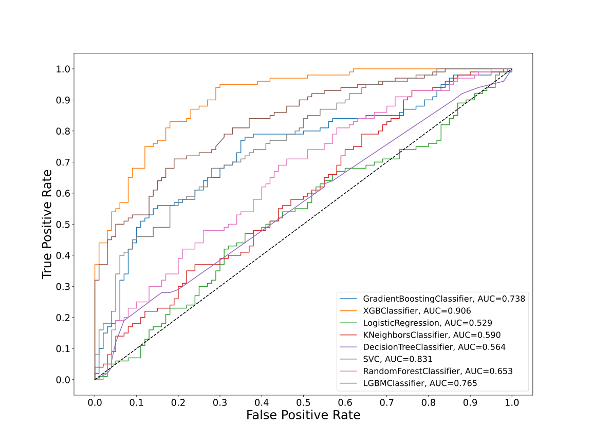
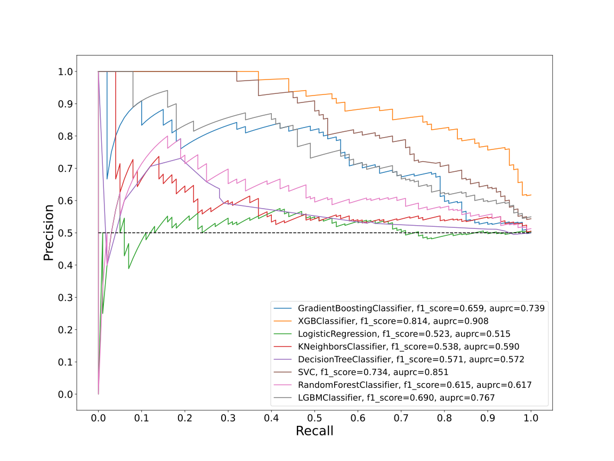
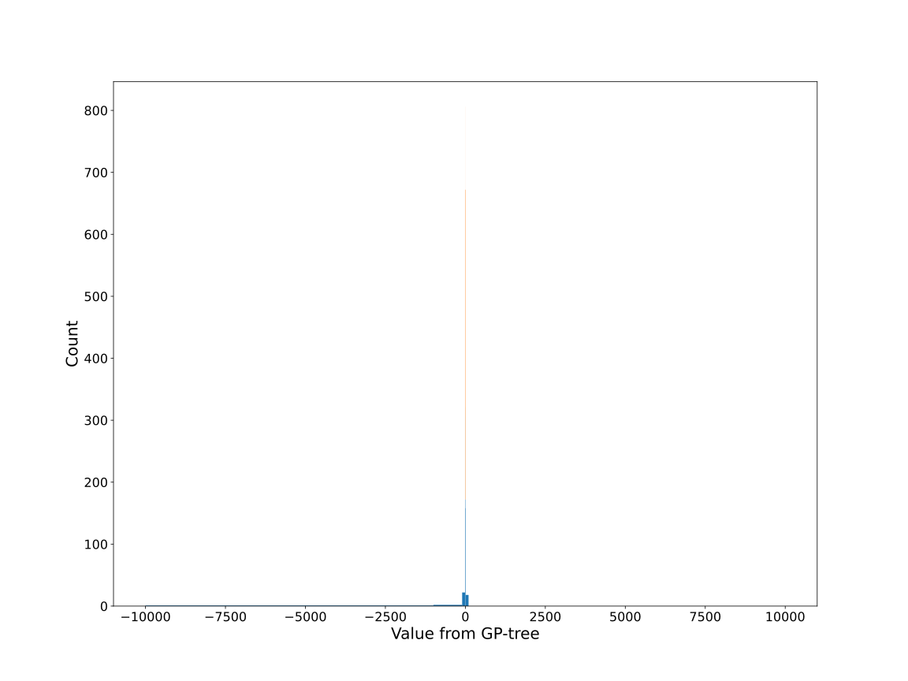
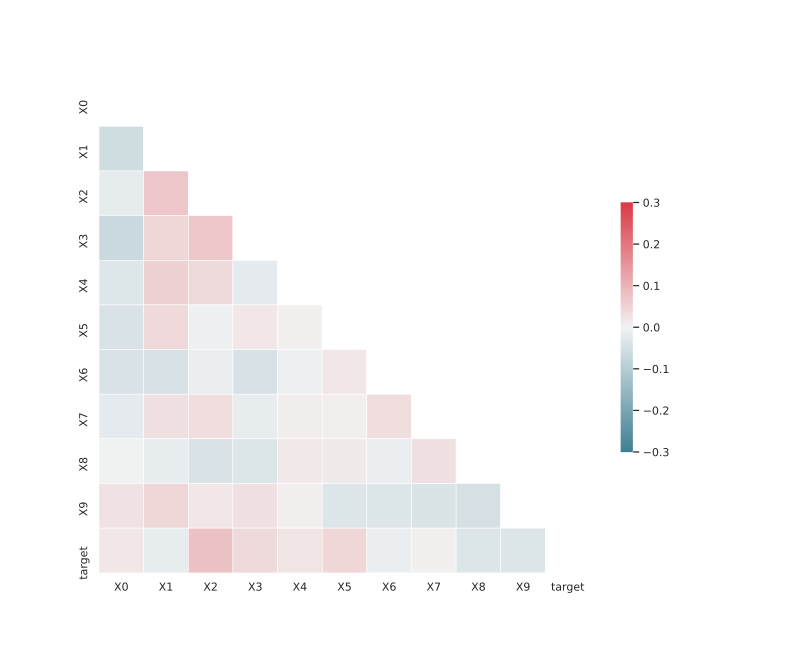

# Dataset XSLGFKDR_0.126_0.697_769

|    | classifiers                |   auroc |    auprc |   f1_score |   rank_auroc |   rank_auprc |   rank_f1 |
|---:|:---------------------------|--------:|---------:|-----------:|-------------:|-------------:|----------:|
|  0 | GradientBoostingClassifier |  0.7384 | 0.738872 |   0.659459 |            4 |            4 |         4 |
|  1 | XGBClassifier              |  0.9061 | 0.907547 |   0.81407  |            1 |            1 |         1 |
|  2 | LogisticRegression         |  0.5286 | 0.514598 |   0.523077 |            8 |            8 |         8 |
|  3 | KNeighborsClassifier       |  0.5899 | 0.590097 |   0.538071 |            6 |            6 |         7 |
|  4 | DecisionTreeClassifier     |  0.5643 | 0.571775 |   0.571429 |            7 |            7 |         6 |
|  5 | SVC                        |  0.8306 | 0.850635 |   0.733668 |            2 |            2 |         2 |
|  6 | RandomForestClassifier     |  0.6529 | 0.617124 |   0.614634 |            5 |            5 |         5 |
|  7 | LGBMClassifier             |  0.7649 | 0.766545 |   0.690355 |            3 |            3 |         3 |


<details>
<summary>Parameters of tuned ML methods</summary>


```
GradientBoostingClassifier(ccp_alpha=0.0, criterion='friedman_mse', init=None,
                           learning_rate=0.12030588604423606, loss='deviance',
                           max_depth=10, max_features=None, max_leaf_nodes=None,
                           min_impurity_decrease=0.0, min_impurity_split=None,
                           min_samples_leaf=1, min_samples_split=2,
                           min_weight_fraction_leaf=0.0, n_estimators=100,
                           n_iter_no_change=11, presort='deprecated',
                           random_state=769, subsample=1.0, tol=1e-07,
                           validation_fraction=0.13, verbose=0,
                           warm_start=False)
XGBClassifier(alpha=8.298448906419587e-05, base_score=0.5, booster='dart',
              colsample_bylevel=1, colsample_bynode=1, colsample_bytree=1,
              eta=0.9043201134467568, eval_metric='logloss',
              gamma=0.30000000000000004, gpu_id=-1, importance_type='gain',
              interaction_constraints=None, learning_rate=0.904320121,
              max_delta_step=0, max_depth=10, min_child_weight=1, missing=nan,
              monotone_constraints=None, n_estimators=93, n_jobs=0,
              num_parallel_tree=1, objective='binary:logistic',
              random_state=769, reg_alpha=8.29844867e-05,
              reg_lambda=3.8853583139668193, scale_pos_weight=1, subsample=1,
              tree_method=None, validate_parameters=False, verbosity=None)
LogisticRegression(C=0.00013366516534286355, class_weight=None, dual=False,
                   fit_intercept=True, intercept_scaling=1, l1_ratio=None,
                   max_iter=100, multi_class='auto', n_jobs=None, penalty='l2',
                   random_state=769, solver='lbfgs', tol=0.0001, verbose=0,
                   warm_start=False)
KNeighborsClassifier(algorithm='auto', leaf_size=30, metric='euclidean',
                     metric_params=None, n_jobs=None, n_neighbors=10, p=5,
                     weights='distance')
DecisionTreeClassifier(ccp_alpha=0.0, class_weight=None, criterion='entropy',
                       max_depth=9, max_features=None, max_leaf_nodes=None,
                       min_impurity_decrease=0.0, min_impurity_split=None,
                       min_samples_leaf=13, min_samples_split=10,
                       min_weight_fraction_leaf=0.0, presort='deprecated',
                       random_state=769, splitter='best')
SVC(C=110.65196109778047, break_ties=False, cache_size=200,
    class_weight='balanced', coef0=9.600000000000001,
    decision_function_shape='ovr', degree=4, gamma='scale', kernel='poly',
    max_iter=-1, probability=True, random_state=769, shrinking=True,
    tol=2.309729840912771e-05, verbose=False)
RandomForestClassifier(bootstrap=True, ccp_alpha=0.0, class_weight=None,
                       criterion='gini', max_depth=10, max_features=None,
                       max_leaf_nodes=None, max_samples=None,
                       min_impurity_decrease=0.0, min_impurity_split=None,
                       min_samples_leaf=3, min_samples_split=8,
                       min_weight_fraction_leaf=0.0, n_estimators=70,
                       n_jobs=None, oob_score=False, random_state=769,
                       verbose=0, warm_start=False)
LGBMClassifier(boosting_type='gbdt', class_weight=None, colsample_bytree=1.0,
               importance_type='split', learning_rate=0.1, max_depth=10,
               metric='binary_logloss', min_child_samples=20,
               min_child_weight=0.001, min_split_gain=0.0, n_estimators=97,
               n_jobs=-1, num_leaves=47, objective='binary', random_state=769,
               reg_alpha=0.0, reg_lambda=0.0, silent=True, subsample=1.0,
               subsample_for_bin=200000, subsample_freq=0)
```

</details>

<details>
<summary>Expected performance (100 different random seeds)</summary>

</details>

<details>
<summary>Receiver Operating Characteristics (ROC) curve</summary>

</details>

<details>
<summary>Precision-Recall Curve</summary>

</details>

<details>
<summary>Model (GP-tree)</summary>

</details>

<details>
<summary>Endpoint histogram</summary>

</details>

<details>
<summary>Feature correlations</summary>

</details>

[**Pandas Profiling Report**](https://epistasislab.github.io/digen/profile/XSLGFKDR_0.126_0.697_769.html)