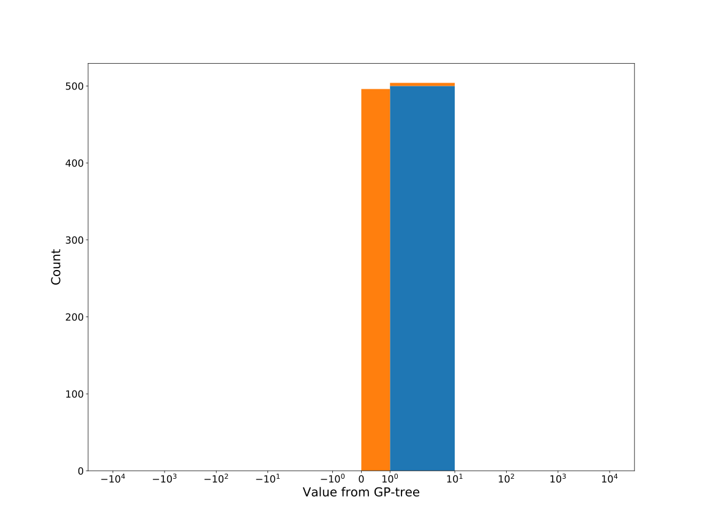

# Dataset: digen10_8322(SXLFGKDR_0.156_0.799_8322)

|    | classifier                 |   auroc |    auprc |   f1_score |   rank_auroc |   rank_auprc |   rank_f1 |
|---:|:---------------------------|--------:|---------:|-----------:|-------------:|-------------:|----------:|
|  0 | GradientBoostingClassifier |  0.8566 | 0.852253 |   0.740741 |            5 |            5 |         5 |
|  1 | LGBMClassifier             |  0.8935 | 0.898174 |   0.787565 |            3 |            3 |         3 |
|  2 | XGBClassifier              |  0.9163 | 0.927558 |   0.827225 |            2 |            2 |         2 |
|  3 | DecisionTreeClassifier     |  0.5679 | 0.62553  |   0.564103 |            7 |            7 |         7 |
|  4 | LogisticRegression         |  0.5209 | 0.507605 |   0.489583 |            8 |            8 |         8 |
|  5 | KNeighborsClassifier       |  0.7892 | 0.789372 |   0.697917 |            6 |            6 |         6 |
|  6 | RandomForestClassifier     |  0.8737 | 0.881657 |   0.78392  |            4 |            4 |         4 |
|  7 | SVC                        |  0.9773 | 0.978749 |   0.945274 |            1 |            1 |         1 |


<details>
<summary>Parameters of tuned ML methods</summary>


```
GradientBoostingClassifier(learning_rate=0.20137906837592243, max_depth=8,
                           min_samples_leaf=57, n_iter_no_change=16,
                           random_state=8322, tol=1e-07,
                           validation_fraction=0.060000000000000005)
LGBMClassifier(deterministic=True, force_row_wise=True, max_depth=10,
               metric='binary_logloss', n_estimators=88, n_jobs=1,
               num_leaves=1024, objective='binary', random_state=8322)
XGBClassifier(alpha=0.02363561061174875, base_score=0.5, booster='dart',
              colsample_bylevel=1, colsample_bynode=1, colsample_bytree=1,
              eta=0.2048495271939533, eval_metric='logloss', gamma=0.4,
              gpu_id=-1, importance_type='gain', interaction_constraints='',
              learning_rate=0.204849526, max_delta_step=0, max_depth=9,
              min_child_weight=1, missing=nan, monotone_constraints='()',
              n_estimators=68, n_jobs=1, nthread=1, num_parallel_tree=1,
              random_state=8322, reg_alpha=0.0236356109,
              reg_lambda=1.6014597716854524, scale_pos_weight=1, subsample=1,
              tree_method='exact', use_label_encoder=False,
              validate_parameters=1, ...)
DecisionTreeClassifier(max_depth=10, min_samples_split=8, random_state=8322)
LogisticRegression(C=0.00014743051505560541, random_state=8322,
                   solver='newton-cg')
KNeighborsClassifier(n_neighbors=36, p=3)
RandomForestClassifier(criterion='entropy', max_depth=10, max_features=None,
                       min_samples_leaf=3, min_samples_split=10,
                       n_estimators=91, random_state=8322)
SVC(C=92.51616172779029, class_weight='balanced', coef0=5.9, degree=2,
    gamma='auto', kernel='poly', probability=True, random_state=8322,
    tol=2.1022230038533015e-05)
```

</details>

<details>
<summary>Expected performance (200 experiments per ML method)</summary>

</details>

<details>
<summary>Receiver Operating Characteristics (ROC) curve</summary>

</details>

<details>
<summary>Precision-Recall Curve</summary>

</details>

<details>
<summary>Model (GP-tree)</summary>

</details>

<details>
<summary>Endpoint histogram</summary>

</details>

<details>
<summary>Feature correlations</summary>

</details>

[**Pandas Profiling Report**](https://github.io/athril/digen-test/docs/profile/digen10_8322.html)