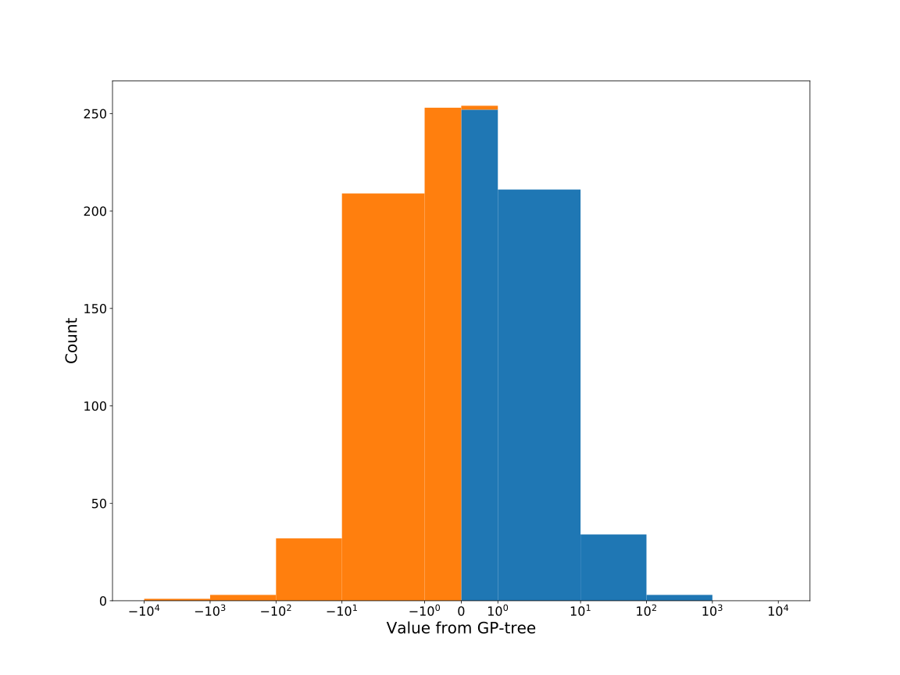

# Dataset: digen11_7270 (X-L-GFDSKR_0.184_0.888_7270)

|    | classifier                 |   auroc |    auprc |   f1_score |   rank_auroc |   rank_auprc |   rank_f1 |
|---:|:---------------------------|--------:|---------:|-----------:|-------------:|-------------:|----------:|
|  0 | GradientBoostingClassifier |  0.9999 | 0.9999   |   0.99     |            1 |            1 |         2 |
|  1 | LGBMClassifier             |  0.9999 | 0.9999   |   0.990099 |            1 |            1 |         2 |
|  2 | XGBClassifier              |  1      | 1        |   1        |            1 |            1 |         1 |
|  3 | DecisionTreeClassifier     |  0.994  | 0.993855 |   0.984925 |            5 |            5 |         4 |
|  4 | LogisticRegression         |  0.435  | 0.436394 |   0.387755 |            8 |            8 |         8 |
|  5 | KNeighborsClassifier       |  0.8332 | 0.827385 |   0.76555  |            7 |            7 |         6 |
|  6 | RandomForestClassifier     |  0.9967 | 0.997466 |   0.984925 |            4 |            4 |         4 |
|  7 | SVC                        |  0.8447 | 0.854436 |   0.730159 |            6 |            6 |         7 |


<details>
<summary>Parameters of tuned ML methods (200 optimizations)</summary>


```
GradientBoostingClassifier(learning_rate=0.13529091800043855, max_depth=5,
                           min_samples_leaf=5, n_iter_no_change=11,
                           random_state=7270, tol=1e-07,
                           validation_fraction=0.060000000000000005)
LGBMClassifier(deterministic=True, force_row_wise=True, max_depth=6,
               metric='binary_logloss', n_estimators=65, n_jobs=1,
               num_leaves=203, objective='binary', random_state=7270)
XGBClassifier(alpha=1.5478314684842867e-05, base_score=0.5, booster='dart',
              colsample_bylevel=1, colsample_bynode=1, colsample_bytree=1,
              eta=0.010690873400215734, eval_metric='logloss',
              gamma=0.30000000000000004, gpu_id=-1, importance_type='gain',
              interaction_constraints='', learning_rate=0.0106908735,
              max_delta_step=0, max_depth=6, min_child_weight=1, missing=nan,
              monotone_constraints='()', n_estimators=35, n_jobs=1, nthread=1,
              num_parallel_tree=1, random_state=7270, reg_alpha=1.54783156e-05,
              reg_lambda=11.510310979899907, scale_pos_weight=1, subsample=1,
              tree_method='exact', use_label_encoder=False,
              validate_parameters=1, ...)
DecisionTreeClassifier(max_depth=8, min_samples_leaf=10, min_samples_split=20,
                       random_state=7270)
LogisticRegression(C=0.0010270431978272176, random_state=7270,
                   solver='newton-cg')
KNeighborsClassifier(n_neighbors=36, p=1, weights='distance')
RandomForestClassifier(max_depth=10, max_features=None, min_samples_split=9,
                       n_estimators=69, random_state=7270)
SVC(C=175.68099360339752, class_weight='balanced', coef0=3.1, kernel='poly',
    probability=True, random_state=7270, tol=1.631233137357333e-05)
```

</details>

<details>
<summary>Expected performance (100 optimizations starting from different random seed)</summary>

</details>

<details>
<summary>Receiver Operating Characteristics (ROC) curve</summary>

</details>

<details>
<summary>Precision-Recall Curve</summary>

</details>

<details>
<summary>Model (GP-tree)</summary>

</details>

<details>
<summary>Endpoint histogram</summary>

</details>

<details>
<summary>Feature correlations</summary>

</details>

[**Pandas Profiling Report**](https://epistasislab.github.io/digen/profile/digen11_7270.html)