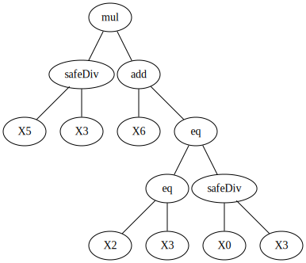
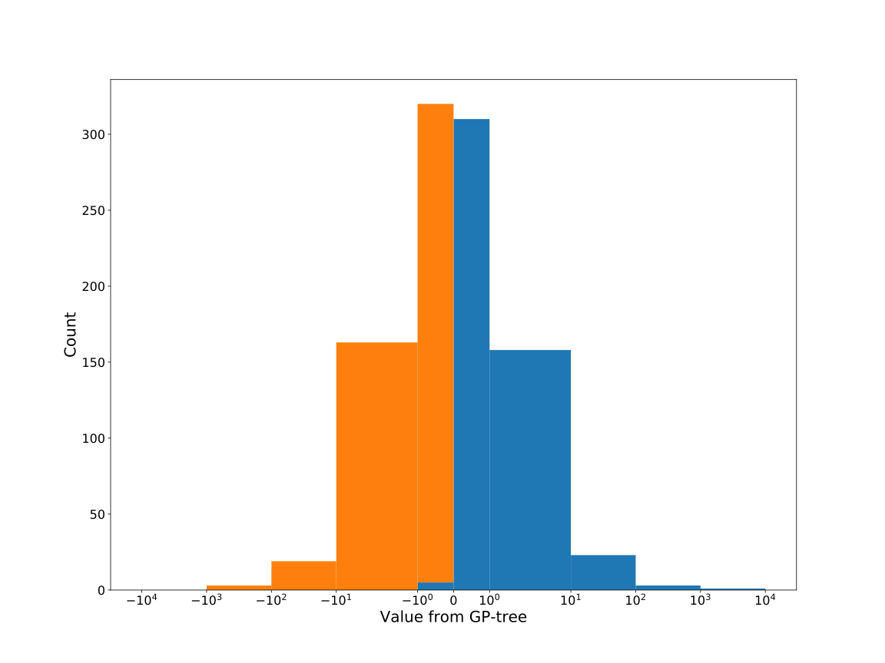

# Dataset: digen12_8322 (XGLFDSKR_0.173_0.831_8322)

|    | classifier                 |   auroc |    auprc |   f1_score |   rank_auroc |   rank_auprc |   rank_f1 |
|---:|:---------------------------|--------:|---------:|-----------:|-------------:|-------------:|----------:|
|  0 | GradientBoostingClassifier | 0.9861  | 0.985807 |   0.97     |            2 |            2 |         2 |
|  1 | LGBMClassifier             | 0.9852  | 0.982393 |   0.956522 |            3 |            3 |         3 |
|  2 | XGBClassifier              | 0.9998  | 0.999803 |   0.990099 |            1 |            1 |         1 |
|  3 | DecisionTreeClassifier     | 0.88785 | 0.892791 |   0.795918 |            5 |            5 |         5 |
|  4 | LogisticRegression         | 0.5     | 0.75     |   0        |            8 |            6 |         8 |
|  5 | KNeighborsClassifier       | 0.6425  | 0.622936 |   0.592965 |            7 |            8 |         7 |
|  6 | RandomForestClassifier     | 0.9079  | 0.897891 |   0.857143 |            4 |            4 |         4 |
|  7 | SVC                        | 0.7371  | 0.735088 |   0.659898 |            6 |            7 |         6 |


<details>
<summary>Parameters of tuned ML methods (200 optimizations)</summary>


```
GradientBoostingClassifier(learning_rate=0.6399751630633738, loss='exponential',
                           max_depth=5, min_samples_leaf=77,
                           n_iter_no_change=17, random_state=8322, tol=1e-07,
                           validation_fraction=0.04)
LGBMClassifier(deterministic=True, force_row_wise=True, max_depth=9,
               metric='binary_logloss', n_jobs=1, num_leaves=512,
               objective='binary', random_state=8322)
XGBClassifier(alpha=2.15936113416058, base_score=0.5, booster='dart',
              colsample_bylevel=1, colsample_bynode=1, colsample_bytree=1,
              eta=0.144910056796475, eval_metric='logloss', gamma=0.0,
              gpu_id=-1, importance_type='gain', interaction_constraints='',
              learning_rate=0.144910052, max_delta_step=0, max_depth=7,
              min_child_weight=1, missing=nan, monotone_constraints='()',
              n_estimators=84, n_jobs=1, nthread=1, num_parallel_tree=1,
              random_state=8322, reg_alpha=2.15936112,
              reg_lambda=5.51097041049789, scale_pos_weight=1, subsample=1,
              tree_method='exact', use_label_encoder=False,
              validate_parameters=1, ...)
DecisionTreeClassifier(max_depth=10, min_samples_leaf=15, min_samples_split=10,
                       random_state=8322)
LogisticRegression(C=0.03161699899136926, penalty='l1', random_state=8322,
                   solver='liblinear')
KNeighborsClassifier(metric='euclidean', n_neighbors=6, weights='distance')
RandomForestClassifier(max_depth=10, max_features=None, min_samples_leaf=3,
                       min_samples_split=9, n_estimators=78, random_state=8322)
SVC(C=0.48750778505294934, class_weight='balanced', coef0=9.600000000000001,
    degree=4, gamma='auto', kernel='poly', probability=True, random_state=8322,
    tol=0.008585603148537443)
```

</details>

<details>
<summary>Expected performance (100 optimizations starting from different random seed)</summary>

</details>

<details>
<summary>Receiver Operating Characteristics (ROC) curve</summary>

</details>

<details>
<summary>Precision-Recall Curve</summary>

</details>

<details>
<summary>Model (GP-tree)</summary>

</details>

<details>
<summary>Endpoint histogram</summary>

</details>

<details>
<summary>Feature correlations</summary>

</details>

[**Pandas Profiling Report**](https://epistasislab.github.io/digen/profile/digen12_8322.html)