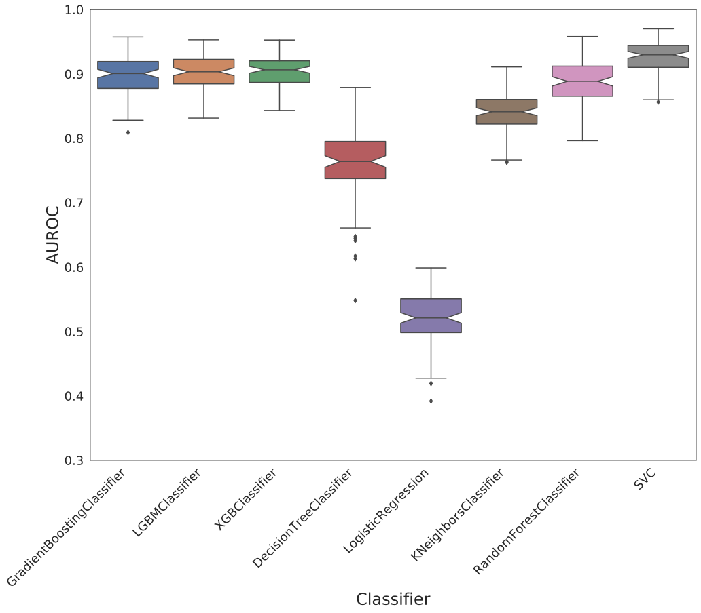
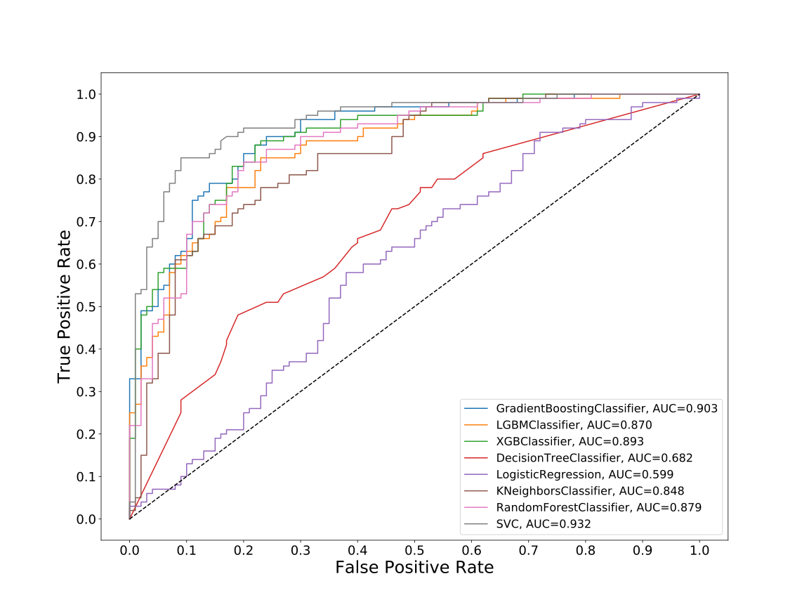
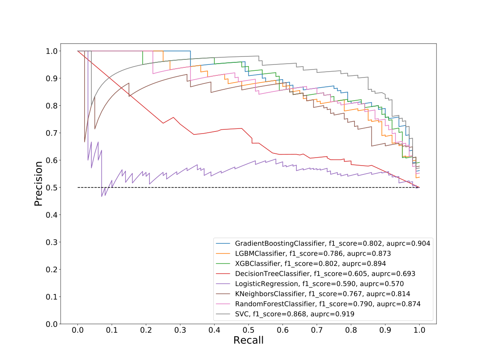
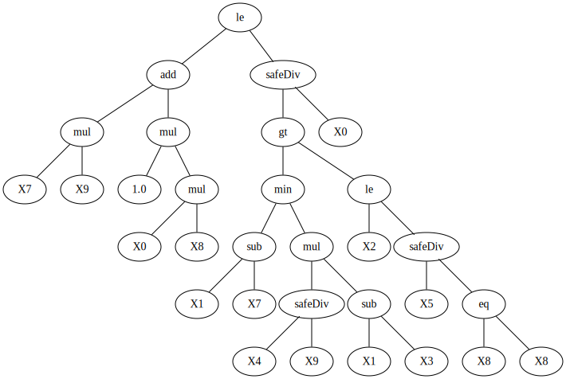
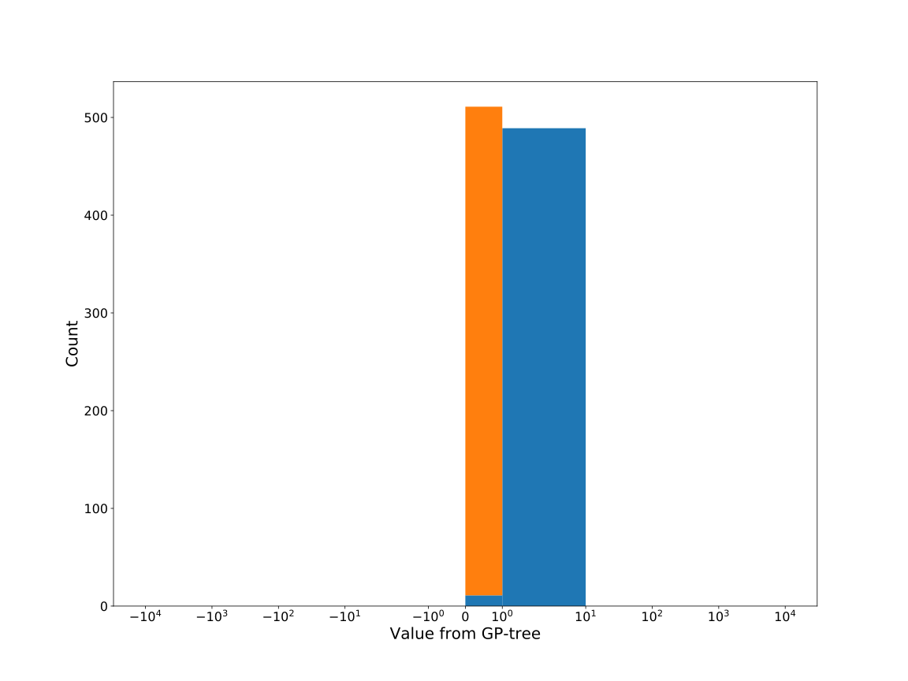
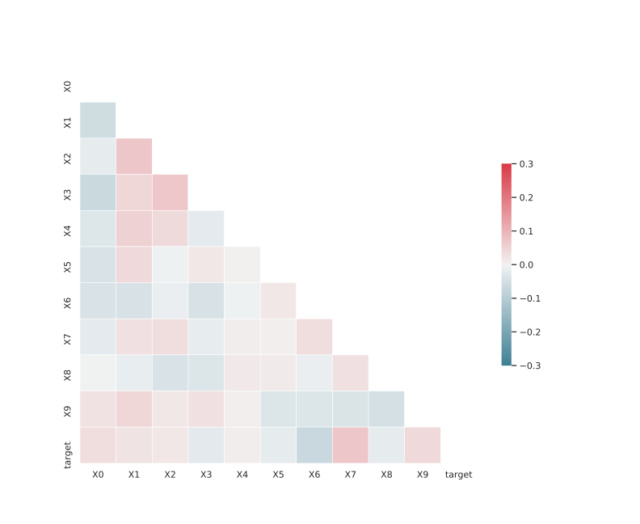

# Dataset: digen13_769 (SGXFLKDR_0.111_0.826_769)

|    | classifier                 |   auroc |    auprc |   f1_score |   rank_auroc |   rank_auprc |   rank_f1 |
|---:|:---------------------------|--------:|---------:|-----------:|-------------:|-------------:|----------:|
|  0 | GradientBoostingClassifier | 0.9033  | 0.904132 |   0.80203  |            2 |            2 |         2 |
|  1 | LGBMClassifier             | 0.8705  | 0.872581 |   0.78607  |            5 |            5 |         5 |
|  2 | XGBClassifier              | 0.8928  | 0.893951 |   0.80203  |            3 |            3 |         2 |
|  3 | DecisionTreeClassifier     | 0.6816  | 0.692922 |   0.605128 |            7 |            7 |         7 |
|  4 | LogisticRegression         | 0.5988  | 0.570482 |   0.59     |            8 |            8 |         8 |
|  5 | KNeighborsClassifier       | 0.8479  | 0.814036 |   0.76699  |            6 |            6 |         6 |
|  6 | RandomForestClassifier     | 0.8788  | 0.874088 |   0.789744 |            4 |            4 |         4 |
|  7 | SVC                        | 0.93185 | 0.919262 |   0.868293 |            1 |            1 |         1 |


<details>
<summary>Parameters of tuned ML methods (200 optimizations)</summary>


```
GradientBoostingClassifier(learning_rate=0.22152392847029245, max_depth=6,
                           min_samples_leaf=74, n_iter_no_change=10,
                           random_state=769, tol=1e-07,
                           validation_fraction=0.05)
LGBMClassifier(deterministic=True, force_row_wise=True, max_depth=9,
               metric='binary_logloss', n_estimators=94, n_jobs=1,
               num_leaves=512, objective='binary', random_state=769)
XGBClassifier(alpha=0.019976786631459704, base_score=0.5, booster='gbtree',
              colsample_bylevel=1, colsample_bynode=1, colsample_bytree=1,
              eta=0.40371597543188886, eval_metric='logloss', gamma=0.2,
              gpu_id=-1, importance_type='gain', interaction_constraints='',
              learning_rate=0.403715968, max_delta_step=0, max_depth=5,
              min_child_weight=1, missing=nan, monotone_constraints='()',
              n_estimators=78, n_jobs=1, nthread=1, num_parallel_tree=1,
              random_state=769, reg_alpha=0.0199767873,
              reg_lambda=17.638700763610817, scale_pos_weight=1, subsample=1,
              tree_method='exact', use_label_encoder=False,
              validate_parameters=1, ...)
DecisionTreeClassifier(max_depth=10, min_samples_leaf=8, min_samples_split=12,
                       random_state=769)
LogisticRegression(C=4.4654098334081915, random_state=769, solver='saga')
KNeighborsClassifier(n_neighbors=50, p=1, weights='distance')
RandomForestClassifier(max_depth=9, max_features=None, min_samples_leaf=5,
                       min_samples_split=6, n_estimators=98, random_state=769)
SVC(C=99227.20183788003, coef0=3.5, degree=2, gamma='auto', kernel='poly',
    probability=True, random_state=769, tol=1.1316145917208109e-05)
```

</details>

<details>
<summary>Expected performance (100 optimizations starting from different random seed)</summary>

</details>

<details>
<summary>Receiver Operating Characteristics (ROC) curve</summary>

</details>

<details>
<summary>Precision-Recall Curve</summary>

</details>

<details>
<summary>Model (GP-tree)</summary>

</details>

<details>
<summary>Endpoint histogram</summary>

</details>

<details>
<summary>Feature correlations</summary>

</details>

[**Pandas Profiling Report**](https://epistasislab.github.io/digen/profile/digen13_769.html)