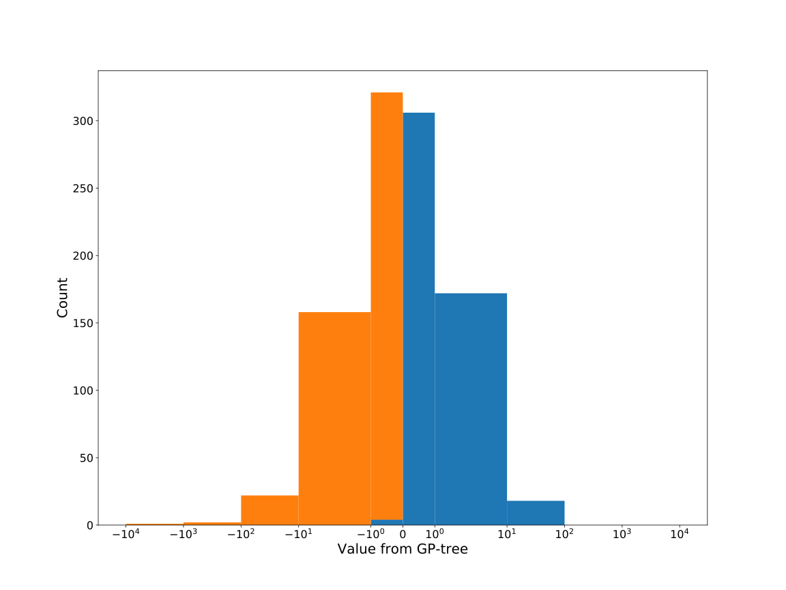

# Dataset: digen14
**Random seed: 769**<br/>
Order of the methods: XGSLFKRD<br/>
Mean performance: 0.734<br/>
Standard deviation: 0.185<br/>


|    | classifier                 |   auroc |    auprc |   f1_score |   rank_auroc |   rank_auprc |   rank_f1 |
|---:|:---------------------------|--------:|---------:|-----------:|-------------:|-------------:|----------:|
|  0 | GradientBoostingClassifier |  0.9943 | 0.99489  |   0.964467 |            2 |            2 |         2 |
|  1 | LGBMClassifier             |  0.7318 | 0.739254 |   0.663415 |            4 |            4 |         4 |
|  2 | XGBClassifier              |  0.9988 | 0.998811 |   0.980198 |            1 |            1 |         1 |
|  3 | DecisionTreeClassifier     |  0.5111 | 0.537892 |   0.60241  |            8 |            7 |         6 |
|  4 | LogisticRegression         |  0.5292 | 0.522781 |   0.52356  |            7 |            8 |         8 |
|  5 | KNeighborsClassifier       |  0.5965 | 0.608713 |   0.575758 |            6 |            5 |         7 |
|  6 | RandomForestClassifier     |  0.6424 | 0.606046 |   0.621359 |            5 |            6 |         5 |
|  7 | SVC                        |  0.8663 | 0.860559 |   0.762376 |            3 |            3 |         3 |


<details>
<summary>Parameters of tuned ML methods (based on 200 optimizations started from seed 769)</summary>


```
GradientBoostingClassifier(learning_rate=0.7303167487125685, max_depth=10,
                           min_samples_leaf=62, n_iter_no_change=20,
                           random_state=769, tol=1e-07,
                           validation_fraction=0.01)
LGBMClassifier(deterministic=True, force_row_wise=True, max_depth=9,
               metric='binary_logloss', n_jobs=1, num_leaves=512,
               objective='binary', random_state=769)
XGBClassifier(alpha=0.14445975205523132, base_score=0.5, booster='dart',
              colsample_bylevel=1, colsample_bynode=1, colsample_bytree=1,
              eta=0.9916515137148832, eval_metric='logloss', gamma=0.0,
              gpu_id=-1, importance_type='gain', interaction_constraints='',
              learning_rate=0.991651535, max_delta_step=0, max_depth=6,
              min_child_weight=1, missing=nan, monotone_constraints='()',
              n_estimators=96, n_jobs=1, nthread=1, num_parallel_tree=1,
              random_state=769, reg_alpha=0.144459754,
              reg_lambda=28.685324135942917, scale_pos_weight=1, subsample=1,
              tree_method='exact', use_label_encoder=False,
              validate_parameters=1, ...)
DecisionTreeClassifier(criterion='entropy', max_depth=9, min_samples_leaf=7,
                       min_samples_split=20, random_state=769)
LogisticRegression(C=4.4654098334081915, random_state=769, solver='saga')
KNeighborsClassifier(n_neighbors=8, p=1, weights='distance')
RandomForestClassifier(max_depth=10, max_features=None, min_samples_leaf=3,
                       min_samples_split=9, n_estimators=74, random_state=769)
SVC(C=1951.087099951524, class_weight='balanced', kernel='poly',
    probability=True, random_state=769, tol=2.7528221927025352e-05)
```

</details>

<details>
<summary>Expected performance (based on 100 runs, each with 100 optimizations started from a different random seed)</summary>

</details>

<details>
<summary>Receiver Operating Characteristics (ROC) curve</summary>

</details>

<details>
<summary>Precision-Recall Curve</summary>

</details>

<details>
<summary>Model (GP-tree)</summary>

</details>

<details>
<summary>Endpoint histogram</summary>

</details>

<details>
<summary>Feature correlations</summary>

</details>

[**Pandas Profiling Report**](https://epistasislab.github.io/digen/profile/digen14_769.html)