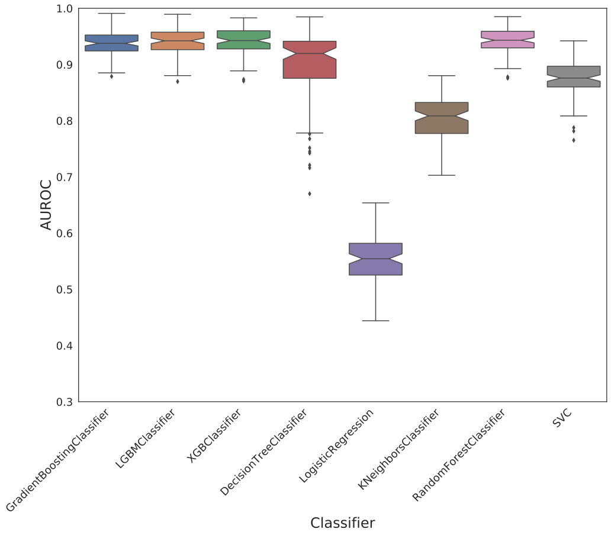
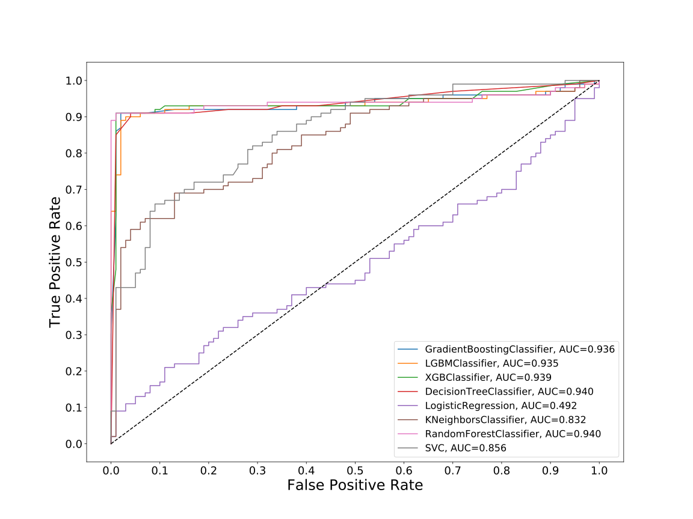
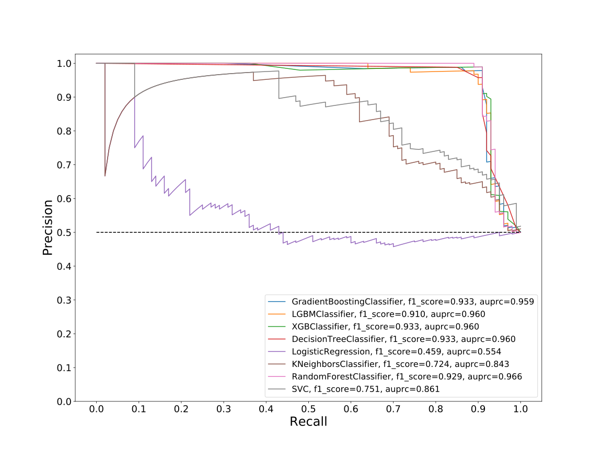
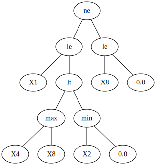
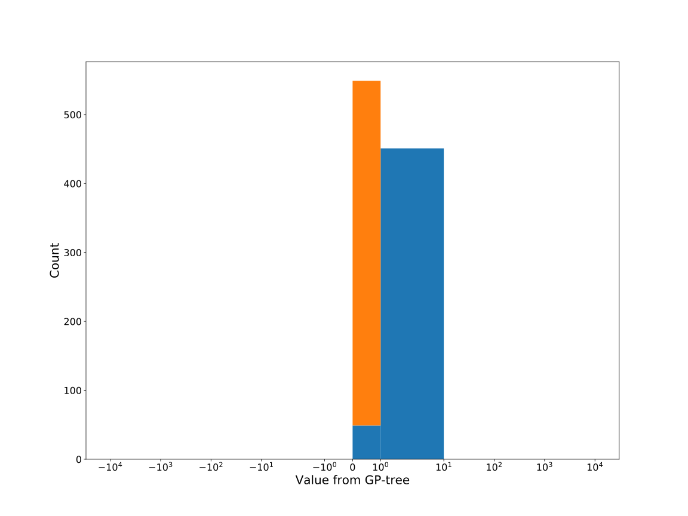
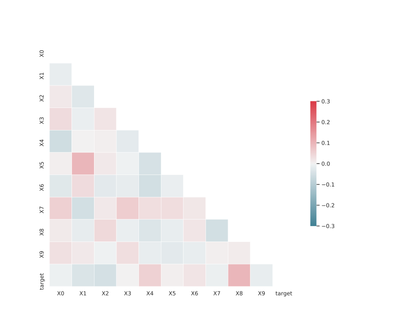

# Dataset: digen15_5311(F-DXGLSKR_0.144_0.859_5311)

|    | classifier                 |   auroc |    auprc |   f1_score |   rank_auroc |   rank_auprc |   rank_f1 |
|---:|:---------------------------|--------:|---------:|-----------:|-------------:|-------------:|----------:|
|  0 | GradientBoostingClassifier | 0.936   | 0.95873  |   0.933333 |            4 |            5 |         1 |
|  1 | LGBMClassifier             | 0.9351  | 0.959709 |   0.91     |            5 |            2 |         5 |
|  2 | XGBClassifier              | 0.93905 | 0.959555 |   0.933333 |            3 |            2 |         1 |
|  3 | DecisionTreeClassifier     | 0.9401  | 0.960198 |   0.933333 |            1 |            2 |         1 |
|  4 | LogisticRegression         | 0.4916  | 0.553954 |   0.459184 |            8 |            8 |         8 |
|  5 | KNeighborsClassifier       | 0.8322  | 0.84301  |   0.723618 |            7 |            7 |         7 |
|  6 | RandomForestClassifier     | 0.9402  | 0.965509 |   0.928571 |            1 |            1 |         4 |
|  7 | SVC                        | 0.8559  | 0.860697 |   0.75122  |            6 |            6 |         6 |


<details>
<summary>Parameters of tuned ML methods</summary>


```
GradientBoostingClassifier(learning_rate=0.012795393239714938, max_depth=7,
                           min_samples_leaf=13, n_iter_no_change=15,
                           random_state=5311, tol=1e-07,
                           validation_fraction=0.02)
LGBMClassifier(deterministic=True, force_row_wise=True, max_depth=10,
               metric='binary_logloss', n_estimators=26, n_jobs=1,
               num_leaves=1024, objective='binary', random_state=5311)
XGBClassifier(alpha=3.1445754394158945, base_score=0.5, booster='dart',
              colsample_bylevel=1, colsample_bynode=1, colsample_bytree=1,
              eta=0.016244156671615197, eval_metric='logloss',
              gamma=0.30000000000000004, gpu_id=-1, importance_type='gain',
              interaction_constraints='', learning_rate=0.0162441563,
              max_delta_step=0, max_depth=9, min_child_weight=1, missing=nan,
              monotone_constraints='()', n_estimators=70, n_jobs=1, nthread=1,
              num_parallel_tree=1, random_state=5311, reg_alpha=3.14457536,
              reg_lambda=0.15921986165727275, scale_pos_weight=1, subsample=1,
              tree_method='exact', use_label_encoder=False,
              validate_parameters=1, ...)
DecisionTreeClassifier(criterion='entropy', max_depth=5, min_samples_leaf=13,
                       min_samples_split=5, random_state=5311)
LogisticRegression(C=0.0005942584036163929, random_state=5311)
KNeighborsClassifier(n_neighbors=42, p=1, weights='distance')
RandomForestClassifier(max_depth=9, max_features=None, min_samples_leaf=3,
                       min_samples_split=4, n_estimators=46, random_state=5311)
SVC(C=14338.661783663985, class_weight='balanced', coef0=7.4, degree=2,
    gamma='auto', kernel='poly', probability=True, random_state=5311,
    tol=0.0016089881738156541)
```

</details>

<details>
<summary>Expected performance (200 experiments per ML method)</summary>

</details>

<details>
<summary>Receiver Operating Characteristics (ROC) curve</summary>

</details>

<details>
<summary>Precision-Recall Curve</summary>

</details>

<details>
<summary>Model (GP-tree)</summary>

</details>

<details>
<summary>Endpoint histogram</summary>

</details>

<details>
<summary>Feature correlations</summary>

</details>

[**Pandas Profiling Report**](https://github.io/athril/digen-test/docs/profile/digen15_5311.html)