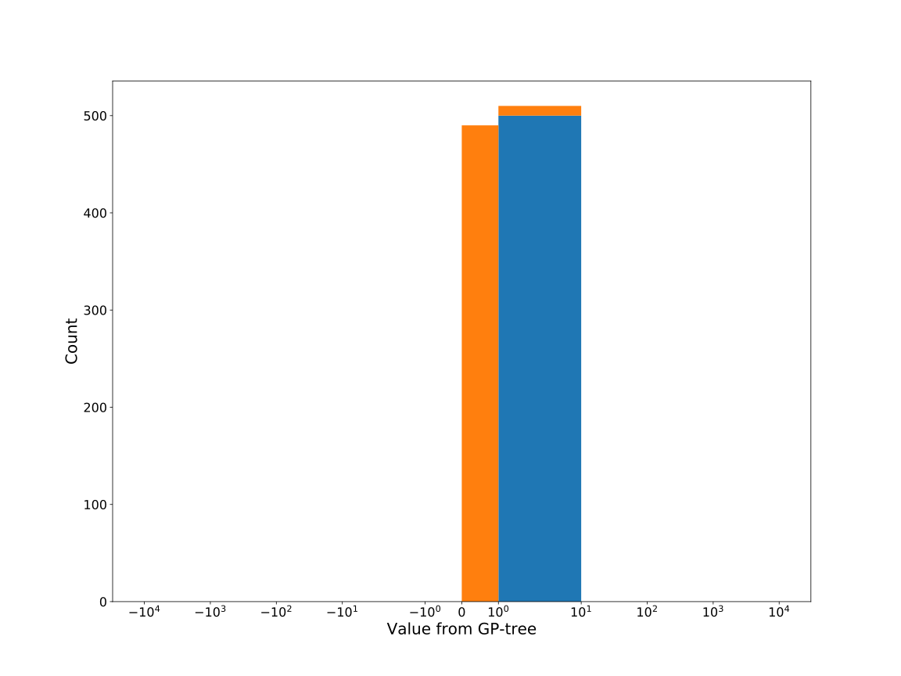

# Dataset: digen16
**Random seed: 5390**<br/>
Order of the methods: SGLXFKDR<br/>
Mean performance: 0.805<br/>
Standard deviation: 0.167<br/>


|    | classifier                 |   auroc |    auprc |   f1_score |   rank_auroc |   rank_auprc |   rank_f1 |
|---:|:---------------------------|--------:|---------:|-----------:|-------------:|-------------:|----------:|
|  0 | GradientBoostingClassifier | 0.9209  | 0.89689  |   0.839024 |            2 |            4 |         4 |
|  1 | LGBMClassifier             | 0.9142  | 0.910167 |   0.841584 |            3 |            2 |         2 |
|  2 | XGBClassifier              | 0.909   | 0.901054 |   0.839623 |            4 |            3 |         3 |
|  3 | DecisionTreeClassifier     | 0.52755 | 0.524872 |   0.608333 |            7 |            8 |         7 |
|  4 | LogisticRegression         | 0.526   | 0.57023  |   0.502513 |            8 |            7 |         8 |
|  5 | KNeighborsClassifier       | 0.8175  | 0.832899 |   0.728972 |            6 |            6 |         6 |
|  6 | RandomForestClassifier     | 0.8458  | 0.83745  |   0.75     |            5 |            5 |         5 |
|  7 | SVC                        | 0.97655 | 0.966264 |   0.926829 |            1 |            1 |         1 |


<details>
<summary>Parameters of tuned ML methods (based on 200 optimizations started from seed 5390)</summary>


```
GradientBoostingClassifier(learning_rate=0.1683696515814698, max_depth=8,
                           min_samples_leaf=46, n_iter_no_change=20,
                           random_state=5390, tol=1e-07,
                           validation_fraction=0.01)
LGBMClassifier(deterministic=True, force_row_wise=True, max_depth=8,
               metric='binary_logloss', n_estimators=99, n_jobs=1,
               num_leaves=256, objective='binary', random_state=5390)
XGBClassifier(alpha=0.025109943718970337, base_score=0.5, booster='gbtree',
              colsample_bylevel=1, colsample_bynode=1, colsample_bytree=1,
              eta=0.9451991963683873, eval_metric='logloss', gamma=0.0,
              gpu_id=-1, importance_type='gain', interaction_constraints='',
              learning_rate=0.945199192, max_delta_step=0, max_depth=10,
              min_child_weight=1, missing=nan, monotone_constraints='()',
              n_estimators=66, n_jobs=1, nthread=1, num_parallel_tree=1,
              random_state=5390, reg_alpha=0.025109943,
              reg_lambda=76.92764834057631, scale_pos_weight=1, subsample=1,
              tree_method='exact', use_label_encoder=False,
              validate_parameters=1, ...)
DecisionTreeClassifier(criterion='entropy', max_depth=4, min_samples_leaf=16,
                       min_samples_split=11, random_state=5390)
LogisticRegression(C=0.4749757679241272, penalty='l1', random_state=5390,
                   solver='liblinear')
KNeighborsClassifier(metric='euclidean', n_neighbors=81, weights='distance')
RandomForestClassifier(max_depth=10, max_features=None, min_samples_leaf=5,
                       min_samples_split=6, n_estimators=93, random_state=5390)
SVC(C=40058.39674867982, coef0=9.0, degree=2, kernel='poly', probability=True,
    random_state=5390, tol=0.0010824928178396794)
```

</details>

<details>
<summary>Expected performance (based on 100 runs, each with 100 optimizations started from a different random seed)</summary>

</details>

<details>
<summary>Receiver Operating Characteristics (ROC) curve</summary>

</details>

<details>
<summary>Precision-Recall Curve</summary>

</details>

<details>
<summary>Model (GP-tree)</summary>

</details>

<details>
<summary>Endpoint histogram</summary>

</details>

<details>
<summary>Feature correlations</summary>

</details>

[**Pandas Profiling Report**](https://epistasislab.github.io/digen/profile/digen16_5390.html)