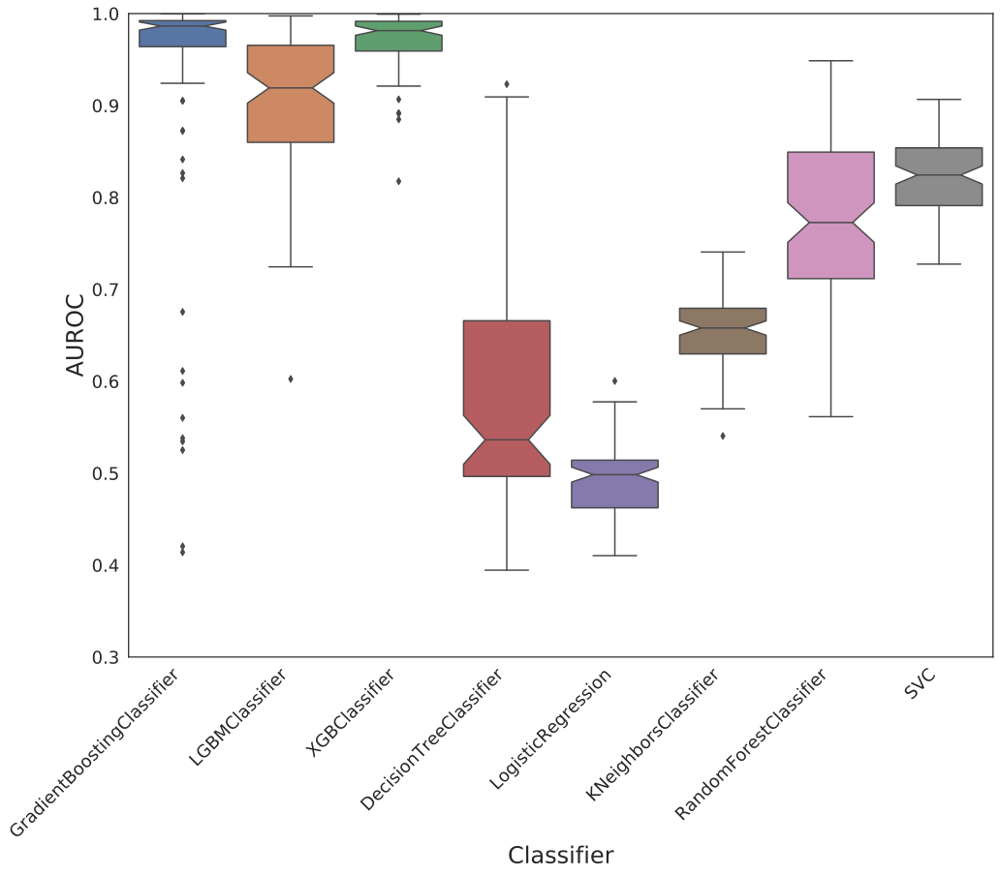
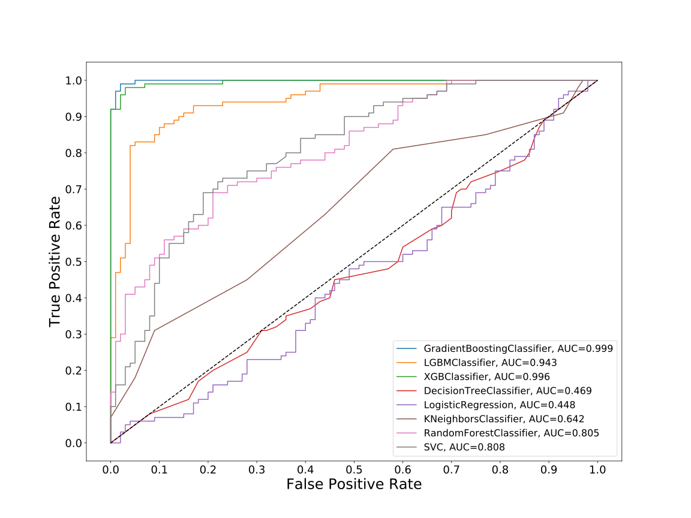
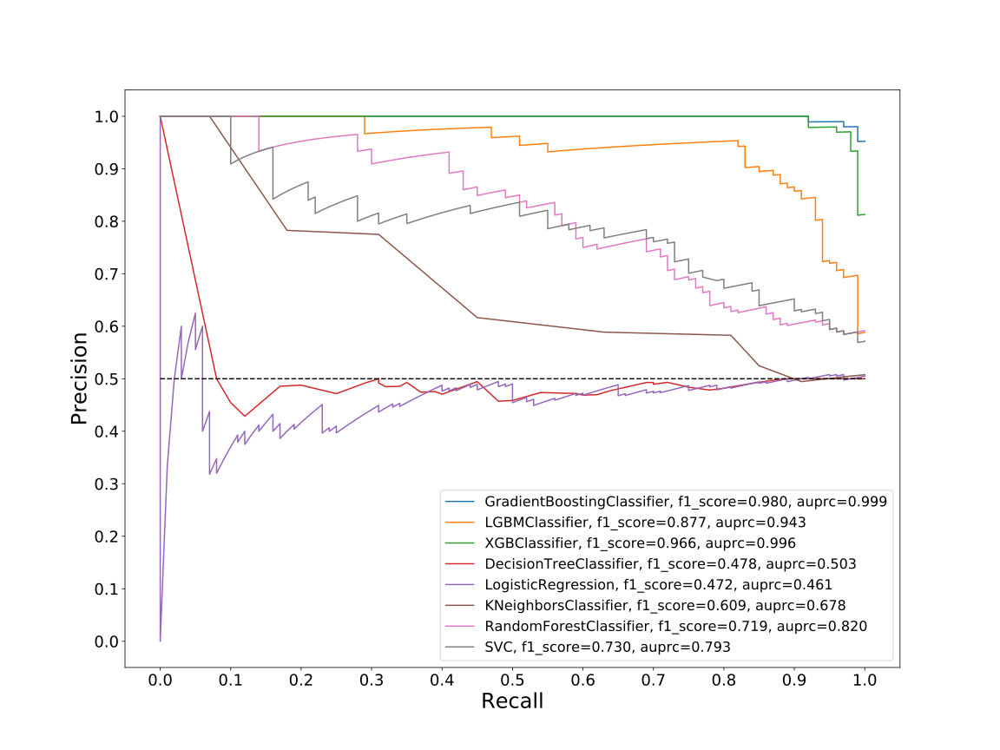
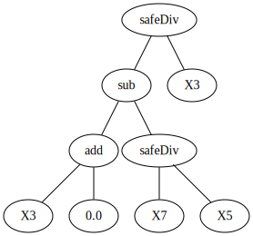
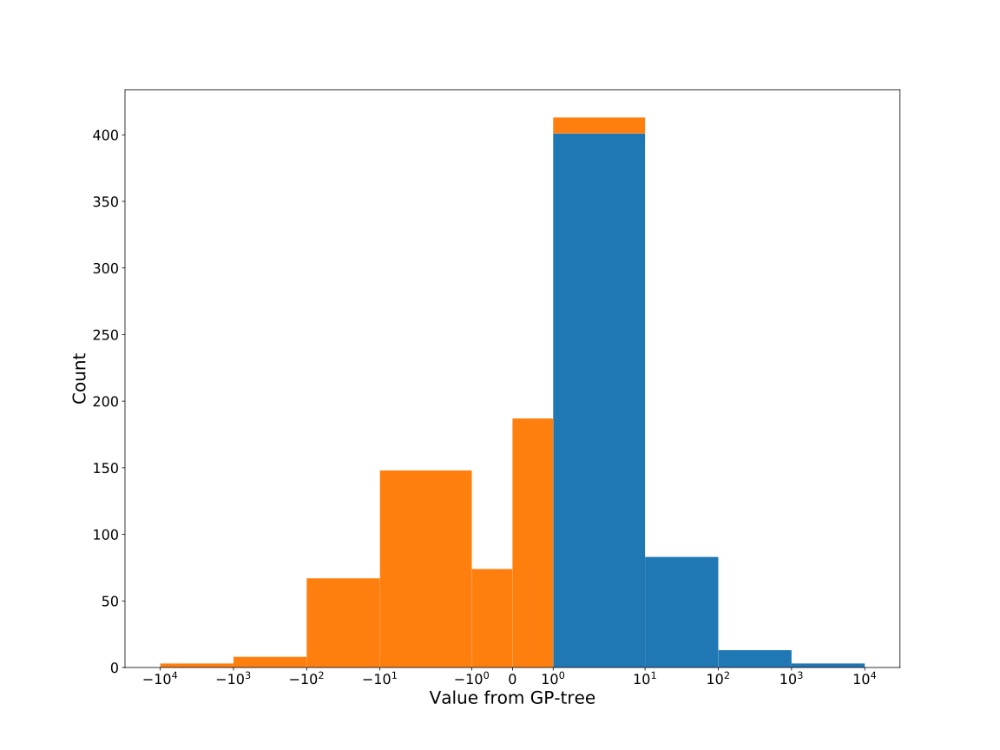
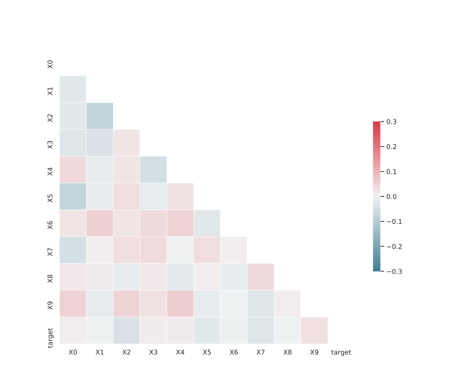

# Dataset: digen17_6949 (GXLSFKDR_0.208_0.764_6949)

|    | classifier                 |   auroc |    auprc |   f1_score |   rank_auroc |   rank_auprc |   rank_f1 |
|---:|:---------------------------|--------:|---------:|-----------:|-------------:|-------------:|----------:|
|  0 | GradientBoostingClassifier | 0.9986  | 0.998598 |   0.980198 |            1 |            1 |         1 |
|  1 | LGBMClassifier             | 0.9432  | 0.942946 |   0.876847 |            3 |            3 |         3 |
|  2 | XGBClassifier              | 0.9956  | 0.996025 |   0.965517 |            2 |            2 |         2 |
|  3 | DecisionTreeClassifier     | 0.46915 | 0.502777 |   0.478469 |            7 |            7 |         7 |
|  4 | LogisticRegression         | 0.4483  | 0.46066  |   0.471795 |            8 |            8 |         8 |
|  5 | KNeighborsClassifier       | 0.6422  | 0.67844  |   0.608696 |            6 |            6 |         6 |
|  6 | RandomForestClassifier     | 0.8053  | 0.819591 |   0.719212 |            5 |            4 |         5 |
|  7 | SVC                        | 0.8078  | 0.79321  |   0.729858 |            4 |            5 |         4 |


<details>
<summary>Parameters of tuned ML methods (200 optimizations)</summary>


```
GradientBoostingClassifier(learning_rate=0.8864210493080154, max_depth=9,
                           min_samples_leaf=83, n_iter_no_change=20,
                           random_state=6949, tol=1e-07,
                           validation_fraction=0.01)
LGBMClassifier(deterministic=True, force_row_wise=True, max_depth=9,
               metric='binary_logloss', n_jobs=1, num_leaves=512,
               objective='binary', random_state=6949)
XGBClassifier(alpha=0.6871304067402606, base_score=0.5, booster='dart',
              colsample_bylevel=1, colsample_bynode=1, colsample_bytree=1,
              eta=0.1992815380986075, eval_metric='logloss', gamma=0.4,
              gpu_id=-1, importance_type='gain', interaction_constraints='',
              learning_rate=0.199281543, max_delta_step=0, max_depth=7,
              min_child_weight=1, missing=nan, monotone_constraints='()',
              n_estimators=49, n_jobs=1, nthread=1, num_parallel_tree=1,
              random_state=6949, reg_alpha=0.687130392,
              reg_lambda=5.747305622303828, scale_pos_weight=1, subsample=1,
              tree_method='exact', use_label_encoder=False,
              validate_parameters=1, ...)
DecisionTreeClassifier(max_depth=9, min_samples_leaf=10, min_samples_split=14,
                       random_state=6949)
LogisticRegression(C=0.16829182858409353, penalty='l1', random_state=6949,
                   solver='liblinear')
KNeighborsClassifier(n_neighbors=21, p=1)
RandomForestClassifier(max_depth=10, max_features=None, min_samples_leaf=2,
                       min_samples_split=10, n_estimators=78,
                       random_state=6949)
SVC(C=99085.3720451237, class_weight='balanced', coef0=8.200000000000001,
    kernel='poly', probability=True, random_state=6949,
    tol=0.000277993011114004)
```

</details>

<details>
<summary>Expected performance (100 optimizations starting from different random seed)</summary>

</details>

<details>
<summary>Receiver Operating Characteristics (ROC) curve</summary>

</details>

<details>
<summary>Precision-Recall Curve</summary>

</details>

<details>
<summary>Model (GP-tree)</summary>

</details>

<details>
<summary>Endpoint histogram</summary>

</details>

<details>
<summary>Feature correlations</summary>

</details>

[**Pandas Profiling Report**](https://epistasislab.github.io/digen/profile/digen17_6949.html)