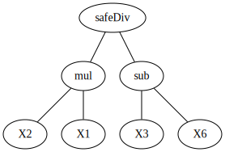

# Dataset: digen18_5578 (SXLKFGDR_0.153_0.652_5578)

|    | classifier                 |   auroc |    auprc |   f1_score |   rank_auroc |   rank_auprc |   rank_f1 |
|---:|:---------------------------|--------:|---------:|-----------:|-------------:|-------------:|----------:|
|  0 | GradientBoostingClassifier | 0.5361  | 0.531343 |   0.507614 |            6 |            6 |         7 |
|  1 | LGBMClassifier             | 0.7435  | 0.677888 |   0.682692 |            3 |            4 |         3 |
|  2 | XGBClassifier              | 0.785   | 0.77504  |   0.742857 |            2 |            2 |         2 |
|  3 | DecisionTreeClassifier     | 0.50625 | 0.515177 |   0.52     |            7 |            7 |         6 |
|  4 | LogisticRegression         | 0.412   | 0.43642  |   0.507042 |            8 |            8 |         8 |
|  5 | KNeighborsClassifier       | 0.6924  | 0.706663 |   0.642857 |            4 |            3 |         4 |
|  6 | RandomForestClassifier     | 0.6285  | 0.634745 |   0.599034 |            5 |            5 |         5 |
|  7 | SVC                        | 0.9105  | 0.921334 |   0.834171 |            1 |            1 |         1 |


<details>
<summary>Parameters of tuned ML methods (200 optimizations)</summary>


```
GradientBoostingClassifier(learning_rate=0.9792245916797673, loss='exponential',
                           max_depth=9, min_samples_leaf=36,
                           n_iter_no_change=13, random_state=5578, tol=1e-07,
                           validation_fraction=0.21000000000000002)
LGBMClassifier(deterministic=True, force_row_wise=True, max_depth=9,
               metric='binary_logloss', n_estimators=98, n_jobs=1,
               num_leaves=512, objective='binary', random_state=5578)
XGBClassifier(alpha=0.0007369685814067004, base_score=0.5, booster='dart',
              colsample_bylevel=1, colsample_bynode=1, colsample_bytree=1,
              eta=0.18292145519273761, eval_metric='logloss', gamma=0.1,
              gpu_id=-1, importance_type='gain', interaction_constraints='',
              learning_rate=0.182921454, max_delta_step=0, max_depth=9,
              min_child_weight=1, missing=nan, monotone_constraints='()',
              n_estimators=99, n_jobs=1, nthread=1, num_parallel_tree=1,
              random_state=5578, reg_alpha=0.000736968592,
              reg_lambda=13.649323130575775, scale_pos_weight=1, subsample=1,
              tree_method='exact', use_label_encoder=False,
              validate_parameters=1, ...)
DecisionTreeClassifier(max_depth=6, max_features='auto', min_samples_leaf=20,
                       min_samples_split=9, random_state=5578)
LogisticRegression(C=0.00025768832893226224, random_state=5578, solver='sag')
KNeighborsClassifier(metric='euclidean', n_neighbors=21, weights='distance')
RandomForestClassifier(max_depth=10, max_features=None, min_samples_split=5,
                       n_estimators=95, random_state=5578)
SVC(C=2630.3102710102316, class_weight='balanced', gamma='auto', kernel='poly',
    probability=True, random_state=5578, tol=0.00036126220267560747)
```

</details>

<details>
<summary>Expected performance (100 optimizations starting from different random seed)</summary>

</details>

<details>
<summary>Receiver Operating Characteristics (ROC) curve</summary>

</details>

<details>
<summary>Precision-Recall Curve</summary>

</details>

<details>
<summary>Model (GP-tree)</summary>

</details>

<details>
<summary>Endpoint histogram</summary>

</details>

<details>
<summary>Feature correlations</summary>

</details>

[**Pandas Profiling Report**](https://epistasislab.github.io/digen/profile/digen18_5578.html)