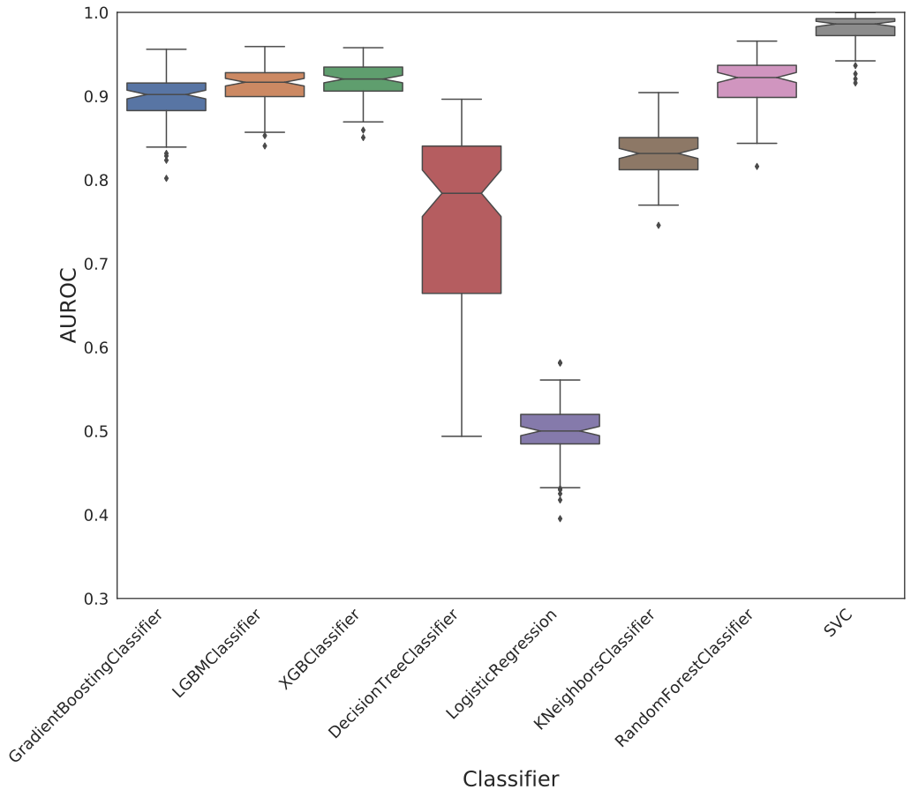
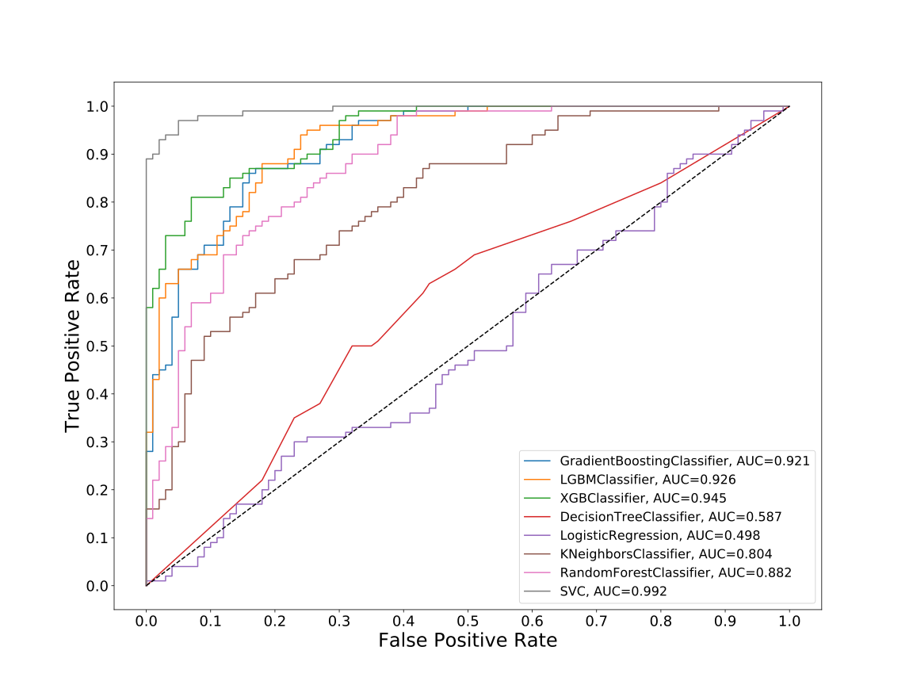
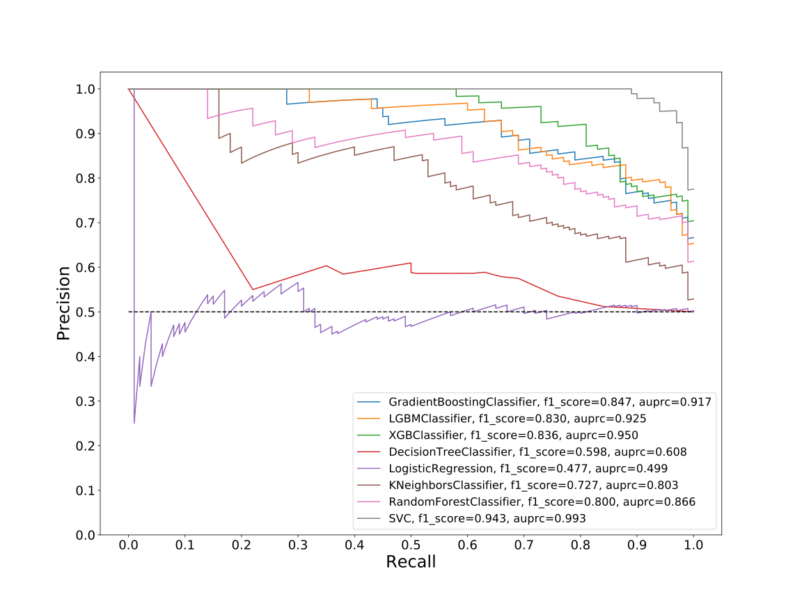
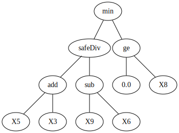
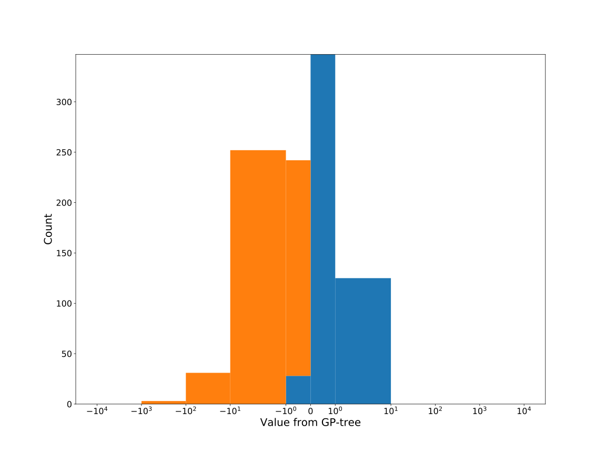
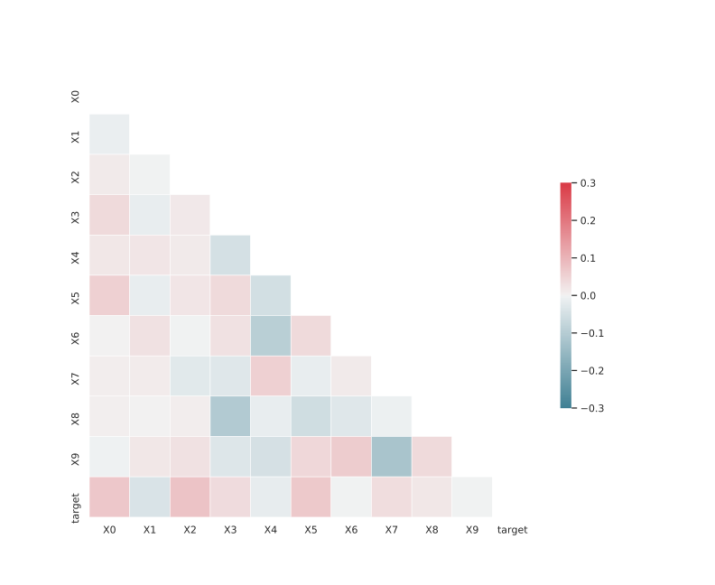

# Dataset: digen19_7270 (SXLGFKDR_0.169_0.819_7270)

|    | classifier                 |   auroc |    auprc |   f1_score |   rank_auroc |   rank_auprc |   rank_f1 |
|---:|:---------------------------|--------:|---------:|-----------:|-------------:|-------------:|----------:|
|  0 | GradientBoostingClassifier |  0.9206 | 0.917371 |   0.847291 |            4 |            4 |         2 |
|  1 | LGBMClassifier             |  0.926  | 0.925427 |   0.83     |            3 |            3 |         4 |
|  2 | XGBClassifier              |  0.945  | 0.949633 |   0.835681 |            2 |            2 |         3 |
|  3 | DecisionTreeClassifier     |  0.5869 | 0.607775 |   0.598039 |            7 |            7 |         7 |
|  4 | LogisticRegression         |  0.4982 | 0.498959 |   0.477157 |            8 |            8 |         8 |
|  5 | KNeighborsClassifier       |  0.8043 | 0.802607 |   0.727273 |            6 |            6 |         6 |
|  6 | RandomForestClassifier     |  0.8815 | 0.865965 |   0.8      |            5 |            5 |         5 |
|  7 | SVC                        |  0.9923 | 0.993107 |   0.943005 |            1 |            1 |         1 |


<details>
<summary>Parameters of tuned ML methods (200 optimizations)</summary>


```
GradientBoostingClassifier(learning_rate=0.1954178432539358, max_depth=10,
                           min_samples_leaf=36, n_iter_no_change=16,
                           random_state=7270, tol=1e-07,
                           validation_fraction=0.06999999999999999)
LGBMClassifier(deterministic=True, force_row_wise=True, max_depth=10,
               metric='binary_logloss', n_estimators=97, n_jobs=1,
               num_leaves=1024, objective='binary', random_state=7270)
XGBClassifier(alpha=0.7681275517219963, base_score=0.5, booster='gbtree',
              colsample_bylevel=1, colsample_bynode=1, colsample_bytree=1,
              eta=0.49429992589378896, eval_metric='logloss', gamma=0.1,
              gpu_id=-1, importance_type='gain', interaction_constraints='',
              learning_rate=0.494299918, max_delta_step=0, max_depth=9,
              min_child_weight=1, missing=nan, monotone_constraints='()',
              n_estimators=65, n_jobs=1, nthread=1, num_parallel_tree=1,
              random_state=7270, reg_alpha=0.768127561,
              reg_lambda=14.841695057921326, scale_pos_weight=1, subsample=1,
              tree_method='exact', use_label_encoder=False,
              validate_parameters=1, ...)
DecisionTreeClassifier(max_depth=10, min_samples_leaf=2, min_samples_split=5,
                       random_state=7270)
LogisticRegression(C=0.010496181877846494, random_state=7270)
KNeighborsClassifier(metric='euclidean', n_neighbors=22, weights='distance')
RandomForestClassifier(max_depth=10, max_features=None, min_samples_leaf=2,
                       min_samples_split=5, n_estimators=59, random_state=7270)
SVC(C=348.3667826204569, class_weight='balanced', coef0=4.4, degree=2,
    kernel='poly', probability=True, random_state=7270,
    tol=1.0992329808321105e-05)
```

</details>

<details>
<summary>Expected performance (100 optimizations starting from different random seed)</summary>

</details>

<details>
<summary>Receiver Operating Characteristics (ROC) curve</summary>

</details>

<details>
<summary>Precision-Recall Curve</summary>

</details>

<details>
<summary>Model (GP-tree)</summary>

</details>

<details>
<summary>Endpoint histogram</summary>

</details>

<details>
<summary>Feature correlations</summary>

</details>

[**Pandas Profiling Report**](https://epistasislab.github.io/digen/profile/digen19_7270.html)