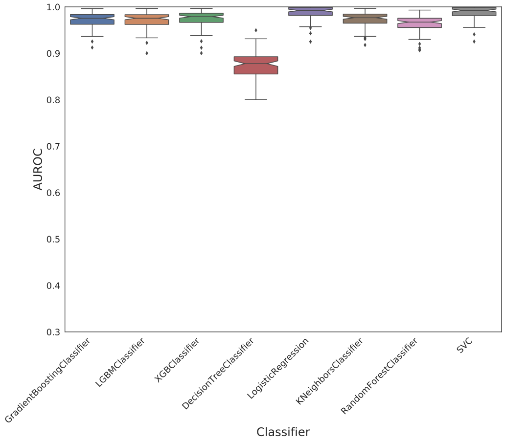
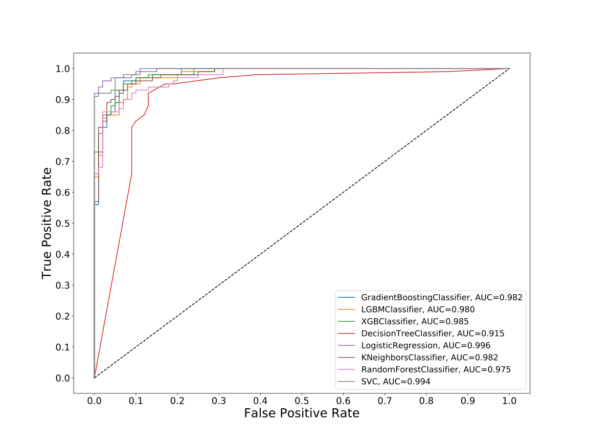
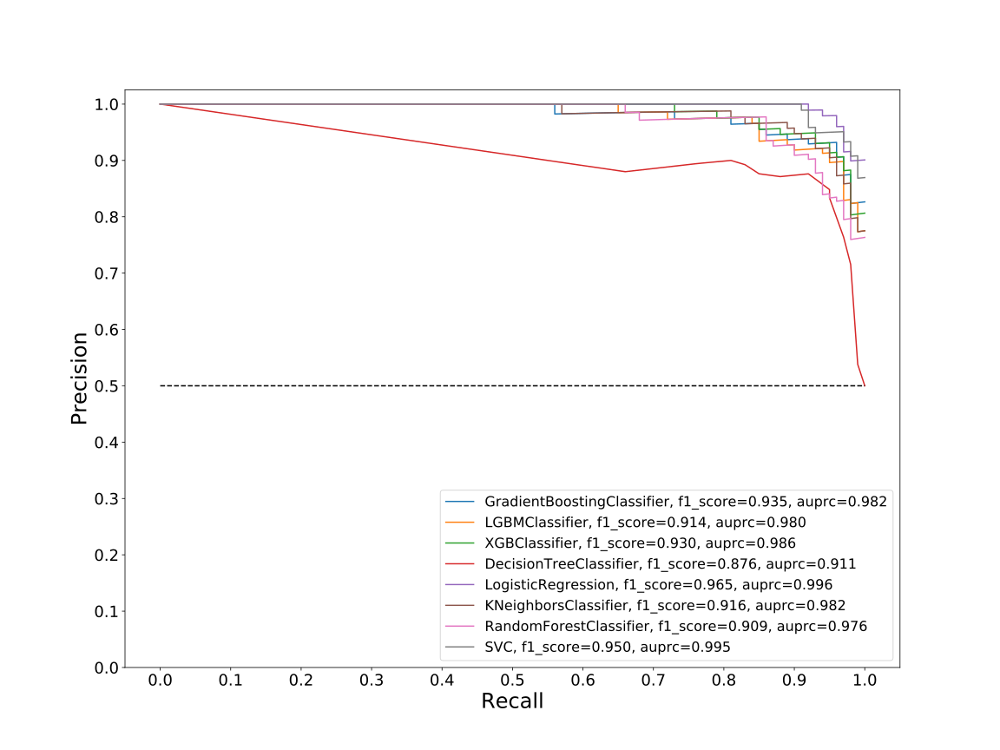
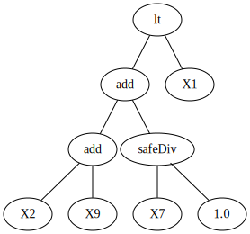
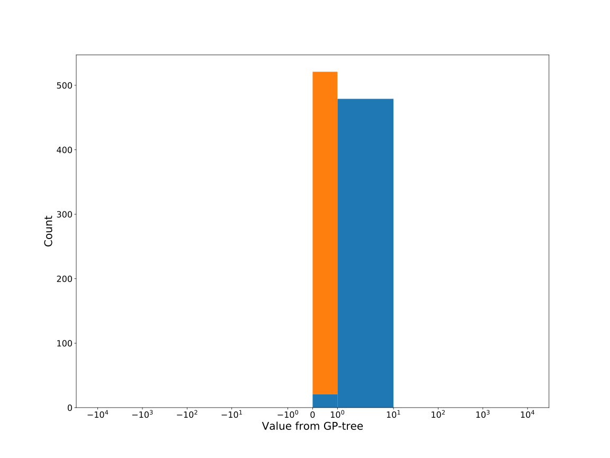
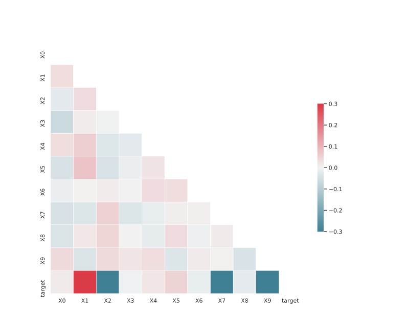

# Dataset: digen1
**Random seed: 6265**<br/>
Order of the methods: RSXG-KLFD<br/>
Mean performance: 0.976<br/>
Standard deviation: 0.024<br/>


|    | classifier                 |   auroc |    auprc |   f1_score |   rank_auroc |   rank_auprc |   rank_f1 |
|---:|:---------------------------|--------:|---------:|-----------:|-------------:|-------------:|----------:|
|  0 | GradientBoostingClassifier | 0.9824  | 0.981565 |   0.935323 |            4 |            4 |         3 |
|  1 | LGBMClassifier             | 0.9802  | 0.980494 |   0.913706 |            6 |            6 |         6 |
|  2 | XGBClassifier              | 0.9851  | 0.985581 |   0.93     |            3 |            3 |         4 |
|  3 | DecisionTreeClassifier     | 0.91545 | 0.911426 |   0.875622 |            8 |            8 |         8 |
|  4 | LogisticRegression         | 0.9959  | 0.996132 |   0.964824 |            1 |            1 |         1 |
|  5 | KNeighborsClassifier       | 0.9823  | 0.982387 |   0.915789 |            4 |            4 |         5 |
|  6 | RandomForestClassifier     | 0.975   | 0.976498 |   0.909091 |            7 |            7 |         7 |
|  7 | SVC                        | 0.9943  | 0.994575 |   0.95     |            2 |            2 |         2 |


<details>
<summary>Parameters of tuned ML methods (based on 200 optimizations started from seed 6265)</summary>


```
GradientBoostingClassifier(learning_rate=0.33642794878861393, max_depth=1,
                           min_samples_leaf=23, n_iter_no_change=18,
                           random_state=6265, tol=1e-07,
                           validation_fraction=0.12)
LGBMClassifier(deterministic=True, force_row_wise=True, max_depth=5,
               metric='binary_logloss', n_estimators=78, n_jobs=1,
               num_leaves=101, objective='binary', random_state=6265)
XGBClassifier(alpha=0.03408034336901315, base_score=0.5, booster='dart',
              colsample_bylevel=1, colsample_bynode=1, colsample_bytree=1,
              eta=0.37796530841926335, eval_metric='logloss',
              gamma=0.30000000000000004, gpu_id=-1, importance_type='gain',
              interaction_constraints='', learning_rate=0.377965301,
              max_delta_step=0, max_depth=1, min_child_weight=1, missing=nan,
              monotone_constraints='()', n_estimators=96, n_jobs=1, nthread=1,
              num_parallel_tree=1, random_state=6265, reg_alpha=0.0340803452,
              reg_lambda=1.1551980605520786, scale_pos_weight=1, subsample=1,
              tree_method='exact', use_label_encoder=False,
              validate_parameters=1, ...)
DecisionTreeClassifier(max_depth=6, min_samples_leaf=5, min_samples_split=10,
                       random_state=6265)
LogisticRegression(C=0.004222416729717084, random_state=6265, solver='saga')
KNeighborsClassifier(n_neighbors=87, p=5, weights='distance')
RandomForestClassifier(criterion='entropy', max_depth=7, max_features='log2',
                       min_samples_leaf=2, min_samples_split=9, n_estimators=90,
                       random_state=6265)
SVC(C=8500.923846513155, class_weight='balanced', coef0=7.2, degree=2,
    gamma='auto', kernel='linear', probability=True, random_state=6265,
    tol=0.003607100974918766)
```

</details>

<details>
<summary>Expected performance (based on 100 runs, each with 100 optimizations started from a different random seed)</summary>

</details>

<details>
<summary>Receiver Operating Characteristics (ROC) curve</summary>

</details>

<details>
<summary>Precision-Recall Curve</summary>

</details>

<details>
<summary>Model (GP-tree)</summary>

</details>

<details>
<summary>Endpoint histogram</summary>

</details>

<details>
<summary>Feature correlations</summary>

</details>

[**Pandas Profiling Report**](https://epistasislab.github.io/digen/profile/digen1_6265.html)