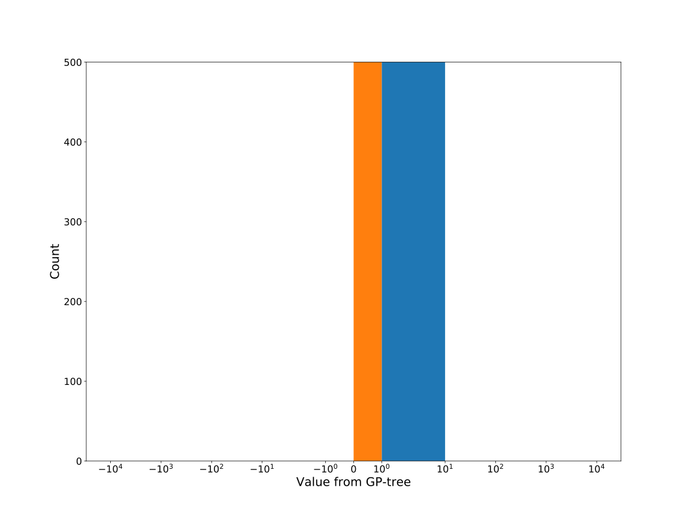

# Dataset: digen20
**Random seed: 5191**<br/>
Order of the methods: G-FLXDSKR<br/>
Mean performance: 0.892<br/>
Standard deviation: 0.144<br/>


|    | classifier                 |   auroc |    auprc |   f1_score |   rank_auroc |   rank_auprc |   rank_f1 |
|---:|:---------------------------|--------:|---------:|-----------:|-------------:|-------------:|----------:|
|  0 | GradientBoostingClassifier | 1       | 1        |   1        |            1 |            1 |         1 |
|  1 | LGBMClassifier             | 0.99695 | 0.997696 |   0.994975 |            3 |            3 |         2 |
|  2 | XGBClassifier              | 0.99175 | 0.995169 |   0.984925 |            4 |            4 |         3 |
|  3 | DecisionTreeClassifier     | 0.9849  | 0.989746 |   0.984925 |            5 |            5 |         3 |
|  4 | LogisticRegression         | 0.6038  | 0.589279 |   0.619048 |            8 |            8 |         8 |
|  5 | KNeighborsClassifier       | 0.7329  | 0.738629 |   0.675926 |            7 |            7 |         7 |
|  6 | RandomForestClassifier     | 0.9998  | 0.9998   |   0.984925 |            1 |            1 |         3 |
|  7 | SVC                        | 0.8298  | 0.846233 |   0.769231 |            6 |            6 |         6 |


<details>
<summary>Parameters of tuned ML methods (based on 200 optimizations started from seed 5191)</summary>


```
GradientBoostingClassifier(learning_rate=0.13455189615628219,
                           loss='exponential', max_depth=8, min_samples_leaf=9,
                           n_iter_no_change=10, random_state=5191, tol=1e-07,
                           validation_fraction=0.09)
LGBMClassifier(boosting_type='dart', deterministic=True, force_row_wise=True,
               max_depth=5, metric='binary_logloss', n_estimators=61, n_jobs=1,
               num_leaves=41, objective='binary', random_state=5191)
XGBClassifier(alpha=0.018158849643115944, base_score=0.5, booster='gbtree',
              colsample_bylevel=1, colsample_bynode=1, colsample_bytree=1,
              eta=5.620530542415265e-06, eval_metric='logloss', gamma=0.0,
              gpu_id=-1, importance_type='gain', interaction_constraints='',
              learning_rate=5.62053128e-06, max_delta_step=0, max_depth=7,
              min_child_weight=1, missing=nan, monotone_constraints='()',
              n_estimators=40, n_jobs=1, nthread=1, num_parallel_tree=1,
              random_state=5191, reg_alpha=0.0181588493,
              reg_lambda=0.013104984102798105, scale_pos_weight=1, subsample=1,
              tree_method='exact', use_label_encoder=False,
              validate_parameters=1, ...)
DecisionTreeClassifier(criterion='entropy', max_depth=8, min_samples_leaf=13,
                       min_samples_split=12, random_state=5191)
LogisticRegression(C=0.06341070239242864, random_state=5191, solver='saga')
KNeighborsClassifier(n_neighbors=20, p=1, weights='distance')
RandomForestClassifier(max_depth=3, max_features=None, min_samples_leaf=17,
                       min_samples_split=4, n_estimators=40, random_state=5191)
SVC(C=865.2698339697611, coef0=6.5, gamma='auto', kernel='poly',
    probability=True, random_state=5191, tol=0.0003163101346655524)
```

</details>

<details>
<summary>Expected performance (based on 100 runs, each with 100 optimizations started from a different random seed)</summary>

</details>

<details>
<summary>Receiver Operating Characteristics (ROC) curve</summary>

</details>

<details>
<summary>Precision-Recall Curve</summary>

</details>

<details>
<summary>Model (GP-tree)</summary>

</details>

<details>
<summary>Endpoint histogram</summary>

</details>

<details>
<summary>Feature correlations</summary>

</details>

[**Pandas Profiling Report**](https://epistasislab.github.io/digen/profile/digen20_5191.html)