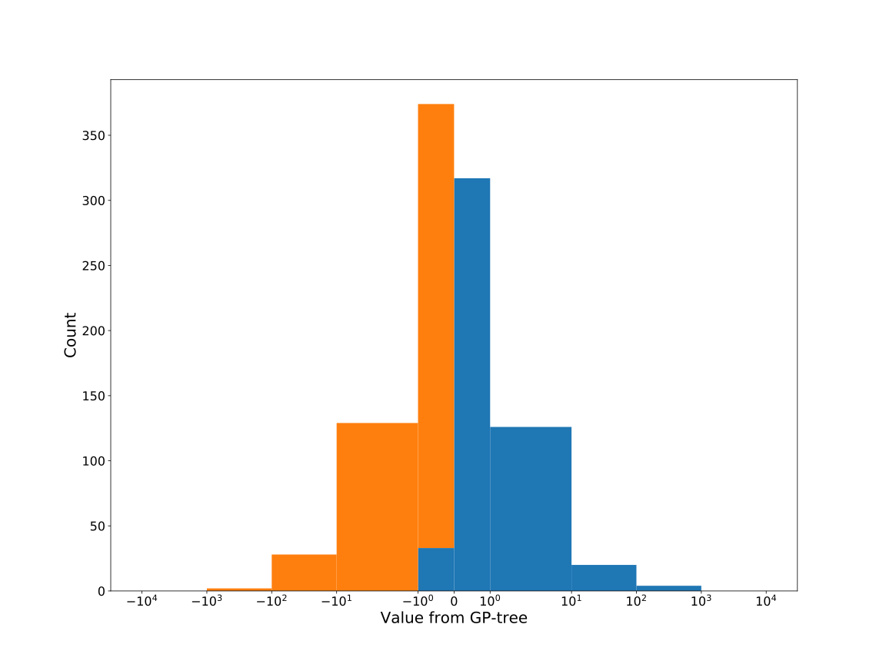

# Dataset: digen21_6265(FLGDXKSR_0.157_0.867_6265)

|    | classifier                 |   auroc |    auprc |   f1_score |   rank_auroc |   rank_auprc |   rank_f1 |
|---:|:---------------------------|--------:|---------:|-----------:|-------------:|-------------:|----------:|
|  0 | GradientBoostingClassifier | 0.98065 | 0.977145 |   0.975369 |            3 |            3 |         1 |
|  1 | LGBMClassifier             | 0.994   | 0.994107 |   0.951923 |            2 |            2 |         5 |
|  2 | XGBClassifier              | 0.9731  | 0.949472 |   0.965174 |            5 |            5 |         3 |
|  3 | DecisionTreeClassifier     | 0.977   | 0.977075 |   0.96     |            4 |            3 |         4 |
|  4 | LogisticRegression         | 0.5822  | 0.579198 |   0.571429 |            8 |            8 |         8 |
|  5 | KNeighborsClassifier       | 0.7209  | 0.713737 |   0.630435 |            6 |            6 |         7 |
|  6 | RandomForestClassifier     | 0.9973  | 0.997366 |   0.975369 |            1 |            1 |         1 |
|  7 | SVC                        | 0.7072  | 0.70927  |   0.660099 |            7 |            7 |         6 |


<details>
<summary>Parameters of tuned ML methods</summary>


```
GradientBoostingClassifier(learning_rate=0.1106929494554916, loss='exponential',
                           max_depth=7, min_samples_leaf=5, n_iter_no_change=12,
                           random_state=6265, tol=1e-07,
                           validation_fraction=0.03)
LGBMClassifier(boosting_type='dart', deterministic=True, force_row_wise=True,
               max_depth=9, metric='binary_logloss', n_estimators=94, n_jobs=1,
               num_leaves=512, objective='binary', random_state=6265)
XGBClassifier(alpha=4.3414646668044926e-05, base_score=0.5, booster='gbtree',
              colsample_bylevel=1, colsample_bynode=1, colsample_bytree=1,
              eta=0.010336218004207712, eval_metric='logloss', gamma=0.4,
              gpu_id=-1, importance_type='gain', interaction_constraints='',
              learning_rate=0.0103362184, max_delta_step=0, max_depth=7,
              min_child_weight=1, missing=nan, monotone_constraints='()',
              n_estimators=48, n_jobs=1, nthread=1, num_parallel_tree=1,
              random_state=6265, reg_alpha=4.34146459e-05,
              reg_lambda=0.00025987277784335366, scale_pos_weight=1,
              subsample=1, tree_method='exact', use_label_encoder=False,
              validate_parameters=1, ...)
DecisionTreeClassifier(criterion='entropy', max_depth=5, min_samples_leaf=2,
                       min_samples_split=15, random_state=6265)
LogisticRegression(C=4.115025362221138, random_state=6265, solver='newton-cg')
KNeighborsClassifier(n_neighbors=22, p=1, weights='distance')
RandomForestClassifier(max_depth=5, max_features=None, min_samples_leaf=3,
                       min_samples_split=5, n_estimators=16, random_state=6265)
SVC(C=83.92431666168372, coef0=3.1, degree=4, gamma='auto', probability=True,
    random_state=6265, tol=3.494335882884236e-05)
```

</details>

<details>
<summary>Expected performance (200 experiments per ML method)</summary>

</details>

<details>
<summary>Receiver Operating Characteristics (ROC) curve</summary>

</details>

<details>
<summary>Precision-Recall Curve</summary>

</details>

<details>
<summary>Model (GP-tree)</summary>

</details>

<details>
<summary>Endpoint histogram</summary>

</details>

<details>
<summary>Feature correlations</summary>

</details>

[**Pandas Profiling Report**](https://github.io/athril/digen-test/docs/profile/digen21_6265.html)