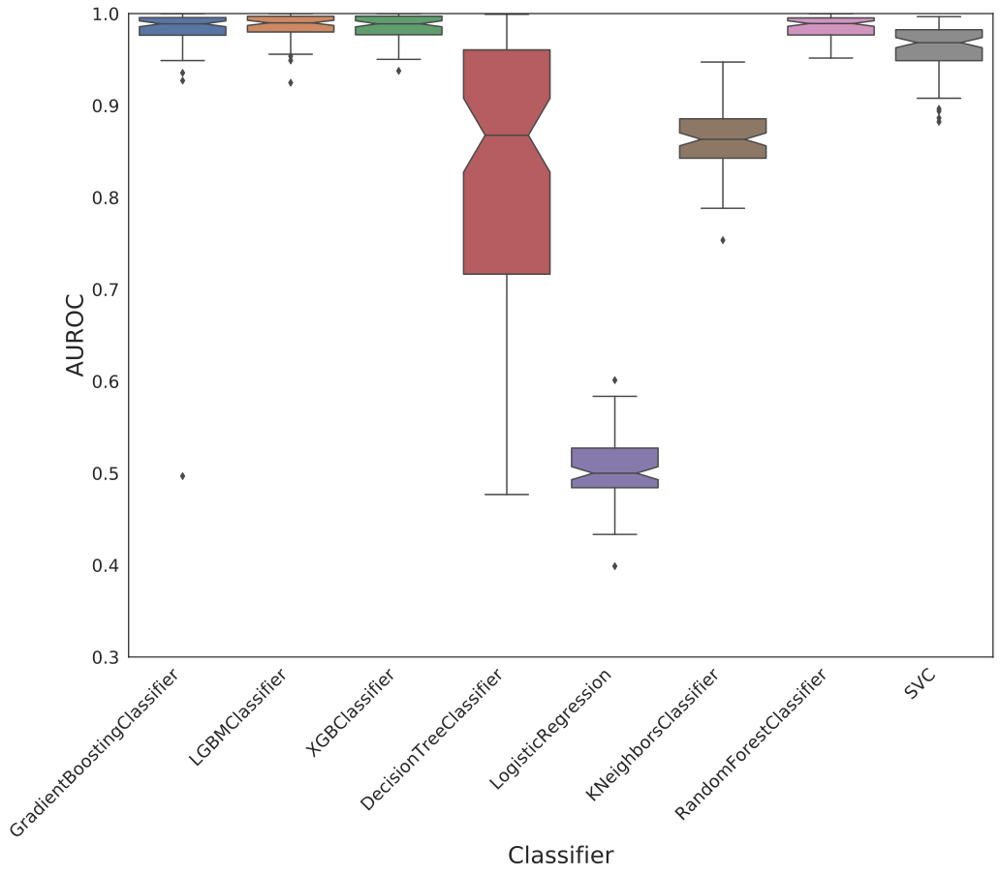
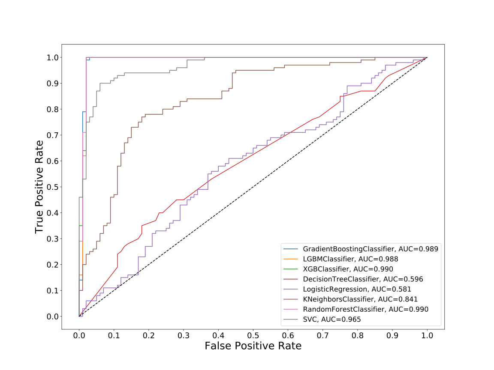
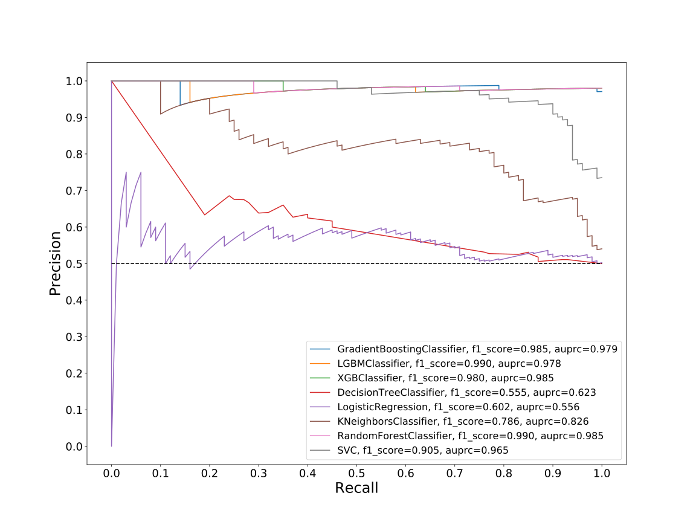
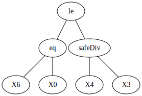
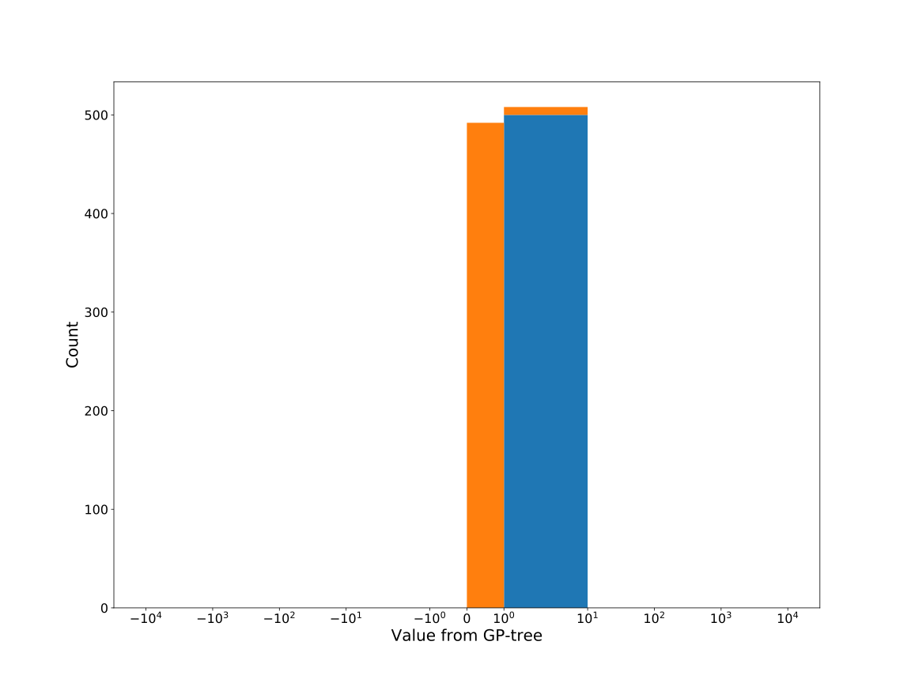
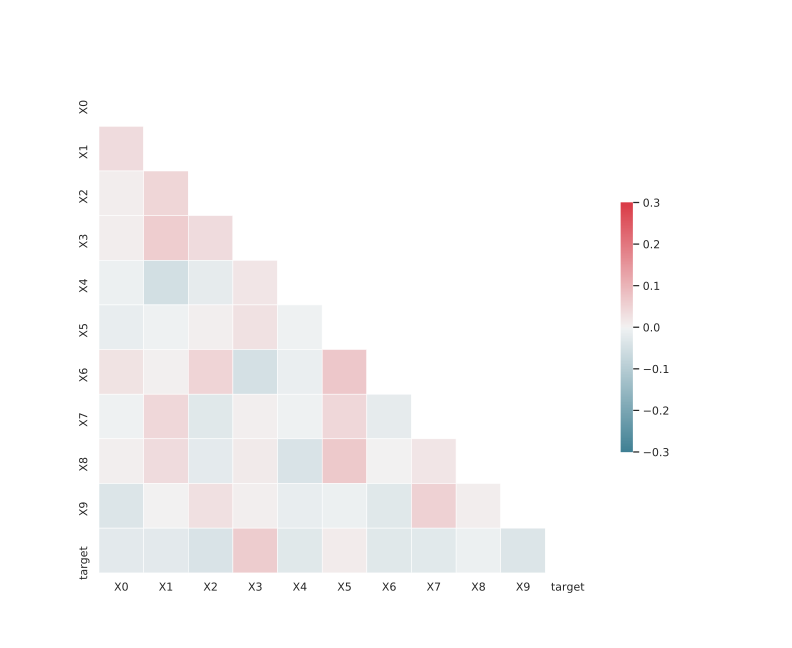

# Dataset: digen22_2433 (F-XGLSKDR_0.168_0.868_2433)

|    | classifier                 |   auroc |    auprc |   f1_score |   rank_auroc |   rank_auprc |   rank_f1 |
|---:|:---------------------------|--------:|---------:|-----------:|-------------:|-------------:|----------:|
|  0 | GradientBoostingClassifier |  0.9892 | 0.97855  |   0.985222 |            3 |            3 |         3 |
|  1 | LGBMClassifier             |  0.9878 | 0.977576 |   0.990099 |            4 |            4 |         1 |
|  2 | XGBClassifier              |  0.9899 | 0.985384 |   0.98     |            1 |            1 |         4 |
|  3 | DecisionTreeClassifier     |  0.5964 | 0.622546 |   0.554974 |            7 |            7 |         8 |
|  4 | LogisticRegression         |  0.5809 | 0.555757 |   0.601852 |            8 |            8 |         7 |
|  5 | KNeighborsClassifier       |  0.8411 | 0.825579 |   0.785714 |            6 |            6 |         6 |
|  6 | RandomForestClassifier     |  0.99   | 0.984554 |   0.990099 |            1 |            1 |         1 |
|  7 | SVC                        |  0.9653 | 0.965424 |   0.905473 |            5 |            5 |         5 |


<details>
<summary>Parameters of tuned ML methods (200 optimizations)</summary>


```
GradientBoostingClassifier(learning_rate=0.10764815020012819,
                           loss='exponential', max_depth=5, min_samples_leaf=8,
                           n_iter_no_change=10, random_state=2433, tol=1e-07,
                           validation_fraction=0.02)
LGBMClassifier(deterministic=True, force_row_wise=True, max_depth=5,
               metric='binary_logloss', n_estimators=59, n_jobs=1,
               num_leaves=169, objective='binary', random_state=2433)
XGBClassifier(alpha=1.610835775349915e-05, base_score=0.5, booster='dart',
              colsample_bylevel=1, colsample_bynode=1, colsample_bytree=1,
              eta=0.09878396403592539, eval_metric='logloss', gamma=0.5,
              gpu_id=-1, importance_type='gain', interaction_constraints='',
              learning_rate=0.0987839624, max_delta_step=0, max_depth=5,
              min_child_weight=1, missing=nan, monotone_constraints='()',
              n_estimators=100, n_jobs=1, nthread=1, num_parallel_tree=1,
              random_state=2433, reg_alpha=1.61083572e-05,
              reg_lambda=0.19920005610776695, scale_pos_weight=1, subsample=1,
              tree_method='exact', use_label_encoder=False,
              validate_parameters=1, ...)
DecisionTreeClassifier(max_depth=10, min_samples_leaf=10, min_samples_split=20,
                       random_state=2433)
LogisticRegression(C=14.756641634721635, dual=True, random_state=2433,
                   solver='liblinear')
KNeighborsClassifier(n_neighbors=34, p=1, weights='distance')
RandomForestClassifier(max_depth=10, max_features=None, min_samples_split=19,
                       n_estimators=96, random_state=2433)
SVC(C=146.56767100206685, class_weight='balanced', coef0=9.8, degree=2,
    gamma='auto', kernel='poly', probability=True, random_state=2433,
    tol=9.550121508831393e-05)
```

</details>

<details>
<summary>Expected performance (100 optimizations starting from different random seed)</summary>

</details>

<details>
<summary>Receiver Operating Characteristics (ROC) curve</summary>

</details>

<details>
<summary>Precision-Recall Curve</summary>

</details>

<details>
<summary>Model (GP-tree)</summary>

</details>

<details>
<summary>Endpoint histogram</summary>

</details>

<details>
<summary>Feature correlations</summary>

</details>

[**Pandas Profiling Report**](https://epistasislab.github.io/digen/profile/digen22_2433.html)