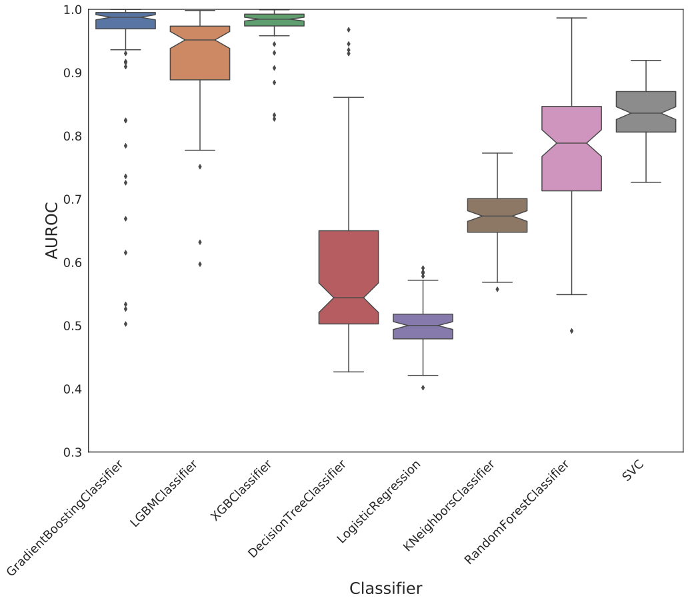
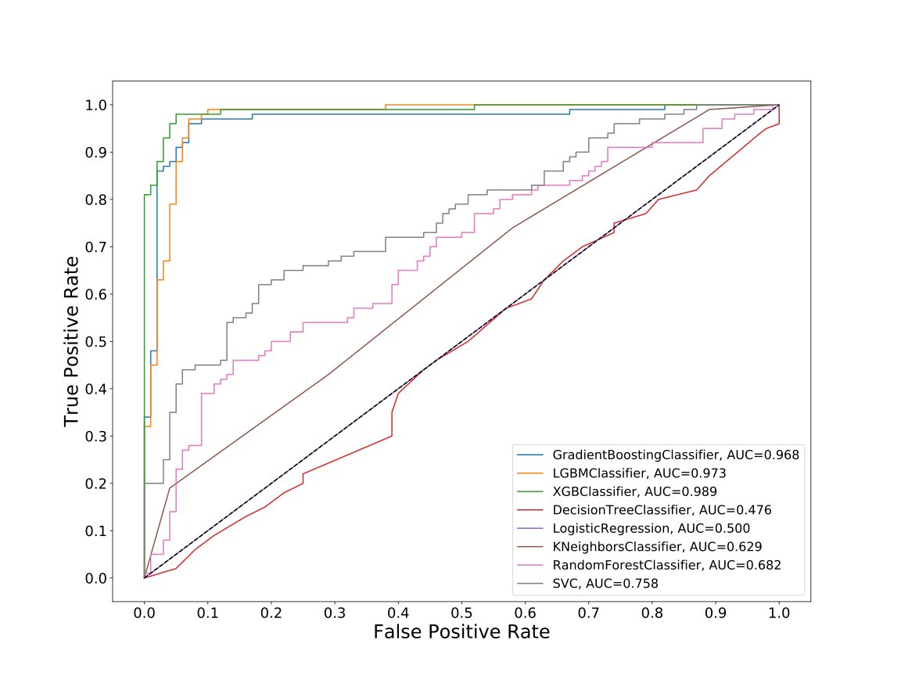
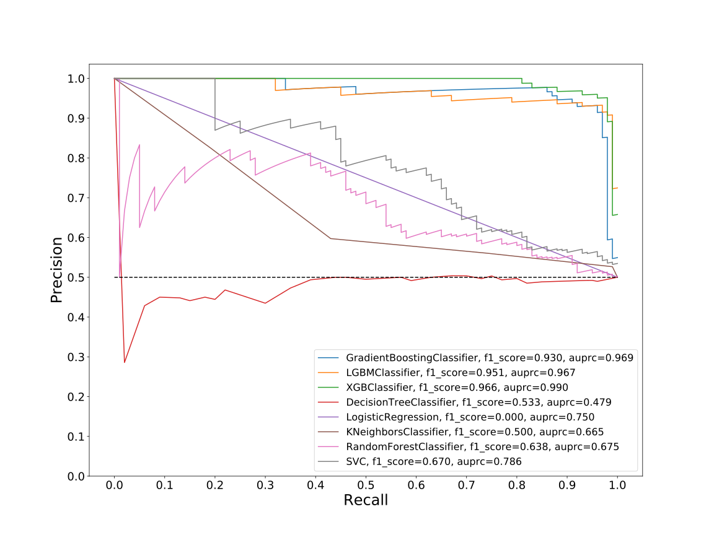
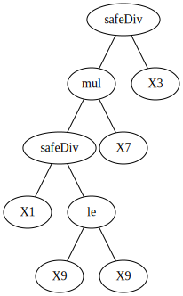
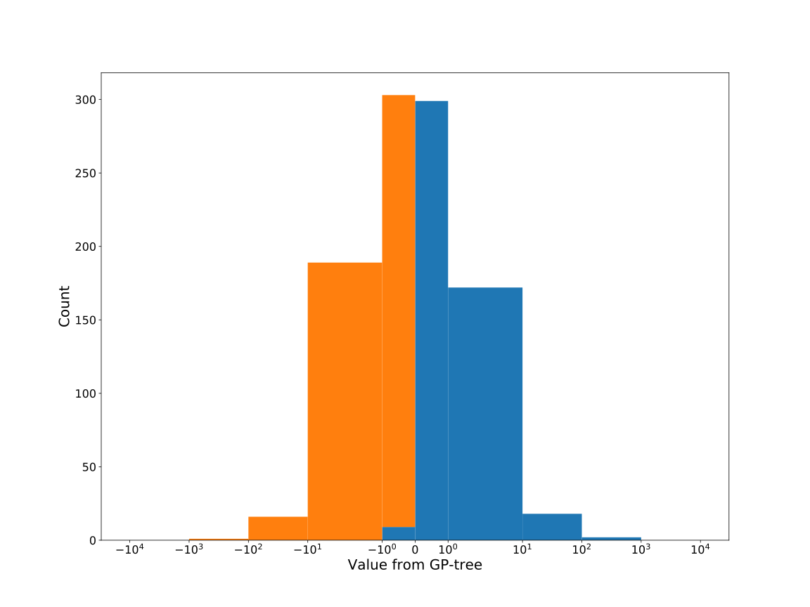
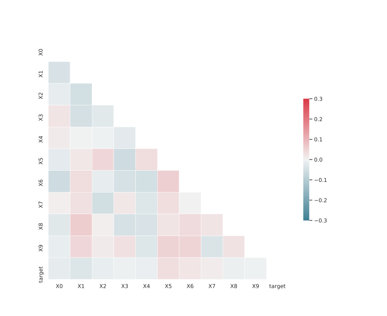

# Dataset: digen23_5191(XLGSFKRD_0.197_0.747_5191)

|    | classifier                 |   auroc |    auprc |   f1_score |   rank_auroc |   rank_auprc |   rank_f1 |
|---:|:---------------------------|--------:|---------:|-----------:|-------------:|-------------:|----------:|
|  0 | GradientBoostingClassifier | 0.9679  | 0.968676 |   0.93     |            3 |            2 |         3 |
|  1 | LGBMClassifier             | 0.9731  | 0.966707 |   0.95098  |            2 |            3 |         2 |
|  2 | XGBClassifier              | 0.9887  | 0.990294 |   0.965517 |            1 |            1 |         1 |
|  3 | DecisionTreeClassifier     | 0.47645 | 0.479281 |   0.53271  |            8 |            8 |         6 |
|  4 | LogisticRegression         | 0.5     | 0.75     |   0        |            7 |            5 |         8 |
|  5 | KNeighborsClassifier       | 0.62855 | 0.664772 |   0.5      |            6 |            7 |         7 |
|  6 | RandomForestClassifier     | 0.6816  | 0.674988 |   0.638095 |            5 |            6 |         5 |
|  7 | SVC                        | 0.7578  | 0.785718 |   0.669903 |            4 |            4 |         4 |


<details>
<summary>Parameters of tuned ML methods</summary>


```
GradientBoostingClassifier(learning_rate=0.5814362809452907, max_depth=9,
                           min_samples_leaf=74, n_iter_no_change=19,
                           random_state=5191, tol=1e-07,
                           validation_fraction=0.04)
LGBMClassifier(deterministic=True, force_row_wise=True, max_depth=10,
               metric='binary_logloss', n_estimators=95, n_jobs=1,
               num_leaves=1024, objective='binary', random_state=5191)
XGBClassifier(alpha=0.49184251320956424, base_score=0.5, booster='dart',
              colsample_bylevel=1, colsample_bynode=1, colsample_bytree=1,
              eta=0.18871603709795215, eval_metric='logloss', gamma=0.0,
              gpu_id=-1, importance_type='gain', interaction_constraints='',
              learning_rate=0.188716039, max_delta_step=0, max_depth=9,
              min_child_weight=1, missing=nan, monotone_constraints='()',
              n_estimators=48, n_jobs=1, nthread=1, num_parallel_tree=1,
              random_state=5191, reg_alpha=0.491842508,
              reg_lambda=0.007682323760589426, scale_pos_weight=1, subsample=1,
              tree_method='exact', use_label_encoder=False,
              validate_parameters=1, ...)
DecisionTreeClassifier(max_depth=8, min_samples_leaf=16, min_samples_split=12,
                       random_state=5191)
LogisticRegression(C=0.004858476693281459, penalty='l1', random_state=5191,
                   solver='liblinear')
KNeighborsClassifier(metric='euclidean', n_neighbors=4)
RandomForestClassifier(max_depth=10, max_features=None, min_samples_split=7,
                       n_estimators=89, random_state=5191)
SVC(C=800.4847130280158, class_weight='balanced', coef0=7.800000000000001,
    degree=4, kernel='poly', probability=True, random_state=5191,
    tol=0.0008008168176610777)
```

</details>

<details>
<summary>Expected performance (200 experiments per ML method)</summary>

</details>

<details>
<summary>Receiver Operating Characteristics (ROC) curve</summary>

</details>

<details>
<summary>Precision-Recall Curve</summary>

</details>

<details>
<summary>Model (GP-tree)</summary>

</details>

<details>
<summary>Endpoint histogram</summary>

</details>

<details>
<summary>Feature correlations</summary>

</details>

[**Pandas Profiling Report**](https://github.io/athril/digen-test/docs/profile/digen23_5191.html)