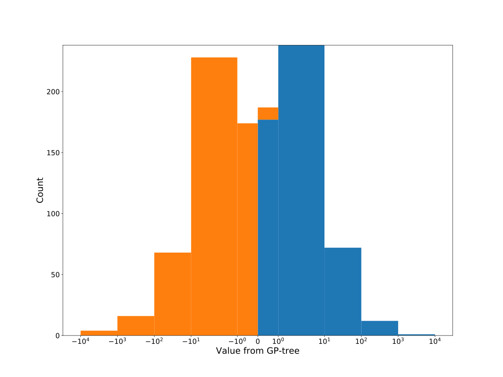

# Dataset: digen24_2433(XGLFSKRD_0.201_0.789_2433)

|    | classifier                 |   auroc |    auprc |   f1_score |   rank_auroc |   rank_auprc |   rank_f1 |
|---:|:---------------------------|--------:|---------:|-----------:|-------------:|-------------:|----------:|
|  0 | GradientBoostingClassifier | 0.9885  | 0.988715 |   0.964824 |            2 |            2 |         2 |
|  1 | LGBMClassifier             | 0.9862  | 0.985284 |   0.929293 |            3 |            3 |         3 |
|  2 | XGBClassifier              | 0.9984  | 0.99841  |   0.984925 |            1 |            1 |         1 |
|  3 | DecisionTreeClassifier     | 0.5015  | 0.662924 |   0.565217 |            8 |            7 |         7 |
|  4 | LogisticRegression         | 0.5077  | 0.510098 |   0.521327 |            7 |            8 |         8 |
|  5 | KNeighborsClassifier       | 0.63765 | 0.6678   |   0.602871 |            6 |            6 |         6 |
|  6 | RandomForestClassifier     | 0.912   | 0.909991 |   0.818653 |            4 |            4 |         4 |
|  7 | SVC                        | 0.7797  | 0.779841 |   0.677083 |            5 |            5 |         5 |


<details>
<summary>Parameters of tuned ML methods</summary>


```
GradientBoostingClassifier(learning_rate=0.3462548950387975, max_depth=6,
                           n_iter_no_change=20, random_state=2433, tol=1e-07,
                           validation_fraction=0.03)
LGBMClassifier(deterministic=True, force_row_wise=True, max_depth=7,
               metric='binary_logloss', n_estimators=99, n_jobs=1,
               num_leaves=128, objective='binary', random_state=2433)
XGBClassifier(alpha=1.0460180855209882, base_score=0.5, booster='dart',
              colsample_bylevel=1, colsample_bynode=1, colsample_bytree=1,
              eta=0.7235542347935017, eval_metric='logloss', gamma=0.0,
              gpu_id=-1, importance_type='gain', interaction_constraints='',
              learning_rate=0.723554254, max_delta_step=0, max_depth=8,
              min_child_weight=1, missing=nan, monotone_constraints='()',
              n_estimators=96, n_jobs=1, nthread=1, num_parallel_tree=1,
              random_state=2433, reg_alpha=1.04601812,
              reg_lambda=48.931445947599286, scale_pos_weight=1, subsample=1,
              tree_method='exact', use_label_encoder=False,
              validate_parameters=1, ...)
DecisionTreeClassifier(criterion='entropy', max_depth=2, min_samples_leaf=8,
                       min_samples_split=7, random_state=2433)
LogisticRegression(C=0.1399682495898341, penalty='l1', random_state=2433,
                   solver='liblinear')
KNeighborsClassifier(n_neighbors=3, p=1, weights='distance')
RandomForestClassifier(max_depth=10, max_features=None, min_samples_leaf=4,
                       min_samples_split=6, n_estimators=82, random_state=2433)
SVC(C=9.806807339798775, coef0=9.8, degree=4, gamma='auto', kernel='poly',
    probability=True, random_state=2433, tol=4.697387498104191e-05)
```

</details>

<details>
<summary>Expected performance (200 experiments per ML method)</summary>

</details>

<details>
<summary>Receiver Operating Characteristics (ROC) curve</summary>

</details>

<details>
<summary>Precision-Recall Curve</summary>

</details>

<details>
<summary>Model (GP-tree)</summary>

</details>

<details>
<summary>Endpoint histogram</summary>

</details>

<details>
<summary>Feature correlations</summary>

</details>

[**Pandas Profiling Report**](https://github.io/athril/digen-test/docs/profile/digen24_2433.html)