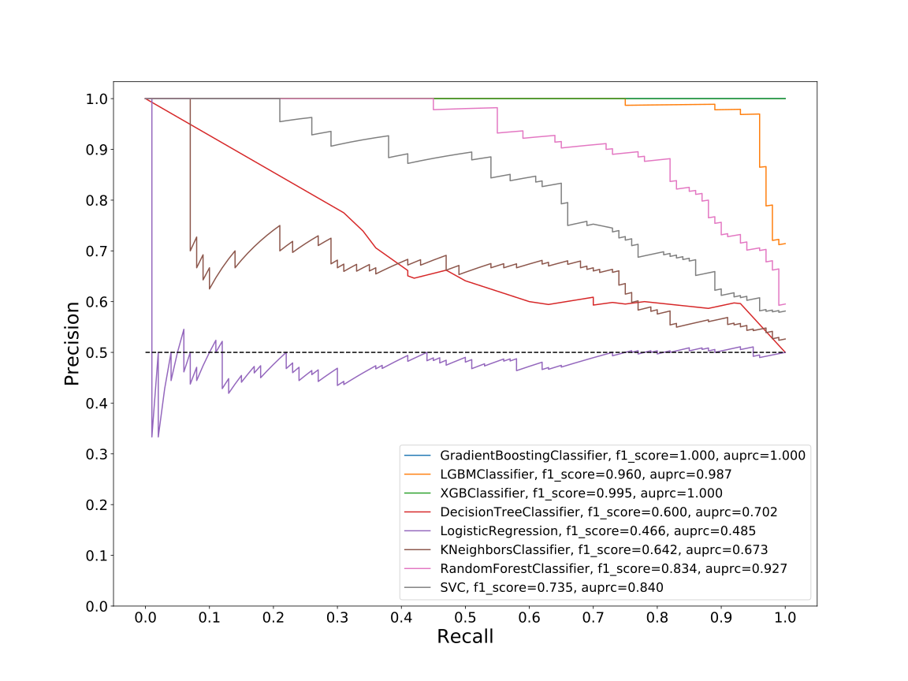

# Dataset: digen25_2433 (XLGFSKDR_0.176_0.821_2433)

|    | classifier                 |   auroc |    auprc |   f1_score |   rank_auroc |   rank_auprc |   rank_f1 |
|---:|:---------------------------|--------:|---------:|-----------:|-------------:|-------------:|----------:|
|  0 | GradientBoostingClassifier | 0.977   | 0.975876 |   0.93     |            3 |            3 |         3 |
|  1 | LGBMClassifier             | 0.985   | 0.987424 |   0.959596 |            2 |            2 |         2 |
|  2 | XGBClassifier              | 1       | 1        |   0.994975 |            1 |            1 |         1 |
|  3 | DecisionTreeClassifier     | 0.68705 | 0.702358 |   0.6      |            7 |            6 |         7 |
|  4 | LogisticRegression         | 0.4744  | 0.484929 |   0.466321 |            8 |            8 |         8 |
|  5 | KNeighborsClassifier       | 0.6933  | 0.672655 |   0.642105 |            6 |            7 |         6 |
|  6 | RandomForestClassifier     | 0.9204  | 0.926953 |   0.834171 |            4 |            4 |         4 |
|  7 | SVC                        | 0.8288  | 0.839783 |   0.734694 |            5 |            5 |         5 |


<details>
<summary>Parameters of tuned ML methods (200 optimizations)</summary>


```
GradientBoostingClassifier(learning_rate=0.5490589545705974, loss='exponential',
                           max_depth=10, min_samples_leaf=54,
                           n_iter_no_change=15, random_state=2433, tol=1e-07,
                           validation_fraction=0.01)
LGBMClassifier(deterministic=True, force_row_wise=True, max_depth=9,
               metric='binary_logloss', n_jobs=1, num_leaves=512,
               objective='binary', random_state=2433)
XGBClassifier(alpha=1.6432336850175108e-05, base_score=0.5, booster='dart',
              colsample_bylevel=1, colsample_bynode=1, colsample_bytree=1,
              eta=0.9812206834180254, eval_metric='logloss', gamma=0.1,
              gpu_id=-1, importance_type='gain', interaction_constraints='',
              learning_rate=0.981220663, max_delta_step=0, max_depth=7,
              min_child_weight=1, missing=nan, monotone_constraints='()',
              n_estimators=67, n_jobs=1, nthread=1, num_parallel_tree=1,
              random_state=2433, reg_alpha=1.64323374e-05,
              reg_lambda=98.37486916552379, scale_pos_weight=1, subsample=1,
              tree_method='exact', use_label_encoder=False,
              validate_parameters=1, ...)
DecisionTreeClassifier(max_depth=8, min_samples_split=17, random_state=2433)
LogisticRegression(C=5.998117398015048, penalty='l1', random_state=2433,
                   solver='liblinear')
KNeighborsClassifier(n_neighbors=28, p=1, weights='distance')
RandomForestClassifier(max_depth=10, max_features=None, min_samples_leaf=2,
                       min_samples_split=5, n_estimators=88, random_state=2433)
SVC(C=6.045852381960481, coef0=5.0, degree=4, kernel='poly', probability=True,
    random_state=2433, tol=0.000321869942542997)
```

</details>

<details>
<summary>Expected performance (100 optimizations starting from different random seed)</summary>

</details>

<details>
<summary>Receiver Operating Characteristics (ROC) curve</summary>

</details>

<details>
<summary>Precision-Recall Curve</summary>

</details>

<details>
<summary>Model (GP-tree)</summary>

</details>

<details>
<summary>Endpoint histogram</summary>

</details>

<details>
<summary>Feature correlations</summary>

</details>

[**Pandas Profiling Report**](https://epistasislab.github.io/digen/profile/digen25_2433.html)