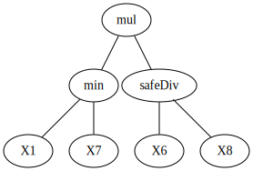

# Dataset: digen26_7270 (FXGLDSKR_0.191_0.846_7270)

|    | classifier                 |   auroc |    auprc |   f1_score |   rank_auroc |   rank_auprc |   rank_f1 |
|---:|:---------------------------|--------:|---------:|-----------:|-------------:|-------------:|----------:|
|  0 | GradientBoostingClassifier | 0.9721  | 0.959852 |   0.970297 |            3 |            4 |         1 |
|  1 | LGBMClassifier             | 0.9698  | 0.976371 |   0.950495 |            4 |            2 |         4 |
|  2 | XGBClassifier              | 0.9779  | 0.976127 |   0.96     |            2 |            2 |         2 |
|  3 | DecisionTreeClassifier     | 0.9447  | 0.959463 |   0.944724 |            5 |            5 |         5 |
|  4 | LogisticRegression         | 0.4311  | 0.436633 |   0.516432 |            8 |            8 |         8 |
|  5 | KNeighborsClassifier       | 0.64345 | 0.661075 |   0.595122 |            7 |            7 |         7 |
|  6 | RandomForestClassifier     | 0.9868  | 0.987173 |   0.955224 |            1 |            1 |         3 |
|  7 | SVC                        | 0.84245 | 0.856586 |   0.757576 |            6 |            6 |         6 |


<details>
<summary>Parameters of tuned ML methods (200 optimizations)</summary>


```
GradientBoostingClassifier(learning_rate=0.02940802864406496, max_depth=10,
                           min_samples_leaf=4, n_iter_no_change=3,
                           random_state=7270, tol=1e-07,
                           validation_fraction=0.01)
LGBMClassifier(deterministic=True, force_row_wise=True, max_depth=10,
               metric='binary_logloss', n_estimators=94, n_jobs=1,
               num_leaves=1024, objective='binary', random_state=7270)
XGBClassifier(alpha=0.002671833586511505, base_score=0.5, booster='gbtree',
              colsample_bylevel=1, colsample_bynode=1, colsample_bytree=1,
              eta=0.21726614506468914, eval_metric='logloss',
              gamma=0.30000000000000004, gpu_id=-1, importance_type='gain',
              interaction_constraints='', learning_rate=0.217266142,
              max_delta_step=0, max_depth=6, min_child_weight=1, missing=nan,
              monotone_constraints='()', n_estimators=58, n_jobs=1, nthread=1,
              num_parallel_tree=1, random_state=7270, reg_alpha=0.00267183362,
              reg_lambda=0.008714476480405672, scale_pos_weight=1, subsample=1,
              tree_method='exact', use_label_encoder=False,
              validate_parameters=1, ...)
DecisionTreeClassifier(max_depth=8, min_samples_split=6, random_state=7270)
LogisticRegression(C=61.28158153371092, dual=True, random_state=7270,
                   solver='liblinear')
KNeighborsClassifier(metric='euclidean', n_neighbors=32, p=4)
RandomForestClassifier(max_depth=8, max_features=None, min_samples_leaf=2,
                       min_samples_split=4, n_estimators=97, random_state=7270)
SVC(C=55753.94600888312, class_weight='balanced', coef0=6.2, gamma='auto',
    kernel='poly', probability=True, random_state=7270,
    tol=0.0015945931261423405)
```

</details>

<details>
<summary>Expected performance (100 optimizations starting from different random seed)</summary>

</details>

<details>
<summary>Receiver Operating Characteristics (ROC) curve</summary>

</details>

<details>
<summary>Precision-Recall Curve</summary>

</details>

<details>
<summary>Model (GP-tree)</summary>

</details>

<details>
<summary>Endpoint histogram</summary>

</details>

<details>
<summary>Feature correlations</summary>

</details>

[**Pandas Profiling Report**](https://epistasislab.github.io/digen/profile/digen26_7270.html)