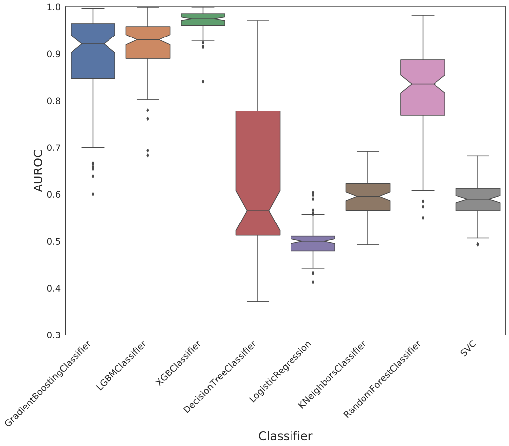
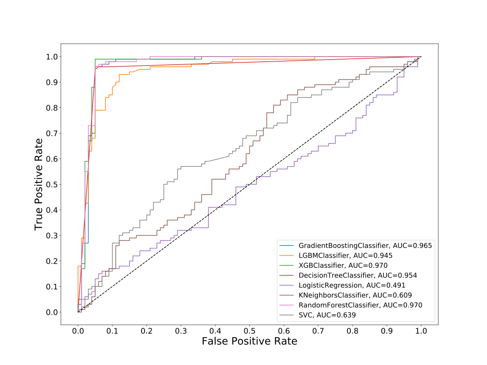
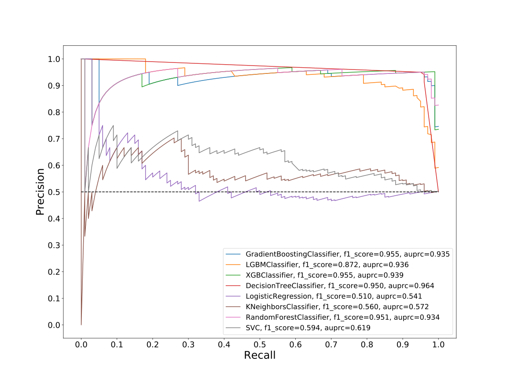
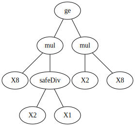
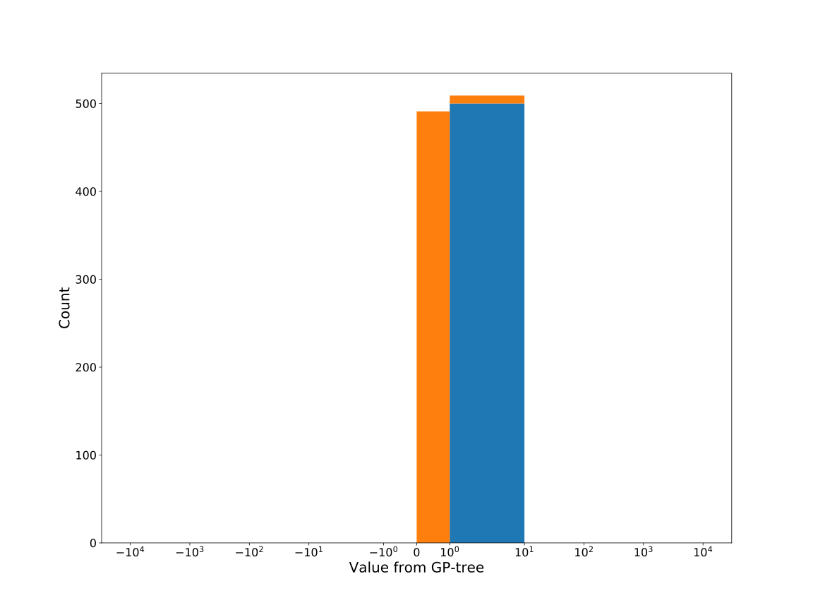
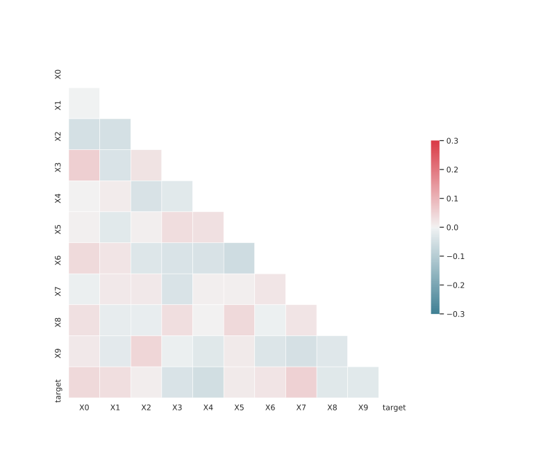

# Dataset: digen27
**Random seed: 860**<br/>
Order of the methods: X-FGDLSKR<br/>
Mean performance: 0.818<br/>
Standard deviation: 0.189<br/>


|    | classifier                 |   auroc |    auprc |   f1_score |   rank_auroc |   rank_auprc |   rank_f1 |
|---:|:---------------------------|--------:|---------:|-----------:|-------------:|-------------:|----------:|
|  0 | GradientBoostingClassifier | 0.9649  | 0.934717 |   0.955224 |            3 |            4 |         1 |
|  1 | LGBMClassifier             | 0.94505 | 0.935647 |   0.871795 |            5 |            3 |         5 |
|  2 | XGBClassifier              | 0.9703  | 0.939325 |   0.955224 |            1 |            2 |         1 |
|  3 | DecisionTreeClassifier     | 0.9539  | 0.963992 |   0.950495 |            4 |            1 |         4 |
|  4 | LogisticRegression         | 0.4905  | 0.541111 |   0.509804 |            8 |            8 |         8 |
|  5 | KNeighborsClassifier       | 0.6094  | 0.572488 |   0.56     |            7 |            7 |         7 |
|  6 | RandomForestClassifier     | 0.9697  | 0.934302 |   0.95098  |            1 |            5 |         3 |
|  7 | SVC                        | 0.6394  | 0.61871  |   0.594059 |            6 |            6 |         6 |


<details>
<summary>Parameters of tuned ML methods (based on 200 optimizations started from seed 860)</summary>


```
GradientBoostingClassifier(learning_rate=0.06051243858812161,
                           loss='exponential', max_depth=9, min_samples_leaf=5,
                           n_iter_no_change=4, random_state=860, tol=1e-07,
                           validation_fraction=0.01)
LGBMClassifier(boosting_type='dart', deterministic=True, force_row_wise=True,
               max_depth=7, metric='binary_logloss', n_estimators=18, n_jobs=1,
               num_leaves=177, objective='binary', random_state=860)
XGBClassifier(alpha=0.000812481310473552, base_score=0.5, booster='dart',
              colsample_bylevel=1, colsample_bynode=1, colsample_bytree=1,
              eta=0.08571441579429503, eval_metric='logloss', gamma=0.1,
              gpu_id=-1, importance_type='gain', interaction_constraints='',
              learning_rate=0.0857144147, max_delta_step=0, max_depth=9,
              min_child_weight=1, missing=nan, monotone_constraints='()',
              n_estimators=73, n_jobs=1, nthread=1, num_parallel_tree=1,
              random_state=860, reg_alpha=0.000812481332,
              reg_lambda=0.0017495902159980637, scale_pos_weight=1, subsample=1,
              tree_method='exact', use_label_encoder=False,
              validate_parameters=1, ...)
DecisionTreeClassifier(criterion='entropy', max_depth=9, min_samples_leaf=2,
                       min_samples_split=11, random_state=860)
LogisticRegression(C=0.012459719411265583, random_state=860, solver='saga')
KNeighborsClassifier(n_neighbors=38, p=1, weights='distance')
RandomForestClassifier(criterion='entropy', max_depth=8, max_features=None,
                       min_samples_split=5, n_estimators=97, random_state=860)
SVC(C=16.289481170105468, class_weight='balanced', coef0=8.3, probability=True,
    random_state=860, tol=5.315233699494783e-05)
```

</details>

<details>
<summary>Expected performance (based on 100 runs, each with 100 optimizations started from a different random seed)</summary>

</details>

<details>
<summary>Receiver Operating Characteristics (ROC) curve</summary>

</details>

<details>
<summary>Precision-Recall Curve</summary>

</details>

<details>
<summary>Model (GP-tree)</summary>

</details>

<details>
<summary>Endpoint histogram</summary>

</details>

<details>
<summary>Feature correlations</summary>

</details>

[**Pandas Profiling Report**](https://epistasislab.github.io/digen/profile/digen27_860.html)