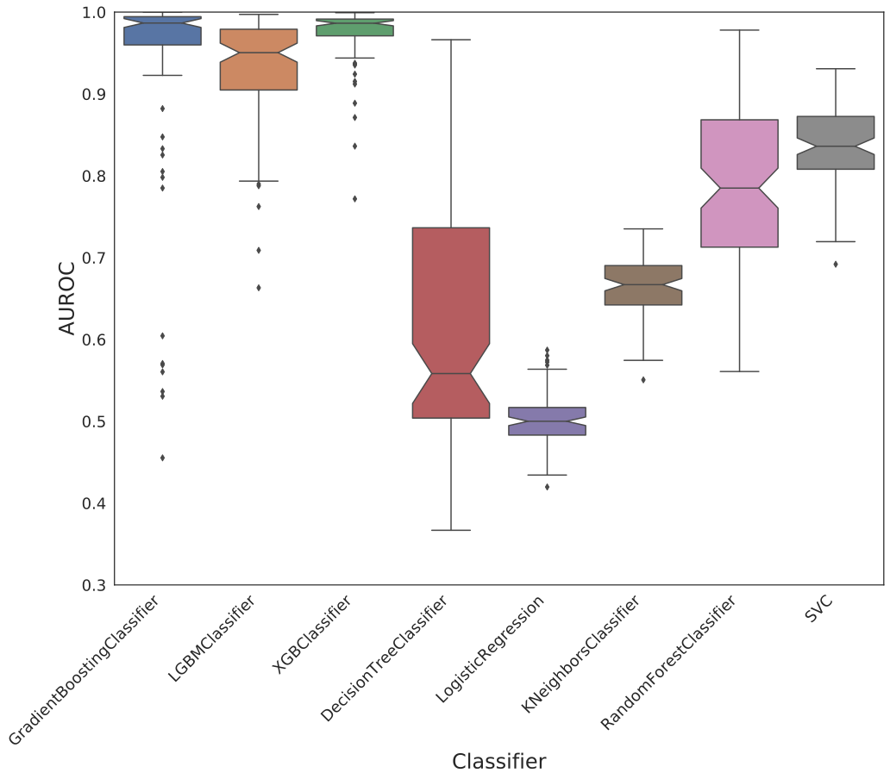
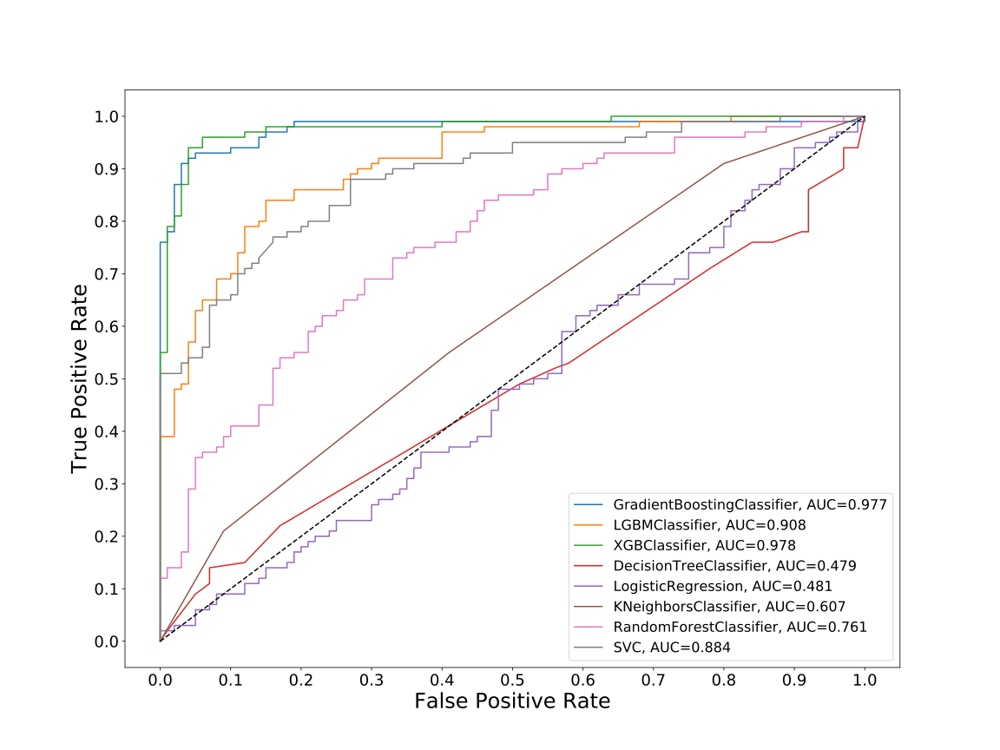

# Dataset: digen28
**Random seed: 769**<br/>
Order of the methods: XGLSFKRD<br/>
Mean performance: 0.759<br/>
Standard deviation: 0.198<br/>


|    | classifier                 |   auroc |    auprc |   f1_score |   rank_auroc |   rank_auprc |   rank_f1 |
|---:|:---------------------------|--------:|---------:|-----------:|-------------:|-------------:|----------:|
|  0 | GradientBoostingClassifier | 0.9769  | 0.982307 |   0.925373 |            2 |            1 |         2 |
|  1 | LGBMClassifier             | 0.9084  | 0.913552 |   0.833333 |            3 |            3 |         3 |
|  2 | XGBClassifier              | 0.9783  | 0.980481 |   0.949495 |            1 |            2 |         1 |
|  3 | DecisionTreeClassifier     | 0.47925 | 0.526148 |   0.50237  |            8 |            7 |         7 |
|  4 | LogisticRegression         | 0.4807  | 0.494127 |   0.484848 |            7 |            8 |         8 |
|  5 | KNeighborsClassifier       | 0.60675 | 0.640258 |   0.561224 |            6 |            6 |         6 |
|  6 | RandomForestClassifier     | 0.7614  | 0.763961 |   0.708738 |            5 |            5 |         5 |
|  7 | SVC                        | 0.8835  | 0.900567 |   0.789744 |            4 |            4 |         4 |


<details>
<summary>Parameters of tuned ML methods (based on 200 optimizations started from seed 769)</summary>


```
GradientBoostingClassifier(learning_rate=0.752090013318837, max_depth=5,
                           min_samples_leaf=78, n_iter_no_change=20,
                           random_state=769, tol=1e-07,
                           validation_fraction=0.03)
LGBMClassifier(deterministic=True, force_row_wise=True, max_depth=9,
               metric='binary_logloss', n_estimators=93, n_jobs=1,
               num_leaves=512, objective='binary', random_state=769)
XGBClassifier(alpha=6.878001761882116e-05, base_score=0.5, booster='gbtree',
              colsample_bylevel=1, colsample_bynode=1, colsample_bytree=1,
              eta=0.5839675825727604, eval_metric='logloss', gamma=0.1,
              gpu_id=-1, importance_type='gain', interaction_constraints='',
              learning_rate=0.583967566, max_delta_step=0, max_depth=7,
              min_child_weight=1, missing=nan, monotone_constraints='()',
              n_estimators=79, n_jobs=1, nthread=1, num_parallel_tree=1,
              random_state=769, reg_alpha=6.87800202e-05,
              reg_lambda=26.002520210924413, scale_pos_weight=1, subsample=1,
              tree_method='exact', use_label_encoder=False,
              validate_parameters=1, ...)
DecisionTreeClassifier(max_depth=8, max_features='auto', min_samples_leaf=15,
                       min_samples_split=12, random_state=769)
LogisticRegression(C=0.0520233643340705, penalty='l1', random_state=769,
                   solver='liblinear')
KNeighborsClassifier(metric='euclidean', n_neighbors=3, p=3)
RandomForestClassifier(max_depth=10, max_features=None, min_samples_leaf=3,
                       min_samples_split=5, n_estimators=93, random_state=769)
SVC(C=3495.2924397334027, class_weight='balanced', kernel='poly',
    probability=True, random_state=769, tol=1.5347557342146363e-05)
```

</details>

<details>
<summary>Expected performance (based on 100 runs, each with 100 optimizations started from a different random seed)</summary>

</details>

<details>
<summary>Receiver Operating Characteristics (ROC) curve</summary>

</details>

<details>
<summary>Precision-Recall Curve</summary>

</details>

<details>
<summary>Model (GP-tree)</summary>

</details>

<details>
<summary>Endpoint histogram</summary>

</details>

<details>
<summary>Feature correlations</summary>

</details>

[**Pandas Profiling Report**](https://epistasislab.github.io/digen/profile/digen28_769.html)