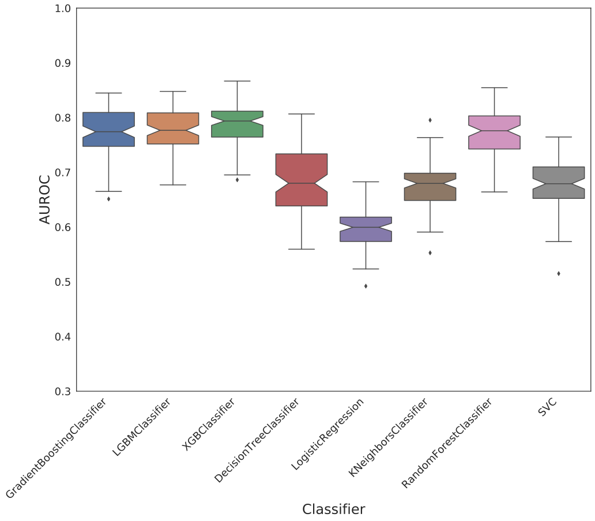
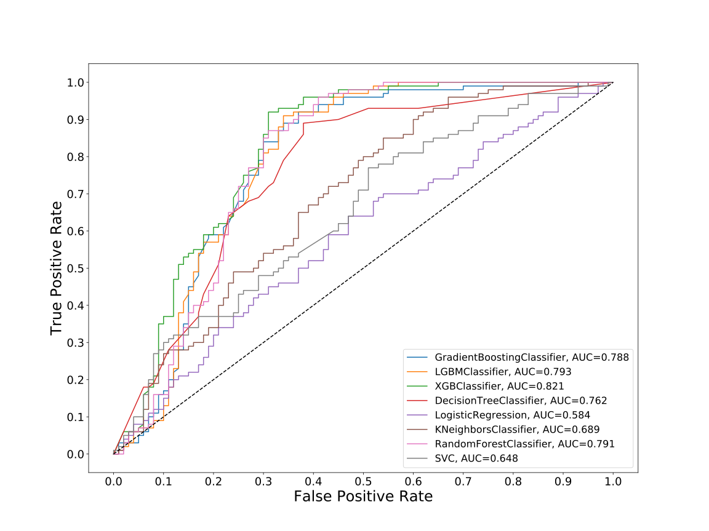
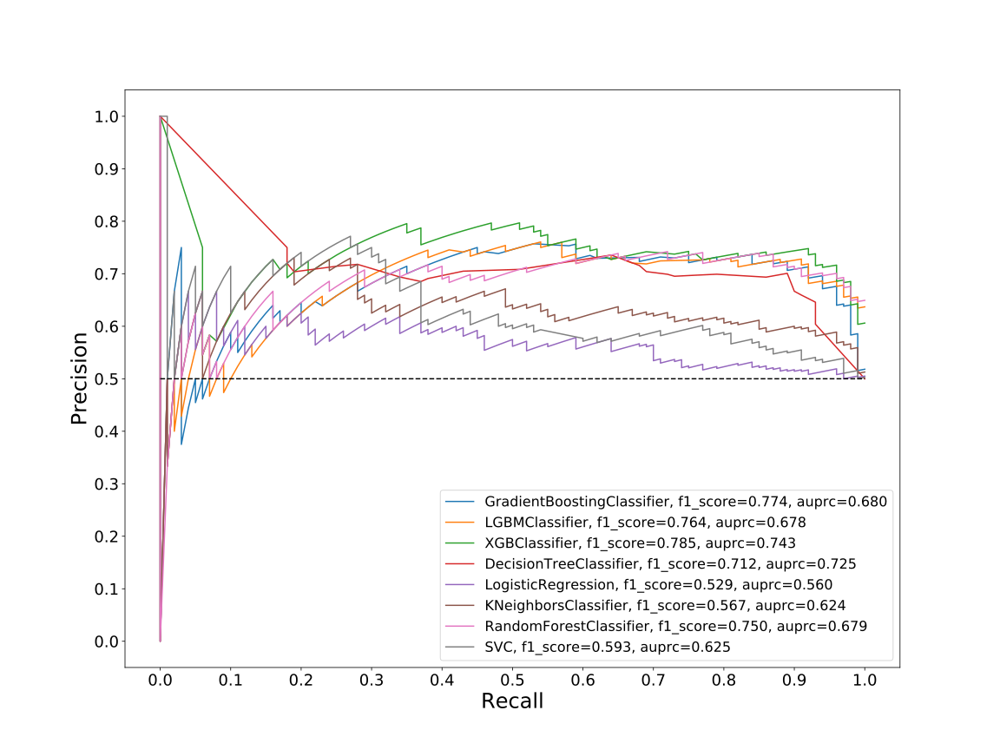
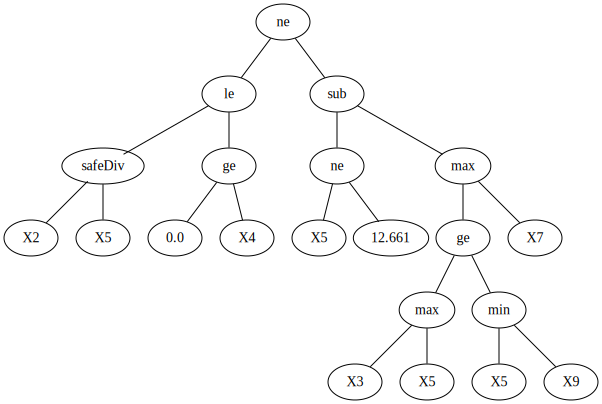
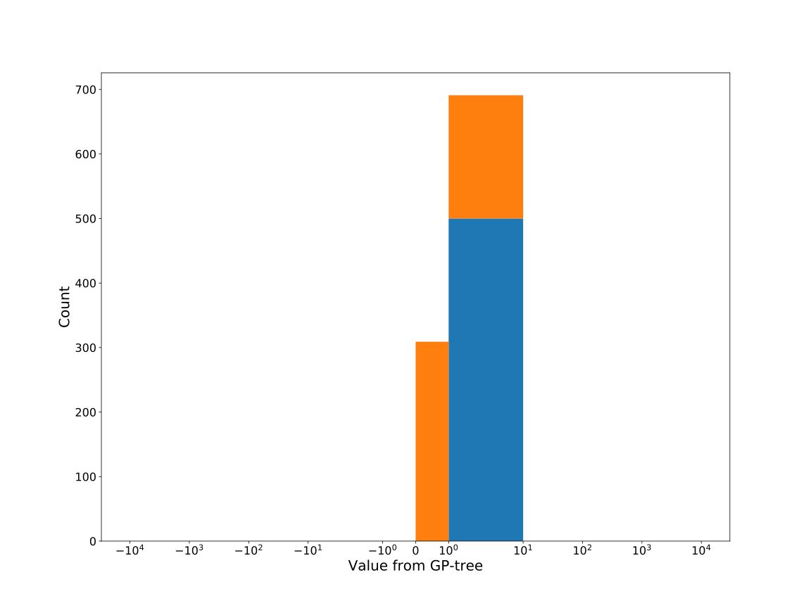
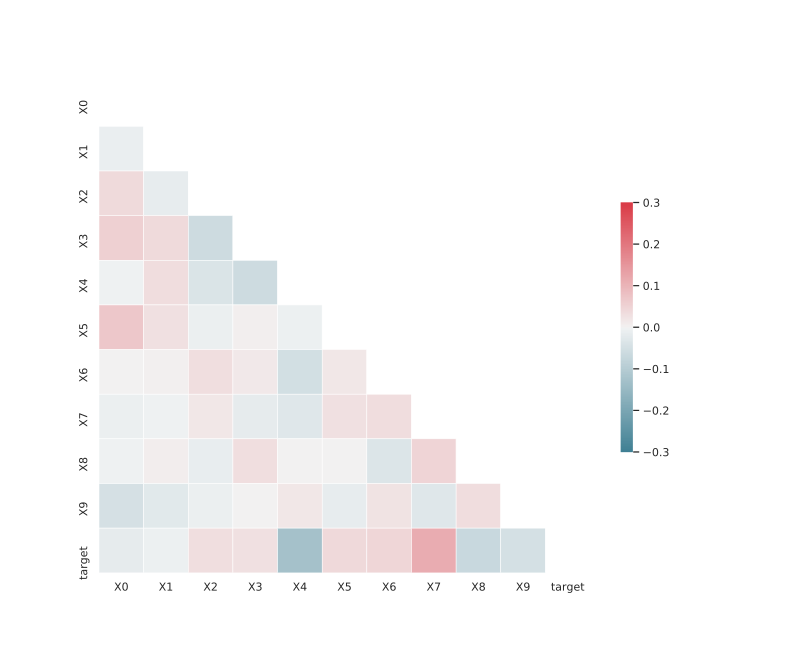

# Dataset: digen29_8322 (XLFGDKSR_0.079_0.734_8322)

|    | classifier                 |   auroc |    auprc |   f1_score |   rank_auroc |   rank_auprc |   rank_f1 |
|---:|:---------------------------|--------:|---------:|-----------:|-------------:|-------------:|----------:|
|  0 | GradientBoostingClassifier | 0.7879  | 0.680065 |   0.773585 |            4 |            3 |         2 |
|  1 | LGBMClassifier             | 0.79345 | 0.677924 |   0.764151 |            2 |            5 |         3 |
|  2 | XGBClassifier              | 0.82085 | 0.742943 |   0.785047 |            1 |            1 |         1 |
|  3 | DecisionTreeClassifier     | 0.7618  | 0.72464  |   0.712195 |            5 |            2 |         5 |
|  4 | LogisticRegression         | 0.5837  | 0.559577 |   0.529101 |            8 |            8 |         8 |
|  5 | KNeighborsClassifier       | 0.6888  | 0.6241   |   0.566667 |            6 |            7 |         7 |
|  6 | RandomForestClassifier     | 0.7913  | 0.678918 |   0.75     |            3 |            4 |         4 |
|  7 | SVC                        | 0.6482  | 0.625415 |   0.592965 |            7 |            6 |         6 |


<details>
<summary>Parameters of tuned ML methods (200 optimizations)</summary>


```
GradientBoostingClassifier(learning_rate=0.018036543842955974, max_depth=6,
                           min_samples_leaf=18, n_iter_no_change=2,
                           random_state=8322, tol=1e-07,
                           validation_fraction=0.03)
LGBMClassifier(boosting_type='dart', deterministic=True, force_row_wise=True,
               max_depth=6, metric='binary_logloss', n_estimators=14, n_jobs=1,
               num_leaves=64, objective='binary', random_state=8322)
XGBClassifier(alpha=1.8228913869316428, base_score=0.5, booster='dart',
              colsample_bylevel=1, colsample_bynode=1, colsample_bytree=1,
              eta=0.013787687078315966, eval_metric='logloss', gamma=0.1,
              gpu_id=-1, importance_type='gain', interaction_constraints='',
              learning_rate=0.0137876868, max_delta_step=0, max_depth=6,
              min_child_weight=1, missing=nan, monotone_constraints='()',
              n_estimators=71, n_jobs=1, nthread=1, num_parallel_tree=1,
              random_state=8322, reg_alpha=1.82289147,
              reg_lambda=0.00016852576259338028, scale_pos_weight=1,
              subsample=1, tree_method='exact', use_label_encoder=False,
              validate_parameters=1, ...)
DecisionTreeClassifier(max_depth=10, min_samples_leaf=19, min_samples_split=15,
                       random_state=8322)
LogisticRegression(C=0.0007631939127512858, random_state=8322, solver='saga')
KNeighborsClassifier(n_neighbors=60, p=1, weights='distance')
RandomForestClassifier(max_depth=7, max_features=None, min_samples_leaf=7,
                       min_samples_split=17, n_estimators=41,
                       random_state=8322)
SVC(C=1.096309995361921, coef0=1.8, gamma='auto', kernel='poly',
    probability=True, random_state=8322, tol=3.8693952080161356e-05)
```

</details>

<details>
<summary>Expected performance (100 optimizations starting from different random seed)</summary>

</details>

<details>
<summary>Receiver Operating Characteristics (ROC) curve</summary>

</details>

<details>
<summary>Precision-Recall Curve</summary>

</details>

<details>
<summary>Model (GP-tree)</summary>

</details>

<details>
<summary>Endpoint histogram</summary>

</details>

<details>
<summary>Feature correlations</summary>

</details>

[**Pandas Profiling Report**](https://epistasislab.github.io/digen/profile/digen29_8322.html)