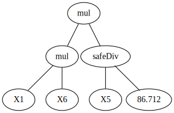
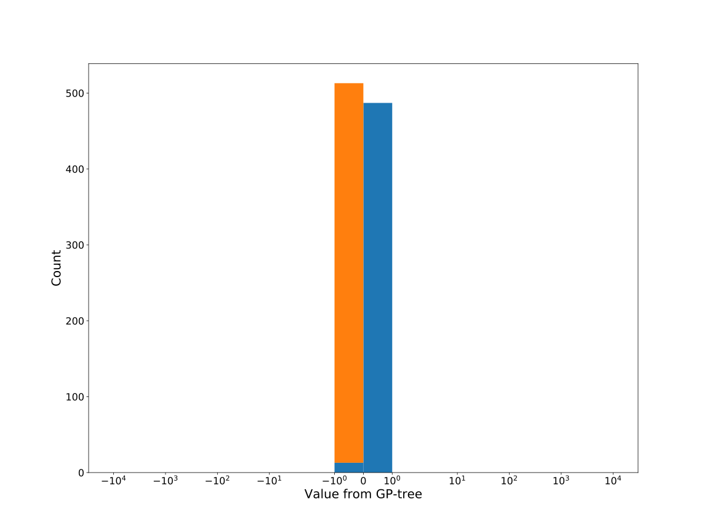

# Dataset: digen2
**Random seed: 6949**<br/>
Order of the methods: XGLFSKDR<br/>
Mean performance: 0.78<br/>
Standard deviation: 0.201<br/>


|    | classifier                 |   auroc |    auprc |   f1_score |   rank_auroc |   rank_auprc |   rank_f1 |
|---:|:---------------------------|--------:|---------:|-----------:|-------------:|-------------:|----------:|
|  0 | GradientBoostingClassifier | 0.9857  | 0.98705  |   0.945813 |            2 |            2 |         2 |
|  1 | LGBMClassifier             | 0.969   | 0.966754 |   0.908213 |            3 |            3 |         3 |
|  2 | XGBClassifier              | 0.9887  | 0.989561 |   0.956098 |            1 |            1 |         1 |
|  3 | DecisionTreeClassifier     | 0.51075 | 0.573632 |   0.507772 |            7 |            7 |         7 |
|  4 | LogisticRegression         | 0.4508  | 0.461441 |   0.467005 |            8 |            8 |         8 |
|  5 | KNeighborsClassifier       | 0.6636  | 0.652196 |   0.609137 |            6 |            6 |         6 |
|  6 | RandomForestClassifier     | 0.8723  | 0.860691 |   0.803922 |            4 |            4 |         4 |
|  7 | SVC                        | 0.7965  | 0.782447 |   0.731707 |            5 |            5 |         5 |


<details>
<summary>Parameters of tuned ML methods (based on 200 optimizations started from seed 6949)</summary>


```
GradientBoostingClassifier(learning_rate=0.17834815327800438, max_depth=7,
                           n_iter_no_change=17, random_state=6949, tol=1e-07,
                           validation_fraction=0.01)
LGBMClassifier(deterministic=True, force_row_wise=True, max_depth=10,
               metric='binary_logloss', n_jobs=1, num_leaves=1024,
               objective='binary', random_state=6949)
XGBClassifier(alpha=3.049050728971073e-05, base_score=0.5, booster='dart',
              colsample_bylevel=1, colsample_bynode=1, colsample_bytree=1,
              eta=0.07927583799542343, eval_metric='logloss', gamma=0.2,
              gpu_id=-1, importance_type='gain', interaction_constraints='',
              learning_rate=0.079275839, max_delta_step=0, max_depth=9,
              min_child_weight=1, missing=nan, monotone_constraints='()',
              n_estimators=98, n_jobs=1, nthread=1, num_parallel_tree=1,
              random_state=6949, reg_alpha=3.04905079e-05,
              reg_lambda=0.0003403727003537758, scale_pos_weight=1, subsample=1,
              tree_method='exact', use_label_encoder=False,
              validate_parameters=1, ...)
DecisionTreeClassifier(max_depth=10, min_samples_split=7, random_state=6949)
LogisticRegression(C=0.03390887127321107, random_state=6949, solver='newton-cg')
KNeighborsClassifier(n_neighbors=16, p=1, weights='distance')
RandomForestClassifier(max_depth=10, max_features=None, min_samples_leaf=2,
                       min_samples_split=10, n_estimators=91,
                       random_state=6949)
SVC(C=37.06732818290728, coef0=6.6000000000000005, kernel='poly',
    probability=True, random_state=6949, tol=9.502002982038392e-05)
```

</details>

<details>
<summary>Expected performance (based on 100 runs, each with 100 optimizations started from a different random seed)</summary>

</details>

<details>
<summary>Receiver Operating Characteristics (ROC) curve</summary>

</details>

<details>
<summary>Precision-Recall Curve</summary>

</details>

<details>
<summary>Model (GP-tree)</summary>

</details>

<details>
<summary>Endpoint histogram</summary>

</details>

<details>
<summary>Feature correlations</summary>

</details>

[**Pandas Profiling Report**](https://epistasislab.github.io/digen/profile/digen2_6949.html)