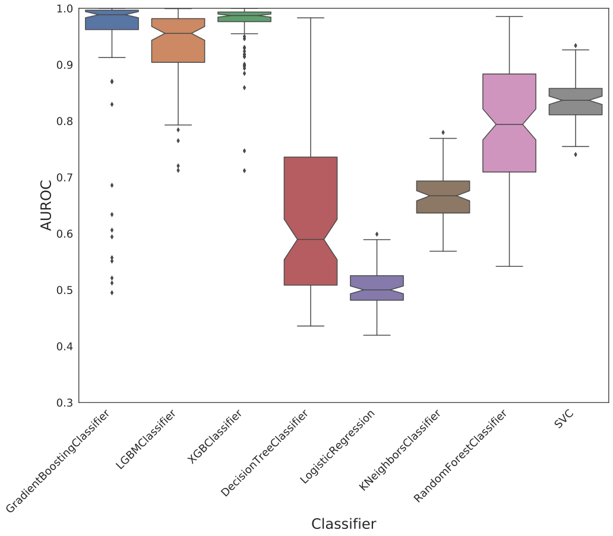
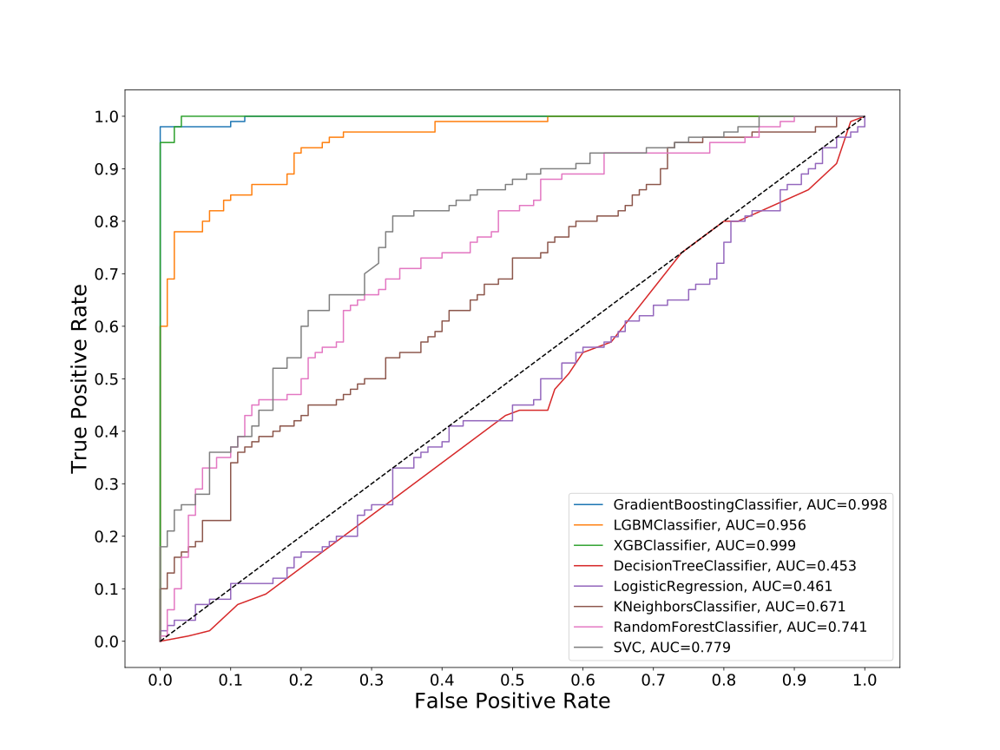
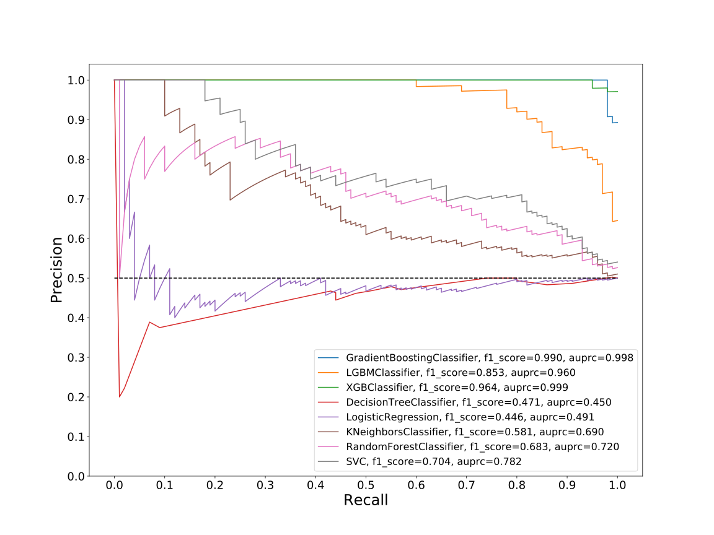
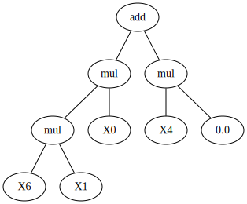
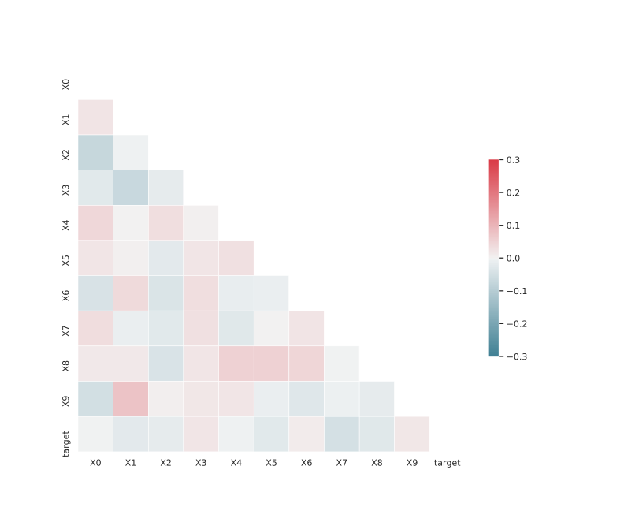

# Dataset: digen30_4426 (XGLSFKRD_0.208_0.757_4426)

|    | classifier                 |   auroc |    auprc |   f1_score |   rank_auroc |   rank_auprc |   rank_f1 |
|---:|:---------------------------|--------:|---------:|-----------:|-------------:|-------------:|----------:|
|  0 | GradientBoostingClassifier | 0.9978  | 0.998002 |   0.989899 |            2 |            2 |         1 |
|  1 | LGBMClassifier             | 0.9555  | 0.960182 |   0.852941 |            3 |            3 |         3 |
|  2 | XGBClassifier              | 0.9988  | 0.998803 |   0.964467 |            1 |            1 |         2 |
|  3 | DecisionTreeClassifier     | 0.45285 | 0.450039 |   0.470588 |            8 |            8 |         7 |
|  4 | LogisticRegression         | 0.4605  | 0.490541 |   0.445596 |            7 |            7 |         8 |
|  5 | KNeighborsClassifier       | 0.6708  | 0.689671 |   0.580645 |            6 |            6 |         6 |
|  6 | RandomForestClassifier     | 0.7405  | 0.719818 |   0.683168 |            5 |            5 |         5 |
|  7 | SVC                        | 0.7794  | 0.782253 |   0.703518 |            4 |            4 |         4 |


<details>
<summary>Parameters of tuned ML methods (200 optimizations)</summary>


```
GradientBoostingClassifier(learning_rate=0.8927104192681034, max_depth=7,
                           min_samples_leaf=55, n_iter_no_change=18,
                           random_state=4426, tol=1e-07,
                           validation_fraction=0.02)
LGBMClassifier(deterministic=True, force_row_wise=True, max_depth=10,
               metric='binary_logloss', n_estimators=75, n_jobs=1,
               num_leaves=1024, objective='binary', random_state=4426)
XGBClassifier(alpha=0.010156565471980922, base_score=0.5, booster='gbtree',
              colsample_bylevel=1, colsample_bynode=1, colsample_bytree=1,
              eta=0.5916896098613627, eval_metric='logloss', gamma=0.0,
              gpu_id=-1, importance_type='gain', interaction_constraints='',
              learning_rate=0.591689587, max_delta_step=0, max_depth=9,
              min_child_weight=1, missing=nan, monotone_constraints='()',
              n_estimators=96, n_jobs=1, nthread=1, num_parallel_tree=1,
              random_state=4426, reg_alpha=0.0101565653,
              reg_lambda=19.84723483476659, scale_pos_weight=1, subsample=1,
              tree_method='exact', use_label_encoder=False,
              validate_parameters=1, ...)
DecisionTreeClassifier(max_depth=5, max_features='auto', min_samples_leaf=20,
                       random_state=4426)
LogisticRegression(C=0.011221098909184215, dual=True, random_state=4426,
                   solver='liblinear')
KNeighborsClassifier(n_neighbors=8, p=1, weights='distance')
RandomForestClassifier(max_depth=10, max_features=None, min_samples_leaf=12,
                       min_samples_split=16, random_state=4426)
SVC(C=234.57217207333505, coef0=8.200000000000001, kernel='poly',
    probability=True, random_state=4426, tol=2.9042402797515083e-05)
```

</details>

<details>
<summary>Expected performance (100 optimizations starting from different random seed)</summary>

</details>

<details>
<summary>Receiver Operating Characteristics (ROC) curve</summary>

</details>

<details>
<summary>Precision-Recall Curve</summary>

</details>

<details>
<summary>Model (GP-tree)</summary>

</details>

<details>
<summary>Endpoint histogram</summary>

</details>

<details>
<summary>Feature correlations</summary>

</details>

[**Pandas Profiling Report**](https://epistasislab.github.io/digen/profile/digen30_4426.html)