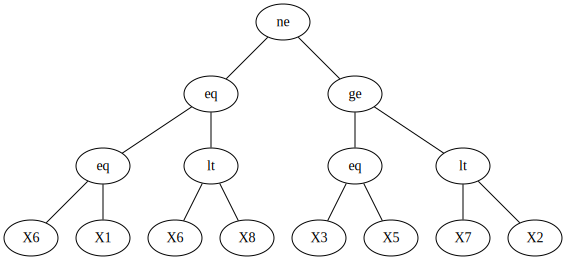
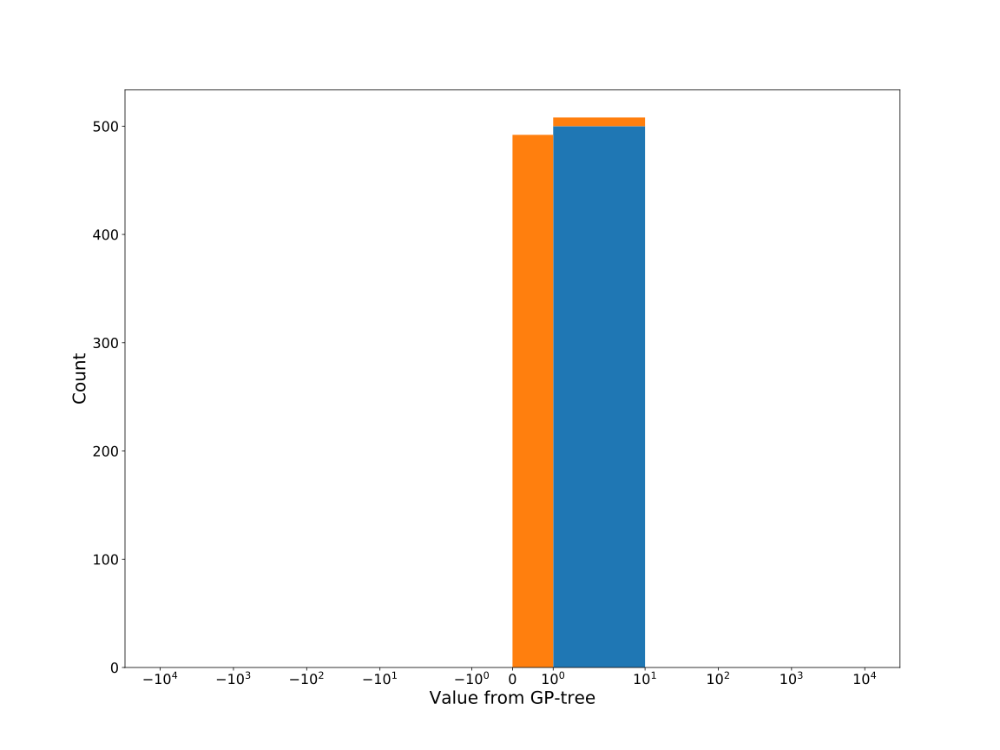

# Dataset: digen31
**Random seed: 2433**<br/>
Order of the methods: SXFLGKDR<br/>
Mean performance: 0.785<br/>
Standard deviation: 0.173<br/>


|    | classifier                 |   auroc |    auprc |   f1_score |   rank_auroc |   rank_auprc |   rank_f1 |
|---:|:---------------------------|--------:|---------:|-----------:|-------------:|-------------:|----------:|
|  0 | GradientBoostingClassifier | 0.8669  | 0.871832 |   0.77512  |            5 |            5 |         5 |
|  1 | LGBMClassifier             | 0.8795  | 0.890874 |   0.776699 |            4 |            4 |         4 |
|  2 | XGBClassifier              | 0.9072  | 0.913256 |   0.830918 |            2 |            2 |         2 |
|  3 | DecisionTreeClassifier     | 0.50715 | 0.51968  |   0.521327 |            7 |            8 |         7 |
|  4 | LogisticRegression         | 0.4816  | 0.550313 |   0.5      |            8 |            7 |         8 |
|  5 | KNeighborsClassifier       | 0.7925  | 0.815524 |   0.7173   |            6 |            6 |         6 |
|  6 | RandomForestClassifier     | 0.8946  | 0.900582 |   0.8      |            3 |            3 |         3 |
|  7 | SVC                        | 0.9496  | 0.950785 |   0.885572 |            1 |            1 |         1 |


<details>
<summary>Parameters of tuned ML methods (based on 200 optimizations started from seed 2433)</summary>


```
GradientBoostingClassifier(learning_rate=0.14963990700197707,
                           loss='exponential', max_depth=10,
                           min_samples_leaf=17, n_iter_no_change=8,
                           random_state=2433, tol=1e-07,
                           validation_fraction=0.09)
LGBMClassifier(boosting_type='dart', deterministic=True, force_row_wise=True,
               max_depth=10, metric='binary_logloss', n_estimators=86, n_jobs=1,
               num_leaves=1024, objective='binary', random_state=2433)
XGBClassifier(alpha=0.22718210339802045, base_score=0.5, booster='gbtree',
              colsample_bylevel=1, colsample_bynode=1, colsample_bytree=1,
              eta=0.128908512928316, eval_metric='logloss',
              gamma=0.30000000000000004, gpu_id=-1, importance_type='gain',
              interaction_constraints='', learning_rate=0.128908515,
              max_delta_step=0, max_depth=8, min_child_weight=1, missing=nan,
              monotone_constraints='()', n_estimators=76, n_jobs=1, nthread=1,
              num_parallel_tree=1, random_state=2433, reg_alpha=0.227182105,
              reg_lambda=3.87254138374144, scale_pos_weight=1, subsample=1,
              tree_method='exact', use_label_encoder=False,
              validate_parameters=1, ...)
DecisionTreeClassifier(max_depth=10, min_samples_leaf=5, min_samples_split=18,
                       random_state=2433)
LogisticRegression(C=32.77543952576448, dual=True, random_state=2433,
                   solver='liblinear')
KNeighborsClassifier(metric='euclidean', n_neighbors=82, p=4,
                     weights='distance')
RandomForestClassifier(max_depth=9, max_features=None, min_samples_leaf=4,
                       min_samples_split=4, n_estimators=93, random_state=2433)
SVC(C=1.0244693156215607, class_weight='balanced', coef0=9.700000000000001,
    gamma='auto', kernel='poly', probability=True, random_state=2433,
    tol=0.0097015225668107)
```

</details>

<details>
<summary>Expected performance (based on 100 runs, each with 100 optimizations started from a different random seed)</summary>

</details>

<details>
<summary>Receiver Operating Characteristics (ROC) curve</summary>

</details>

<details>
<summary>Precision-Recall Curve</summary>

</details>

<details>
<summary>Model (GP-tree)</summary>

</details>

<details>
<summary>Endpoint histogram</summary>

</details>

<details>
<summary>Feature correlations</summary>

</details>

[**Pandas Profiling Report**](https://epistasislab.github.io/digen/profile/digen31_2433.html)