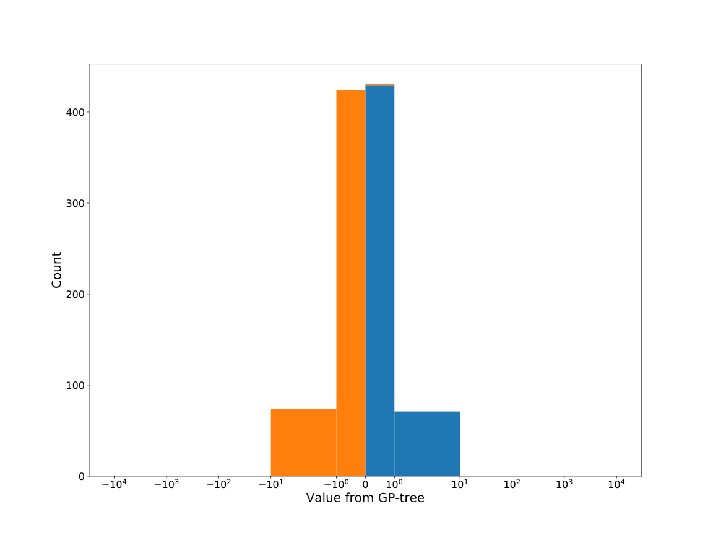

# Dataset: digen32
**Random seed: 5191**<br/>
Order of the methods: XGLFSKR-D<br/>
Mean performance: 0.777<br/>
Standard deviation: 0.196<br/>


|    | classifier                 |   auroc |    auprc |   f1_score |   rank_auroc |   rank_auprc |   rank_f1 |
|---:|:---------------------------|--------:|---------:|-----------:|-------------:|-------------:|----------:|
|  0 | GradientBoostingClassifier | 0.9835  | 0.984645 |   0.943005 |            2 |            2 |         2 |
|  1 | LGBMClassifier             | 0.9721  | 0.967543 |   0.926108 |            3 |            3 |         3 |
|  2 | XGBClassifier              | 0.9914  | 0.990527 |   0.965517 |            1 |            1 |         1 |
|  3 | DecisionTreeClassifier     | 0.4996  | 0.480984 |   0.502513 |            7 |            8 |         7 |
|  4 | LogisticRegression         | 0.5     | 0.75     |   0        |            7 |            6 |         8 |
|  5 | KNeighborsClassifier       | 0.6412  | 0.649505 |   0.562814 |            6 |            7 |         6 |
|  6 | RandomForestClassifier     | 0.8668  | 0.842174 |   0.773196 |            4 |            4 |         4 |
|  7 | SVC                        | 0.76165 | 0.780062 |   0.680412 |            5 |            5 |         5 |


<details>
<summary>Parameters of tuned ML methods (based on 200 optimizations started from seed 5191)</summary>


```
GradientBoostingClassifier(learning_rate=0.6659353990146355, loss='exponential',
                           max_depth=8, min_samples_leaf=14,
                           n_iter_no_change=18, random_state=5191, tol=1e-07,
                           validation_fraction=0.01)
LGBMClassifier(deterministic=True, force_row_wise=True, max_depth=10,
               metric='binary_logloss', n_estimators=98, n_jobs=1,
               num_leaves=1024, objective='binary', random_state=5191)
XGBClassifier(alpha=0.7821304028298368, base_score=0.5, booster='dart',
              colsample_bylevel=1, colsample_bynode=1, colsample_bytree=1,
              eta=0.3485160605195829, eval_metric='logloss', gamma=0.1,
              gpu_id=-1, importance_type='gain', interaction_constraints='',
              learning_rate=0.348516047, max_delta_step=0, max_depth=8,
              min_child_weight=1, missing=nan, monotone_constraints='()',
              n_estimators=84, n_jobs=1, nthread=1, num_parallel_tree=1,
              random_state=5191, reg_alpha=0.78213042,
              reg_lambda=9.793892381042903, scale_pos_weight=1, subsample=1,
              tree_method='exact', use_label_encoder=False,
              validate_parameters=1, ...)
DecisionTreeClassifier(max_depth=10, max_features='auto', min_samples_leaf=15,
                       min_samples_split=3, random_state=5191)
LogisticRegression(C=0.00011401039620395975, penalty='l1', random_state=5191,
                   solver='liblinear')
KNeighborsClassifier(metric='euclidean', n_neighbors=4, p=3, weights='distance')
RandomForestClassifier(max_depth=9, max_features=None, min_samples_split=8,
                       n_estimators=69, random_state=5191)
SVC(C=11.452632602988592, coef0=9.0, degree=5, probability=True,
    random_state=5191, tol=0.0011856409991547316)
```

</details>

<details>
<summary>Expected performance (based on 100 runs, each with 100 optimizations started from a different random seed)</summary>

</details>

<details>
<summary>Receiver Operating Characteristics (ROC) curve</summary>

</details>

<details>
<summary>Precision-Recall Curve</summary>

</details>

<details>
<summary>Model (GP-tree)</summary>

</details>

<details>
<summary>Endpoint histogram</summary>

</details>

<details>
<summary>Feature correlations</summary>

</details>

[**Pandas Profiling Report**](https://epistasislab.github.io/digen/profile/digen32_5191.html)