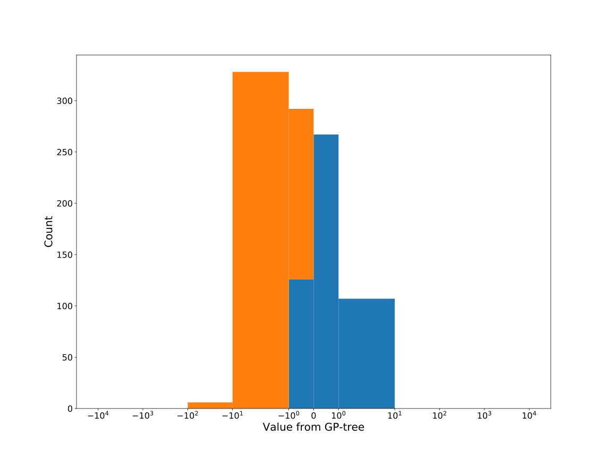

# Dataset: digen33_769 (SGXLFKDR_0.089_0.847_769)

|    | classifier                 |   auroc |    auprc |   f1_score |   rank_auroc |   rank_auprc |   rank_f1 |
|---:|:---------------------------|--------:|---------:|-----------:|-------------:|-------------:|----------:|
|  0 | GradientBoostingClassifier |  0.9269 | 0.922906 |   0.850242 |            2 |            2 |         2 |
|  1 | LGBMClassifier             |  0.8854 | 0.892521 |   0.809756 |            4 |            4 |         4 |
|  2 | XGBClassifier              |  0.9041 | 0.904352 |   0.815534 |            3 |            3 |         3 |
|  3 | DecisionTreeClassifier     |  0.7881 | 0.795425 |   0.700508 |            7 |            6 |         7 |
|  4 | LogisticRegression         |  0.6567 | 0.553942 |   0.568306 |            8 |            8 |         8 |
|  5 | KNeighborsClassifier       |  0.7949 | 0.765498 |   0.77193  |            6 |            7 |         6 |
|  6 | RandomForestClassifier     |  0.8772 | 0.876201 |   0.807882 |            5 |            5 |         5 |
|  7 | SVC                        |  0.9444 | 0.936128 |   0.891089 |            1 |            1 |         1 |


<details>
<summary>Parameters of tuned ML methods (200 optimizations)</summary>


```
GradientBoostingClassifier(learning_rate=0.09606870711603976, max_depth=9,
                           min_samples_leaf=3, n_iter_no_change=16,
                           random_state=769, tol=1e-07,
                           validation_fraction=0.03)
LGBMClassifier(boosting_type='dart', deterministic=True, force_row_wise=True,
               max_depth=9, metric='binary_logloss', n_estimators=45, n_jobs=1,
               num_leaves=512, objective='binary', random_state=769)
XGBClassifier(alpha=0.010695573698488146, base_score=0.5, booster='dart',
              colsample_bylevel=1, colsample_bynode=1, colsample_bytree=1,
              eta=0.24330061780756526, eval_metric='logloss', gamma=0.4,
              gpu_id=-1, importance_type='gain', interaction_constraints='',
              learning_rate=0.243300617, max_delta_step=0, max_depth=8,
              min_child_weight=1, missing=nan, monotone_constraints='()',
              n_estimators=20, n_jobs=1, nthread=1, num_parallel_tree=1,
              random_state=769, reg_alpha=0.0106955739,
              reg_lambda=0.0008806965545044316, scale_pos_weight=1, subsample=1,
              tree_method='exact', use_label_encoder=False,
              validate_parameters=1, ...)
DecisionTreeClassifier(criterion='entropy', max_depth=8, min_samples_leaf=16,
                       min_samples_split=16, random_state=769)
LogisticRegression(C=0.03148250213434678, penalty='l1', random_state=769,
                   solver='liblinear')
KNeighborsClassifier(n_neighbors=68, p=1, weights='distance')
RandomForestClassifier(criterion='entropy', max_depth=9, max_features=None,
                       min_samples_leaf=8, min_samples_split=13,
                       n_estimators=32, random_state=769)
SVC(C=39525.143428342424, class_weight='balanced', coef0=1.0, degree=2,
    gamma='auto', kernel='poly', probability=True, random_state=769,
    tol=1.5405177609334323e-05)
```

</details>

<details>
<summary>Expected performance (100 optimizations starting from different random seed)</summary>

</details>

<details>
<summary>Receiver Operating Characteristics (ROC) curve</summary>

</details>

<details>
<summary>Precision-Recall Curve</summary>

</details>

<details>
<summary>Model (GP-tree)</summary>

</details>

<details>
<summary>Endpoint histogram</summary>

</details>

<details>
<summary>Feature correlations</summary>

</details>

[**Pandas Profiling Report**](https://epistasislab.github.io/digen/profile/digen33_769.html)