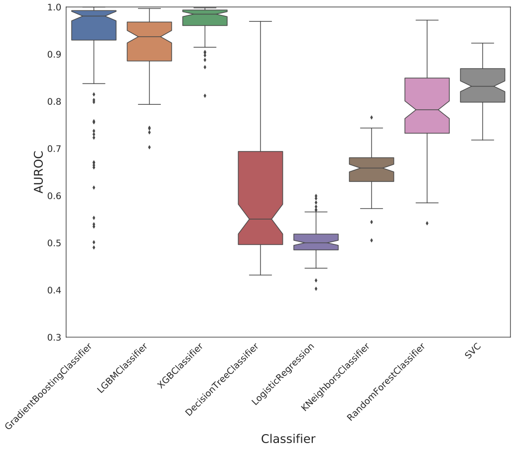
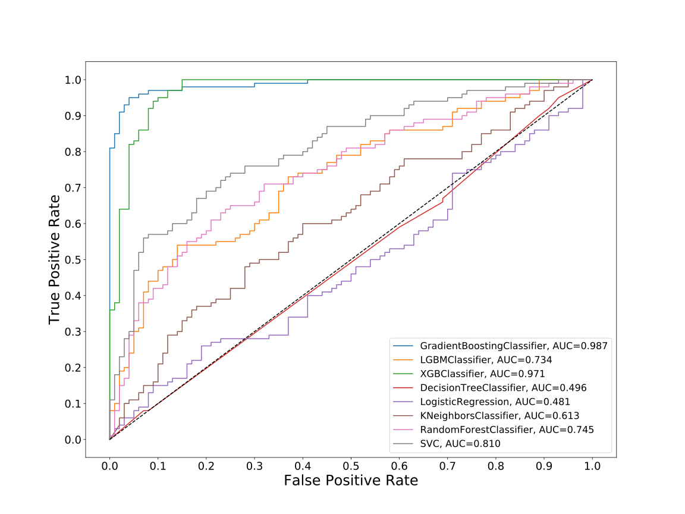
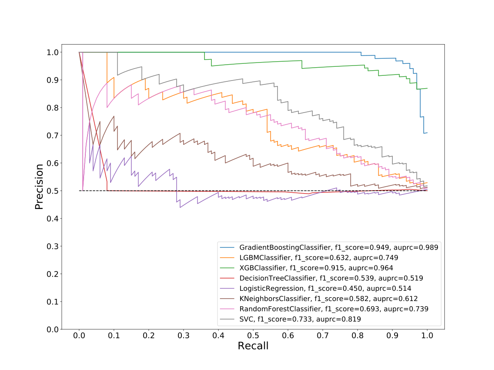
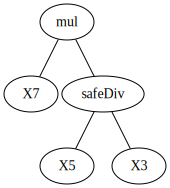
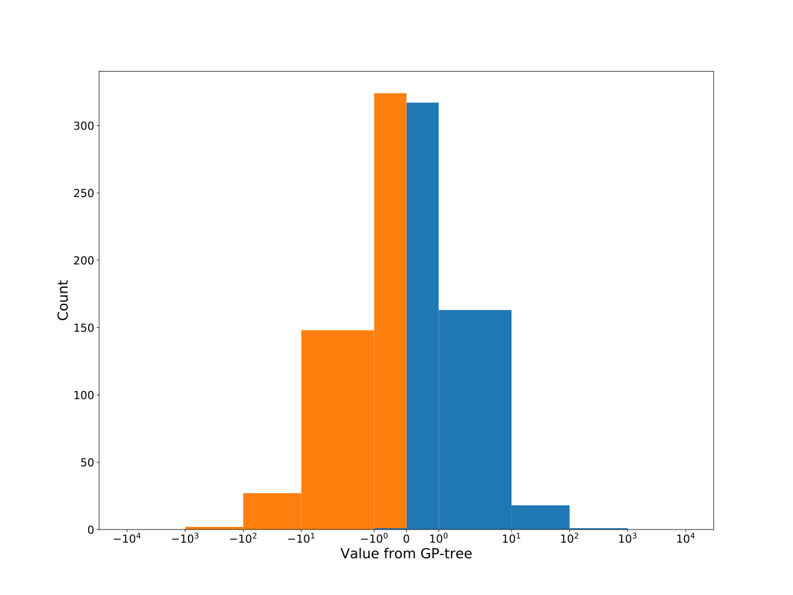
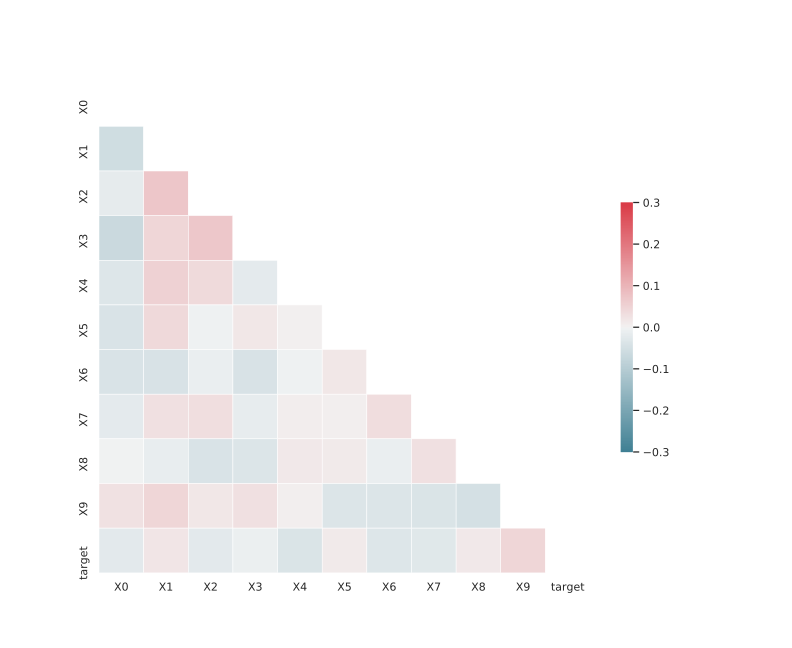

# Dataset: digen34_769 (GXSFLKDR_0.181_0.73_769)

|    | classifier                 |   auroc |    auprc |   f1_score |   rank_auroc |   rank_auprc |   rank_f1 |
|---:|:---------------------------|--------:|---------:|-----------:|-------------:|-------------:|----------:|
|  0 | GradientBoostingClassifier |  0.987  | 0.988799 |   0.949495 |            1 |            1 |         1 |
|  1 | LGBMClassifier             |  0.7342 | 0.749067 |   0.632124 |            5 |            4 |         5 |
|  2 | XGBClassifier              |  0.9706 | 0.963644 |   0.915423 |            2 |            2 |         2 |
|  3 | DecisionTreeClassifier     |  0.4962 | 0.519418 |   0.538813 |            7 |            7 |         7 |
|  4 | LogisticRegression         |  0.4814 | 0.513565 |   0.450262 |            8 |            8 |         8 |
|  5 | KNeighborsClassifier       |  0.6135 | 0.611958 |   0.581633 |            6 |            6 |         6 |
|  6 | RandomForestClassifier     |  0.745  | 0.739076 |   0.693069 |            4 |            5 |         4 |
|  7 | SVC                        |  0.8103 | 0.818559 |   0.732673 |            3 |            3 |         3 |


<details>
<summary>Parameters of tuned ML methods (200 optimizations)</summary>


```
GradientBoostingClassifier(learning_rate=0.7060849712559205, loss='exponential',
                           max_depth=8, min_samples_leaf=82,
                           n_iter_no_change=15, random_state=769, tol=1e-07,
                           validation_fraction=0.03)
LGBMClassifier(boosting_type='dart', deterministic=True, force_row_wise=True,
               max_depth=8, metric='binary_logloss', n_estimators=97, n_jobs=1,
               num_leaves=256, objective='binary', random_state=769)
XGBClassifier(alpha=2.0144221474145194, base_score=0.5, booster='gbtree',
              colsample_bylevel=1, colsample_bynode=1, colsample_bytree=1,
              eta=0.16087254671584855, eval_metric='logloss', gamma=0.2,
              gpu_id=-1, importance_type='gain', interaction_constraints='',
              learning_rate=0.160872549, max_delta_step=0, max_depth=8,
              min_child_weight=1, missing=nan, monotone_constraints='()',
              n_estimators=91, n_jobs=1, nthread=1, num_parallel_tree=1,
              random_state=769, reg_alpha=2.01442218,
              reg_lambda=3.5495549549594214, scale_pos_weight=1, subsample=1,
              tree_method='exact', use_label_encoder=False,
              validate_parameters=1, ...)
DecisionTreeClassifier(criterion='entropy', max_depth=9, max_features='auto',
                       min_samples_leaf=5, min_samples_split=10,
                       random_state=769)
LogisticRegression(C=0.0824171258544289, penalty='l1', random_state=769,
                   solver='liblinear')
KNeighborsClassifier(metric='euclidean', n_neighbors=6, p=5, weights='distance')
RandomForestClassifier(max_depth=10, max_features=None, min_samples_leaf=8,
                       min_samples_split=13, n_estimators=50, random_state=769)
SVC(C=187.49058959610034, class_weight='balanced', coef0=9.3, kernel='poly',
    probability=True, random_state=769, tol=0.00011051182755907301)
```

</details>

<details>
<summary>Expected performance (100 optimizations starting from different random seed)</summary>

</details>

<details>
<summary>Receiver Operating Characteristics (ROC) curve</summary>

</details>

<details>
<summary>Precision-Recall Curve</summary>

</details>

<details>
<summary>Model (GP-tree)</summary>

</details>

<details>
<summary>Endpoint histogram</summary>

</details>

<details>
<summary>Feature correlations</summary>

</details>

[**Pandas Profiling Report**](https://epistasislab.github.io/digen/profile/digen34_769.html)