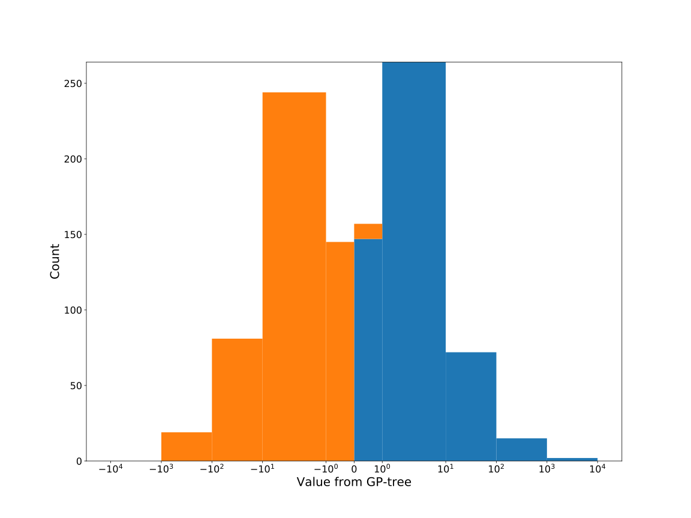

# Dataset: digen35_4426(GXLSFKDR_0.187_0.756_4426)

|    | classifier                 |   auroc |    auprc |   f1_score |   rank_auroc |   rank_auprc |   rank_f1 |
|---:|:---------------------------|--------:|---------:|-----------:|-------------:|-------------:|----------:|
|  0 | GradientBoostingClassifier | 0.9824  | 0.985078 |   0.954315 |            1 |            1 |         1 |
|  1 | LGBMClassifier             | 0.9448  | 0.947265 |   0.9      |            3 |            3 |         3 |
|  2 | XGBClassifier              | 0.9701  | 0.972851 |   0.913706 |            2 |            2 |         2 |
|  3 | DecisionTreeClassifier     | 0.54885 | 0.571079 |   0.576271 |            7 |            7 |         7 |
|  4 | LogisticRegression         | 0.4687  | 0.528482 |   0.50237  |            8 |            8 |         8 |
|  5 | KNeighborsClassifier       | 0.62955 | 0.625718 |   0.619289 |            6 |            6 |         6 |
|  6 | RandomForestClassifier     | 0.6981  | 0.706825 |   0.673171 |            5 |            5 |         5 |
|  7 | SVC                        | 0.8046  | 0.816585 |   0.712871 |            4 |            4 |         4 |


<details>
<summary>Parameters of tuned ML methods</summary>


```
GradientBoostingClassifier(learning_rate=0.7280931907710034, max_depth=10,
                           n_iter_no_change=16, random_state=4426, tol=1e-07,
                           validation_fraction=0.060000000000000005)
LGBMClassifier(deterministic=True, force_row_wise=True, max_depth=9,
               metric='binary_logloss', n_estimators=90, n_jobs=1,
               num_leaves=512, objective='binary', random_state=4426)
XGBClassifier(alpha=1.3790975696338315, base_score=0.5, booster='dart',
              colsample_bylevel=1, colsample_bynode=1, colsample_bytree=1,
              eta=0.13896270616257594, eval_metric='logloss',
              gamma=0.30000000000000004, gpu_id=-1, importance_type='gain',
              interaction_constraints='', learning_rate=0.138962701,
              max_delta_step=0, max_depth=6, min_child_weight=1, missing=nan,
              monotone_constraints='()', n_estimators=94, n_jobs=1, nthread=1,
              num_parallel_tree=1, random_state=4426, reg_alpha=1.37909758,
              reg_lambda=8.690372694864962, scale_pos_weight=1, subsample=1,
              tree_method='exact', use_label_encoder=False,
              validate_parameters=1, ...)
DecisionTreeClassifier(max_depth=9, max_features='auto', min_samples_leaf=8,
                       min_samples_split=5, random_state=4426)
LogisticRegression(C=0.0021735845482076343, random_state=4426,
                   solver='newton-cg')
KNeighborsClassifier(metric='euclidean', n_neighbors=4, p=1, weights='distance')
RandomForestClassifier(max_depth=9, max_features=None, min_samples_leaf=3,
                       min_samples_split=10, n_estimators=85,
                       random_state=4426)
SVC(C=317.6179888507738, coef0=9.0, kernel='poly', probability=True,
    random_state=4426, tol=2.7492575695659333e-05)
```

</details>

<details>
<summary>Expected performance (200 experiments per ML method)</summary>

</details>

<details>
<summary>Receiver Operating Characteristics (ROC) curve</summary>

</details>

<details>
<summary>Precision-Recall Curve</summary>

</details>

<details>
<summary>Model (GP-tree)</summary>

</details>

<details>
<summary>Endpoint histogram</summary>

</details>

<details>
<summary>Feature correlations</summary>

</details>

[**Pandas Profiling Report**](https://github.io/athril/digen-test/docs/profile/digen35_4426.html)