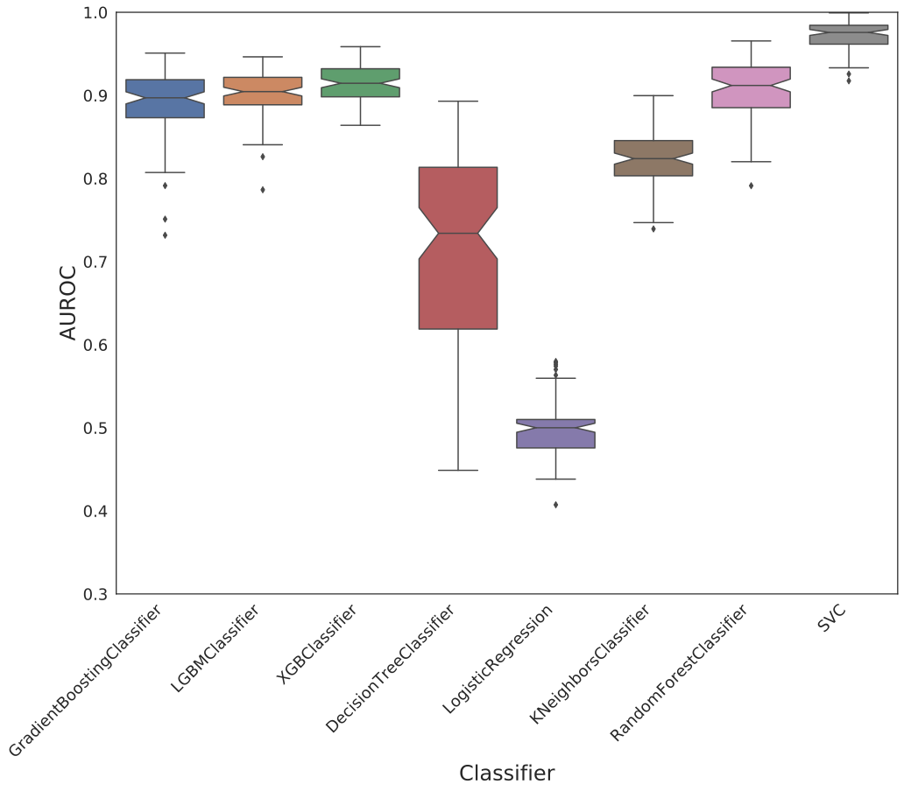
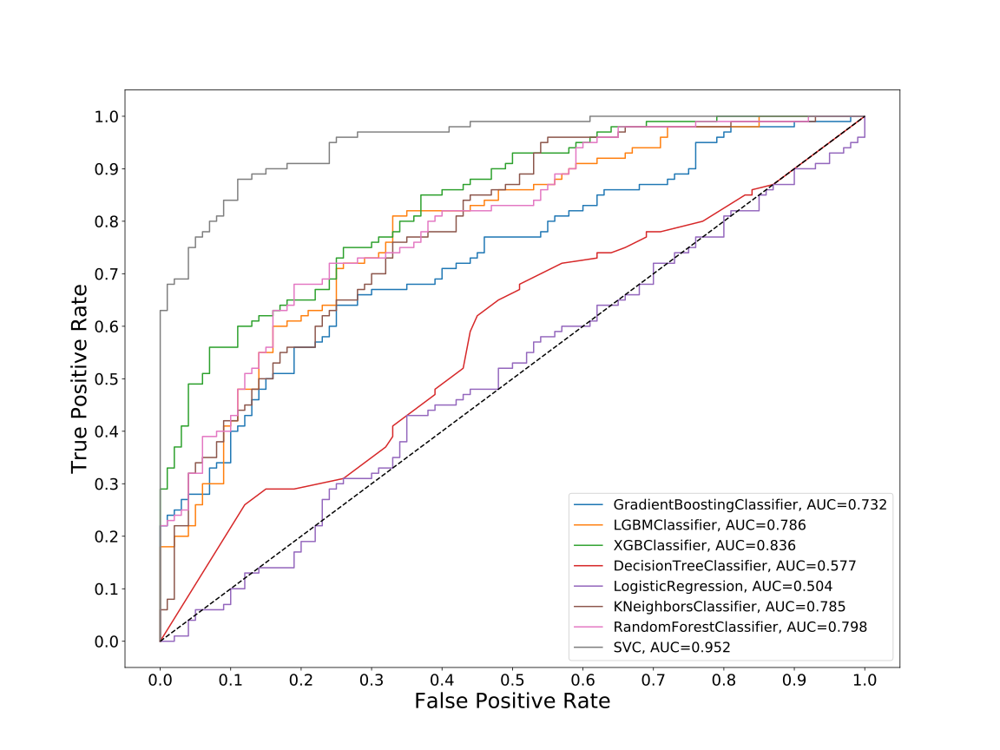
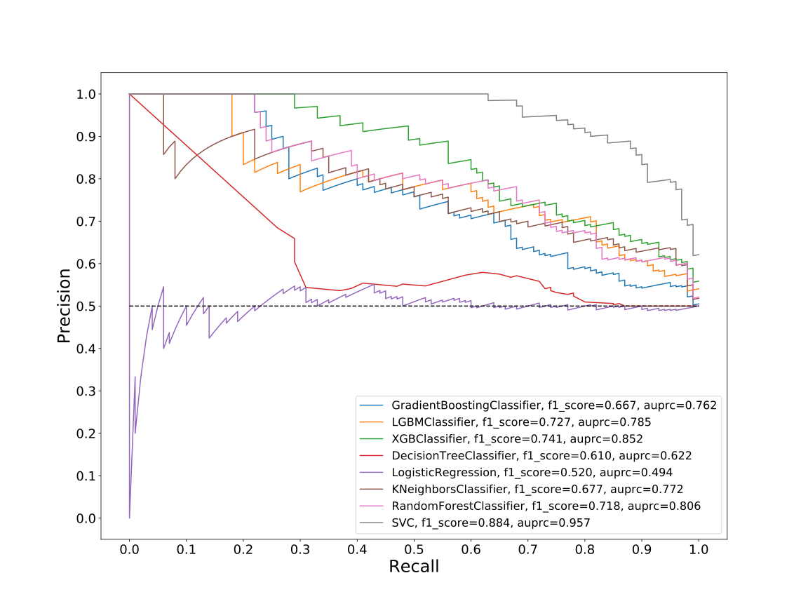
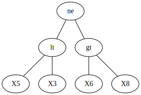
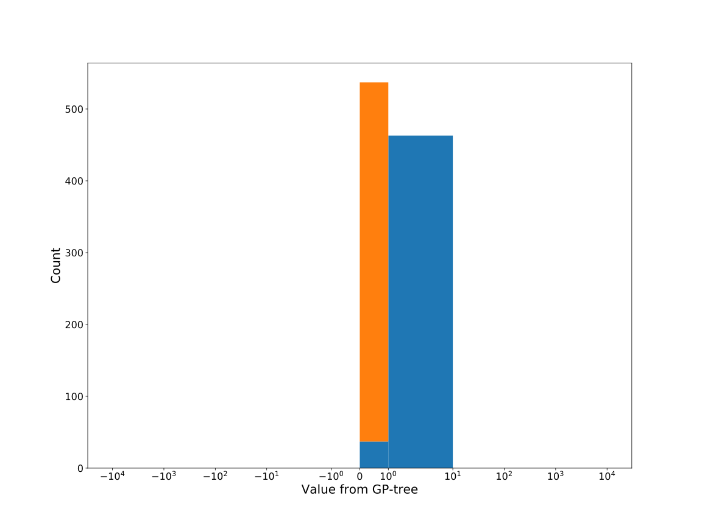
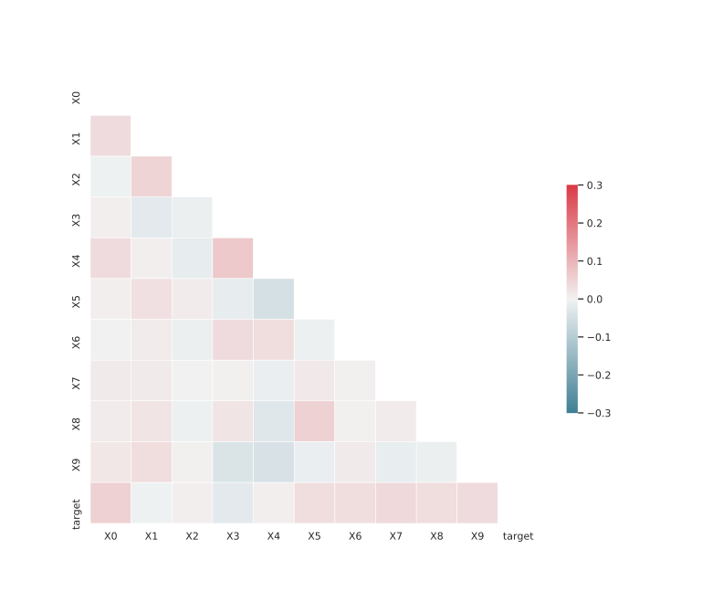

# Dataset: digen36
**Random seed: 466**<br/>
Order of the methods: SXFL-KGDR<br/>
Mean performance: 0.746<br/>
Standard deviation: 0.134<br/>


|    | classifier                 |   auroc |    auprc |   f1_score |   rank_auroc |   rank_auprc |   rank_f1 |
|---:|:---------------------------|--------:|---------:|-----------:|-------------:|-------------:|----------:|
|  0 | GradientBoostingClassifier | 0.7317  | 0.762424 |   0.666667 |            6 |            6 |         6 |
|  1 | LGBMClassifier             | 0.7864  | 0.785379 |   0.727273 |            4 |            4 |         3 |
|  2 | XGBClassifier              | 0.8363  | 0.851609 |   0.740741 |            2 |            2 |         2 |
|  3 | DecisionTreeClassifier     | 0.57675 | 0.621667 |   0.610329 |            7 |            7 |         7 |
|  4 | LogisticRegression         | 0.5038  | 0.494113 |   0.52     |            8 |            8 |         8 |
|  5 | KNeighborsClassifier       | 0.7855  | 0.772057 |   0.677083 |            4 |            5 |         5 |
|  6 | RandomForestClassifier     | 0.7976  | 0.806057 |   0.717703 |            3 |            3 |         4 |
|  7 | SVC                        | 0.9519  | 0.957077 |   0.884422 |            1 |            1 |         1 |


<details>
<summary>Parameters of tuned ML methods (based on 200 optimizations started from seed 466)</summary>


```
GradientBoostingClassifier(learning_rate=0.18336196491653062,
                           loss='exponential', max_depth=6, min_samples_leaf=44,
                           n_iter_no_change=9, random_state=466, tol=1e-07,
                           validation_fraction=0.12)
LGBMClassifier(deterministic=True, force_row_wise=True, max_depth=9,
               metric='binary_logloss', n_estimators=65, n_jobs=1,
               num_leaves=512, objective='binary', random_state=466)
XGBClassifier(alpha=0.004006471734443385, base_score=0.5, booster='dart',
              colsample_bylevel=1, colsample_bynode=1, colsample_bytree=1,
              eta=0.9956944262441327, eval_metric='logloss', gamma=0.2,
              gpu_id=-1, importance_type='gain', interaction_constraints='',
              learning_rate=0.995694399, max_delta_step=0, max_depth=10,
              min_child_weight=1, missing=nan, monotone_constraints='()',
              n_estimators=94, n_jobs=1, nthread=1, num_parallel_tree=1,
              random_state=466, reg_alpha=0.00400647195,
              reg_lambda=97.27421245846705, scale_pos_weight=1, subsample=1,
              tree_method='exact', use_label_encoder=False,
              validate_parameters=1, ...)
DecisionTreeClassifier(max_depth=9, min_samples_leaf=8, min_samples_split=17,
                       random_state=466)
LogisticRegression(C=0.30175834821259256, penalty='l1', random_state=466,
                   solver='liblinear')
KNeighborsClassifier(metric='euclidean', n_neighbors=40, p=4,
                     weights='distance')
RandomForestClassifier(criterion='entropy', max_depth=9, max_features=None,
                       min_samples_leaf=7, min_samples_split=14,
                       n_estimators=98, random_state=466)
SVC(C=28003.590453299326, class_weight='balanced', coef0=5.7, degree=2,
    kernel='poly', probability=True, random_state=466,
    tol=0.000266168554894406)
```

</details>

<details>
<summary>Expected performance (based on 100 runs, each with 100 optimizations started from a different random seed)</summary>

</details>

<details>
<summary>Receiver Operating Characteristics (ROC) curve</summary>

</details>

<details>
<summary>Precision-Recall Curve</summary>

</details>

<details>
<summary>Model (GP-tree)</summary>

</details>

<details>
<summary>Endpoint histogram</summary>

</details>

<details>
<summary>Feature correlations</summary>

</details>

[**Pandas Profiling Report**](https://epistasislab.github.io/digen/profile/digen36_466.html)