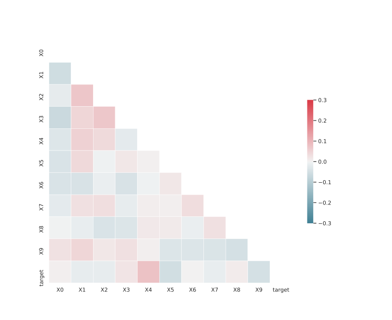

# Dataset: digen37_769 (SFXLGDKR_0.141_0.846_769)

|    | classifier                 |   auroc |    auprc |   f1_score |   rank_auroc |   rank_auprc |   rank_f1 |
|---:|:---------------------------|--------:|---------:|-----------:|-------------:|-------------:|----------:|
|  0 | GradientBoostingClassifier |  0.8863 | 0.883253 |   0.793651 |            5 |            6 |         6 |
|  1 | LGBMClassifier             |  0.9009 | 0.896027 |   0.814433 |            4 |            4 |         4 |
|  2 | XGBClassifier              |  0.9057 | 0.897287 |   0.831683 |            3 |            3 |         3 |
|  3 | DecisionTreeClassifier     |  0.8596 | 0.886254 |   0.79798  |            6 |            5 |         5 |
|  4 | LogisticRegression         |  0.503  | 0.518014 |   0.484848 |            8 |            8 |         8 |
|  5 | KNeighborsClassifier       |  0.784  | 0.781821 |   0.733945 |            7 |            7 |         7 |
|  6 | RandomForestClassifier     |  0.9315 | 0.920893 |   0.845361 |            2 |            2 |         2 |
|  7 | SVC                        |  0.993  | 0.99225  |   0.97     |            1 |            1 |         1 |


<details>
<summary>Parameters of tuned ML methods (200 optimizations)</summary>


```
GradientBoostingClassifier(learning_rate=0.4222016491367795, max_depth=8,
                           min_samples_leaf=8, n_iter_no_change=18,
                           random_state=769, tol=1e-07,
                           validation_fraction=0.02)
LGBMClassifier(boosting_type='dart', deterministic=True, force_row_wise=True,
               max_depth=10, metric='binary_logloss', n_estimators=86, n_jobs=1,
               num_leaves=1024, objective='binary', random_state=769)
XGBClassifier(alpha=0.04859106720697657, base_score=0.5, booster='dart',
              colsample_bylevel=1, colsample_bynode=1, colsample_bytree=1,
              eta=0.6736814699872563, eval_metric='logloss', gamma=0.0,
              gpu_id=-1, importance_type='gain', interaction_constraints='',
              learning_rate=0.673681498, max_delta_step=0, max_depth=10,
              min_child_weight=1, missing=nan, monotone_constraints='()',
              n_estimators=84, n_jobs=1, nthread=1, num_parallel_tree=1,
              random_state=769, reg_alpha=0.0485910662,
              reg_lambda=47.45245943547817, scale_pos_weight=1, subsample=1,
              tree_method='exact', use_label_encoder=False,
              validate_parameters=1, ...)
DecisionTreeClassifier(max_depth=9, min_samples_leaf=3, min_samples_split=6,
                       random_state=769)
LogisticRegression(C=0.18661112735765192, random_state=769, solver='saga')
KNeighborsClassifier(n_neighbors=80, p=1, weights='distance')
RandomForestClassifier(max_depth=10, max_features=None, min_samples_leaf=2,
                       min_samples_split=3, n_estimators=87, random_state=769)
SVC(C=72333.2860651946, degree=2, gamma='auto', kernel='poly', probability=True,
    random_state=769, tol=2.2135679908384104e-05)
```

</details>

<details>
<summary>Expected performance (100 optimizations starting from different random seed)</summary>

</details>

<details>
<summary>Receiver Operating Characteristics (ROC) curve</summary>

</details>

<details>
<summary>Precision-Recall Curve</summary>

</details>

<details>
<summary>Model (GP-tree)</summary>

</details>

<details>
<summary>Endpoint histogram</summary>

</details>

<details>
<summary>Feature correlations</summary>

</details>

[**Pandas Profiling Report**](https://epistasislab.github.io/digen/profile/digen37_769.html)