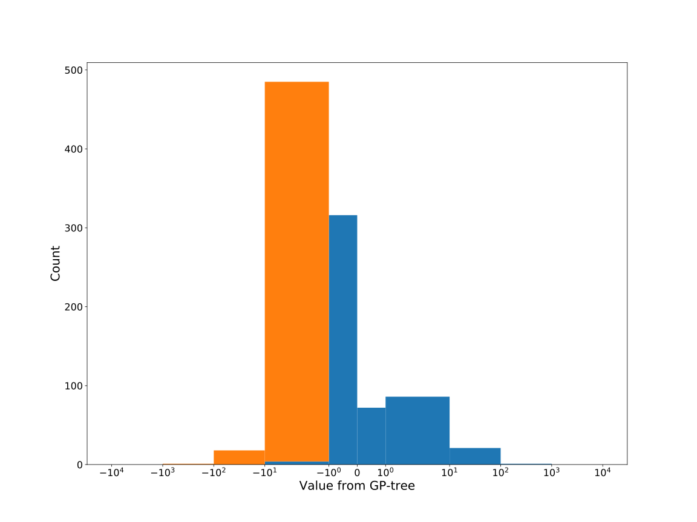

# Dataset: digen38_4426 (GXSLFKDR_0.183_0.763_4426)

|    | classifier                 |   auroc |    auprc |   f1_score |   rank_auroc |   rank_auprc |   rank_f1 |
|---:|:---------------------------|--------:|---------:|-----------:|-------------:|-------------:|----------:|
|  0 | GradientBoostingClassifier |  0.9957 | 0.996163 |   0.975124 |            1 |            1 |         1 |
|  1 | LGBMClassifier             |  0.8505 | 0.854238 |   0.78673  |            4 |            4 |         3 |
|  2 | XGBClassifier              |  0.9852 | 0.988485 |   0.96     |            2 |            2 |         2 |
|  3 | DecisionTreeClassifier     |  0.536  | 0.545602 |   0.429379 |            7 |            7 |         8 |
|  4 | LogisticRegression         |  0.4661 | 0.496846 |   0.47343  |            8 |            8 |         7 |
|  5 | KNeighborsClassifier       |  0.679  | 0.676398 |   0.591398 |            6 |            6 |         6 |
|  6 | RandomForestClassifier     |  0.7416 | 0.718704 |   0.669951 |            5 |            5 |         5 |
|  7 | SVC                        |  0.8529 | 0.878393 |   0.752577 |            3 |            3 |         4 |


<details>
<summary>Parameters of tuned ML methods (200 optimizations)</summary>


```
GradientBoostingClassifier(learning_rate=0.5923118909186984, max_depth=6,
                           min_samples_leaf=82, n_iter_no_change=17,
                           random_state=4426, tol=1e-07,
                           validation_fraction=0.01)
LGBMClassifier(deterministic=True, force_row_wise=True, max_depth=10,
               metric='binary_logloss', n_jobs=1, num_leaves=1024,
               objective='binary', random_state=4426)
XGBClassifier(alpha=2.245887444244428, base_score=0.5, booster='gbtree',
              colsample_bylevel=1, colsample_bynode=1, colsample_bytree=1,
              eta=0.13196580465068994, eval_metric='logloss', gamma=0.5,
              gpu_id=-1, importance_type='gain', interaction_constraints='',
              learning_rate=0.131965801, max_delta_step=0, max_depth=7,
              min_child_weight=1, missing=nan, monotone_constraints='()',
              n_estimators=100, n_jobs=1, nthread=1, num_parallel_tree=1,
              random_state=4426, reg_alpha=2.24588752,
              reg_lambda=0.0011401850838286963, scale_pos_weight=1, subsample=1,
              tree_method='exact', use_label_encoder=False,
              validate_parameters=1, ...)
DecisionTreeClassifier(max_depth=8, max_features='auto', min_samples_leaf=2,
                       min_samples_split=13, random_state=4426)
LogisticRegression(C=0.3075304790451844, random_state=4426, solver='sag')
KNeighborsClassifier(n_neighbors=6, p=1, weights='distance')
RandomForestClassifier(max_depth=10, max_features=None, min_samples_leaf=2,
                       min_samples_split=5, n_estimators=91, random_state=4426)
SVC(C=4873.703354641575, class_weight='balanced', kernel='poly',
    probability=True, random_state=4426, tol=0.0016317815221876945)
```

</details>

<details>
<summary>Expected performance (100 optimizations starting from different random seed)</summary>

</details>

<details>
<summary>Receiver Operating Characteristics (ROC) curve</summary>

</details>

<details>
<summary>Precision-Recall Curve</summary>

</details>

<details>
<summary>Model (GP-tree)</summary>

</details>

<details>
<summary>Endpoint histogram</summary>

</details>

<details>
<summary>Feature correlations</summary>

</details>

[**Pandas Profiling Report**](https://epistasislab.github.io/digen/profile/digen38_4426.html)