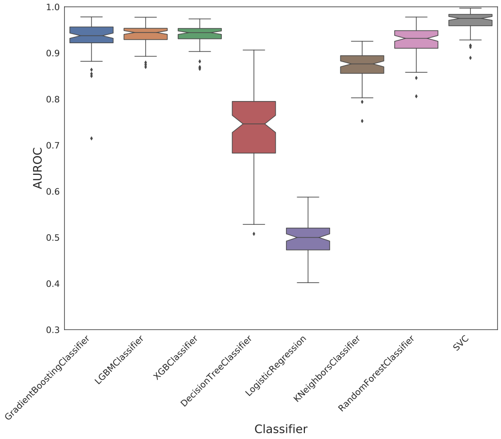

# Dataset: digen39_5578(SXLGFKDR_0.127_0.889_5578)

|    | classifier                 |   auroc |    auprc |   f1_score |   rank_auroc |   rank_auprc |   rank_f1 |
|---:|:---------------------------|--------:|---------:|-----------:|-------------:|-------------:|----------:|
|  0 | GradientBoostingClassifier |  0.9685 | 0.972915 |   0.920792 |            4 |            4 |         2 |
|  1 | LGBMClassifier             |  0.9703 | 0.978038 |   0.92     |            3 |            2 |         3 |
|  2 | XGBClassifier              |  0.9706 | 0.976364 |   0.910891 |            2 |            3 |         4 |
|  3 | DecisionTreeClassifier     |  0.8159 | 0.796179 |   0.769953 |            7 |            7 |         7 |
|  4 | LogisticRegression         |  0.5863 | 0.604431 |   0.576923 |            8 |            8 |         8 |
|  5 | KNeighborsClassifier       |  0.885  | 0.898103 |   0.770732 |            6 |            6 |         6 |
|  6 | RandomForestClassifier     |  0.9266 | 0.91098  |   0.858537 |            5 |            5 |         5 |
|  7 | SVC                        |  0.9894 | 0.992443 |   0.959596 |            1 |            1 |         1 |


<details>
<summary>Parameters of tuned ML methods</summary>


```
GradientBoostingClassifier(learning_rate=0.1585411956670701, loss='exponential',
                           max_depth=6, min_samples_leaf=49,
                           n_iter_no_change=18, random_state=5578, tol=1e-07,
                           validation_fraction=0.06999999999999999)
LGBMClassifier(deterministic=True, force_row_wise=True, max_depth=10,
               metric='binary_logloss', n_estimators=82, n_jobs=1,
               num_leaves=1024, objective='binary', random_state=5578)
XGBClassifier(alpha=0.005059158405829309, base_score=0.5, booster='dart',
              colsample_bylevel=1, colsample_bynode=1, colsample_bytree=1,
              eta=0.5447965176942732, eval_metric='logloss', gamma=0.1,
              gpu_id=-1, importance_type='gain', interaction_constraints='',
              learning_rate=0.544796526, max_delta_step=0, max_depth=7,
              min_child_weight=1, missing=nan, monotone_constraints='()',
              n_estimators=75, n_jobs=1, nthread=1, num_parallel_tree=1,
              random_state=5578, reg_alpha=0.00505915843,
              reg_lambda=42.37439030193409, scale_pos_weight=1, subsample=1,
              tree_method='exact', use_label_encoder=False,
              validate_parameters=1, ...)
DecisionTreeClassifier(criterion='entropy', max_depth=8, min_samples_leaf=20,
                       min_samples_split=3, random_state=5578)
LogisticRegression(C=2.703288209540803, penalty='l1', random_state=5578,
                   solver='liblinear')
KNeighborsClassifier(metric='euclidean', n_neighbors=37, p=4,
                     weights='distance')
RandomForestClassifier(max_depth=10, max_features=None, min_samples_split=3,
                       n_estimators=65, random_state=5578)
SVC(C=102.95458343932938, class_weight='balanced', coef0=9.3, degree=2,
    gamma='auto', kernel='poly', probability=True, random_state=5578,
    tol=0.0004952612478501676)
```

</details>

<details>
<summary>Expected performance (200 experiments per ML method)</summary>

</details>

<details>
<summary>Receiver Operating Characteristics (ROC) curve</summary>

</details>

<details>
<summary>Precision-Recall Curve</summary>

</details>

<details>
<summary>Model (GP-tree)</summary>

</details>

<details>
<summary>Endpoint histogram</summary>

</details>

<details>
<summary>Feature correlations</summary>

</details>

[**Pandas Profiling Report**](https://github.io/athril/digen-test/docs/profile/digen39_5578.html)