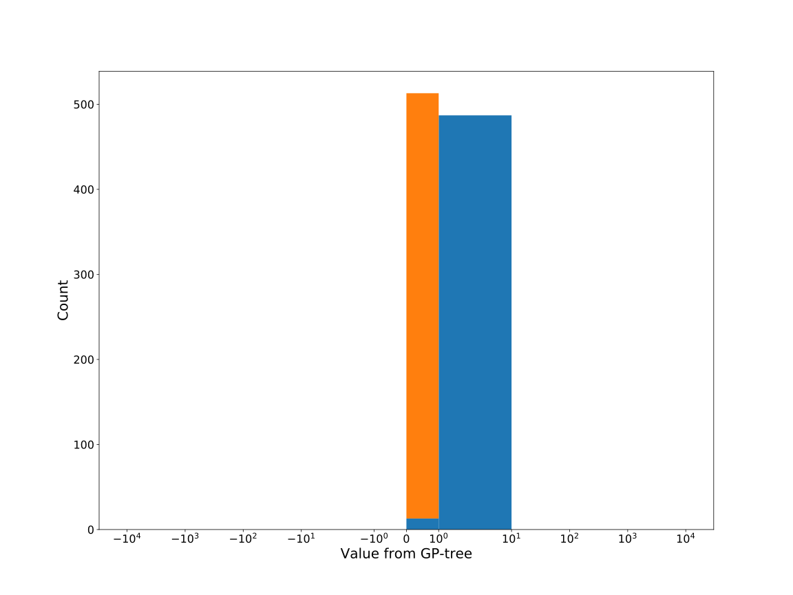

# Dataset: digen3
**Random seed: 769**<br/>
Order of the methods: RSKG-XLFD<br/>
Mean performance: 0.958<br/>
Standard deviation: 0.036<br/>


|    | classifier                 |   auroc |    auprc |   f1_score |   rank_auroc |   rank_auprc |   rank_f1 |
|---:|:---------------------------|--------:|---------:|-----------:|-------------:|-------------:|----------:|
|  0 | GradientBoostingClassifier | 0.9712  | 0.978289 |   0.928571 |            4 |            3 |         3 |
|  1 | LGBMClassifier             | 0.9656  | 0.970891 |   0.902564 |            6 |            6 |         6 |
|  2 | XGBClassifier              | 0.9708  | 0.976227 |   0.91     |            4 |            5 |         5 |
|  3 | DecisionTreeClassifier     | 0.86505 | 0.889346 |   0.793814 |            8 |            8 |         8 |
|  4 | LogisticRegression         | 0.9828  | 0.989081 |   0.979592 |            1 |            1 |         1 |
|  5 | KNeighborsClassifier       | 0.9719  | 0.977922 |   0.914573 |            3 |            3 |         4 |
|  6 | RandomForestClassifier     | 0.9568  | 0.959845 |   0.884211 |            7 |            7 |         7 |
|  7 | SVC                        | 0.9817  | 0.988183 |   0.96     |            2 |            2 |         2 |


<details>
<summary>Parameters of tuned ML methods (based on 200 optimizations started from seed 769)</summary>


```
GradientBoostingClassifier(learning_rate=0.337867698864724, max_depth=1,
                           min_samples_leaf=14, n_iter_no_change=14,
                           random_state=769, tol=1e-07,
                           validation_fraction=0.09)
LGBMClassifier(deterministic=True, force_row_wise=True, max_depth=10,
               metric='binary_logloss', n_estimators=79, n_jobs=1,
               num_leaves=1024, objective='binary', random_state=769)
XGBClassifier(alpha=3.4846112718759746e-05, base_score=0.5, booster='gbtree',
              colsample_bylevel=1, colsample_bynode=1, colsample_bytree=1,
              eta=0.22517326758142897, eval_metric='logloss', gamma=0.1,
              gpu_id=-1, importance_type='gain', interaction_constraints='',
              learning_rate=0.225173265, max_delta_step=0, max_depth=4,
              min_child_weight=1, missing=nan, monotone_constraints='()',
              n_estimators=54, n_jobs=1, nthread=1, num_parallel_tree=1,
              random_state=769, reg_alpha=3.48461144e-05,
              reg_lambda=71.12514002330738, scale_pos_weight=1, subsample=1,
              tree_method='exact', use_label_encoder=False,
              validate_parameters=1, ...)
DecisionTreeClassifier(criterion='entropy', max_depth=9, min_samples_leaf=5,
                       min_samples_split=17, random_state=769)
LogisticRegression(C=0.07105505061968753, penalty='l1', random_state=769,
                   solver='liblinear')
KNeighborsClassifier(metric='euclidean', n_neighbors=58, p=1,
                     weights='distance')
RandomForestClassifier(criterion='entropy', max_depth=8, max_features='log2',
                       min_samples_split=9, n_estimators=99, random_state=769)
SVC(C=37597.16038511512, class_weight='balanced', degree=5, kernel='linear',
    probability=True, random_state=769, tol=0.00017585771388966642)
```

</details>

<details>
<summary>Expected performance (based on 100 runs, each with 100 optimizations started from a different random seed)</summary>

</details>

<details>
<summary>Receiver Operating Characteristics (ROC) curve</summary>

</details>

<details>
<summary>Precision-Recall Curve</summary>

</details>

<details>
<summary>Model (GP-tree)</summary>

</details>

<details>
<summary>Endpoint histogram</summary>

</details>

<details>
<summary>Feature correlations</summary>

</details>

[**Pandas Profiling Report**](https://epistasislab.github.io/digen/profile/digen3_769.html)