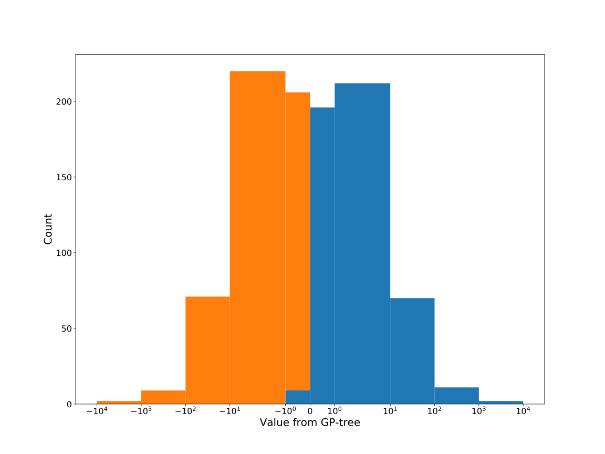

# Dataset: digen40_5390(XLGFSRDK_0.187_0.734_5390)

|    | classifier                 |   auroc |    auprc |   f1_score |   rank_auroc |   rank_auprc |   rank_f1 |
|---:|:---------------------------|--------:|---------:|-----------:|-------------:|-------------:|----------:|
|  0 | GradientBoostingClassifier | 0.9384  | 0.919198 |   0.920792 |            3 |            3 |         3 |
|  1 | LGBMClassifier             | 0.9709  | 0.974473 |   0.92381  |            2 |            1 |         2 |
|  2 | XGBClassifier              | 0.9763  | 0.971871 |   0.934673 |            1 |            2 |         1 |
|  3 | DecisionTreeClassifier     | 0.54605 | 0.522539 |   0.545455 |            7 |            8 |         8 |
|  4 | LogisticRegression         | 0.5792  | 0.532032 |   0.576923 |            6 |            7 |         6 |
|  5 | KNeighborsClassifier       | 0.53    | 0.658636 |   0.552381 |            8 |            5 |         7 |
|  6 | RandomForestClassifier     | 0.7468  | 0.672989 |   0.7109   |            4 |            4 |         4 |
|  7 | SVC                        | 0.5821  | 0.611449 |   0.580645 |            5 |            6 |         5 |


<details>
<summary>Parameters of tuned ML methods</summary>


```
GradientBoostingClassifier(learning_rate=0.24261576644161678, max_depth=8,
                           n_iter_no_change=18, random_state=5390, tol=1e-07,
                           validation_fraction=0.03)
LGBMClassifier(deterministic=True, force_row_wise=True, max_depth=7,
               metric='binary_logloss', n_estimators=92, n_jobs=1,
               num_leaves=232, objective='binary', random_state=5390)
XGBClassifier(alpha=0.0014227793019547016, base_score=0.5, booster='dart',
              colsample_bylevel=1, colsample_bynode=1, colsample_bytree=1,
              eta=0.4347261074360663, eval_metric='logloss', gamma=0.4,
              gpu_id=-1, importance_type='gain', interaction_constraints='',
              learning_rate=0.434726119, max_delta_step=0, max_depth=6,
              min_child_weight=1, missing=nan, monotone_constraints='()',
              n_estimators=97, n_jobs=1, nthread=1, num_parallel_tree=1,
              random_state=5390, reg_alpha=0.00142277929,
              reg_lambda=24.156383963504, scale_pos_weight=1, subsample=1,
              tree_method='exact', use_label_encoder=False,
              validate_parameters=1, ...)
DecisionTreeClassifier(max_depth=9, min_samples_leaf=12, min_samples_split=14,
                       random_state=5390)
LogisticRegression(C=0.0002162964105647448, random_state=5390, solver='saga')
KNeighborsClassifier(metric='euclidean', n_neighbors=1, p=1)
RandomForestClassifier(max_depth=9, max_features=None, min_samples_leaf=4,
                       n_estimators=95, random_state=5390)
SVC(C=7314.432828693774, class_weight='balanced', coef0=3.4000000000000004,
    gamma='auto', probability=True, random_state=5390,
    tol=0.00027111150254323043)
```

</details>

<details>
<summary>Expected performance (200 experiments per ML method)</summary>

</details>

<details>
<summary>Receiver Operating Characteristics (ROC) curve</summary>

</details>

<details>
<summary>Precision-Recall Curve</summary>

</details>

<details>
<summary>Model (GP-tree)</summary>

</details>

<details>
<summary>Endpoint histogram</summary>

</details>

<details>
<summary>Feature correlations</summary>

</details>

[**Pandas Profiling Report**](https://github.io/athril/digen-test/docs/profile/digen40_5390.html)