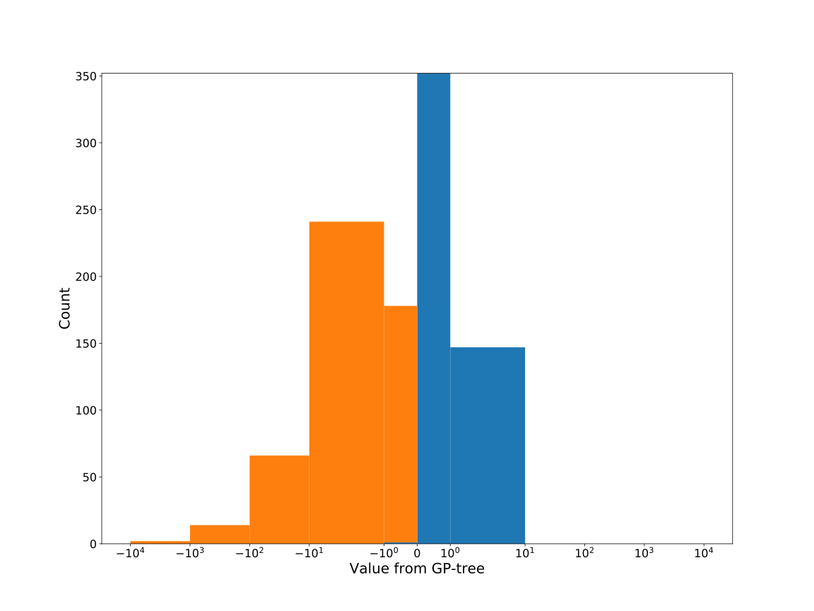

# Dataset: digen4_860 (XLSFKGDR_0.188_0.729_860)

|    | classifier                 |   auroc |    auprc |   f1_score |   rank_auroc |   rank_auprc |   rank_f1 |
|---:|:---------------------------|--------:|---------:|-----------:|-------------:|-------------:|----------:|
|  0 | GradientBoostingClassifier |  0.5956 | 0.584352 |   0.556701 |            6 |            6 |         6 |
|  1 | LGBMClassifier             |  0.9412 | 0.939581 |   0.879227 |            2 |            2 |         2 |
|  2 | XGBClassifier              |  0.9898 | 0.990889 |   0.95     |            1 |            1 |         1 |
|  3 | DecisionTreeClassifier     |  0.5026 | 0.485067 |   0.428571 |            7 |            7 |         7 |
|  4 | LogisticRegression         |  0.4614 | 0.484259 |   0.384181 |            8 |            8 |         8 |
|  5 | KNeighborsClassifier       |  0.6649 | 0.666325 |   0.651163 |            5 |            5 |         5 |
|  6 | RandomForestClassifier     |  0.8288 | 0.817089 |   0.712042 |            4 |            4 |         4 |
|  7 | SVC                        |  0.8504 | 0.854726 |   0.761421 |            3 |            3 |         3 |


<details>
<summary>Parameters of tuned ML methods (200 optimizations)</summary>


```
GradientBoostingClassifier(learning_rate=0.7226356475773567, max_depth=10,
                           min_samples_leaf=82, n_iter_no_change=19,
                           random_state=860, tol=1e-07,
                           validation_fraction=0.04)
LGBMClassifier(deterministic=True, force_row_wise=True, max_depth=9,
               metric='binary_logloss', n_estimators=87, n_jobs=1,
               num_leaves=512, objective='binary', random_state=860)
XGBClassifier(alpha=0.8193498060603384, base_score=0.5, booster='gbtree',
              colsample_bylevel=1, colsample_bynode=1, colsample_bytree=1,
              eta=0.5137823954812878, eval_metric='logloss', gamma=0.0,
              gpu_id=-1, importance_type='gain', interaction_constraints='',
              learning_rate=0.513782382, max_delta_step=0, max_depth=9,
              min_child_weight=1, missing=nan, monotone_constraints='()',
              n_estimators=56, n_jobs=1, nthread=1, num_parallel_tree=1,
              random_state=860, reg_alpha=0.819349825,
              reg_lambda=3.3645704500539435, scale_pos_weight=1, subsample=1,
              tree_method='exact', use_label_encoder=False,
              validate_parameters=1, ...)
DecisionTreeClassifier(max_depth=8, max_features='auto', min_samples_leaf=13,
                       min_samples_split=3, random_state=860)
LogisticRegression(C=0.06915437450932722, penalty='l1', random_state=860,
                   solver='liblinear')
KNeighborsClassifier(n_neighbors=22, p=1, weights='distance')
RandomForestClassifier(max_depth=10, max_features=None, min_samples_leaf=2,
                       min_samples_split=4, n_estimators=48, random_state=860)
SVC(C=48.74266137429492, gamma='auto', kernel='poly', probability=True,
    random_state=860, tol=0.000981428847789152)
```

</details>

<details>
<summary>Expected performance (100 optimizations starting from different random seed)</summary>

</details>

<details>
<summary>Receiver Operating Characteristics (ROC) curve</summary>

</details>

<details>
<summary>Precision-Recall Curve</summary>

</details>

<details>
<summary>Model (GP-tree)</summary>

</details>

<details>
<summary>Endpoint histogram</summary>

</details>

<details>
<summary>Feature correlations</summary>

</details>

[**Pandas Profiling Report**](https://epistasislab.github.io/digen/profile/digen4_860.html)