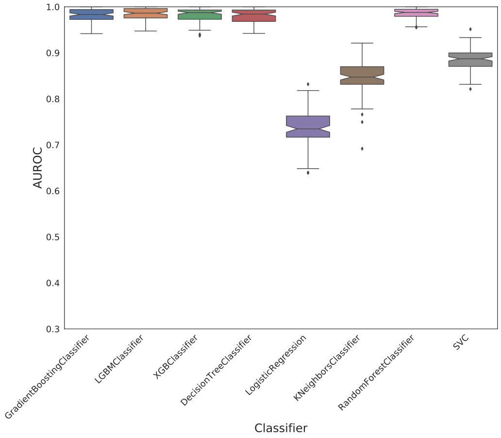
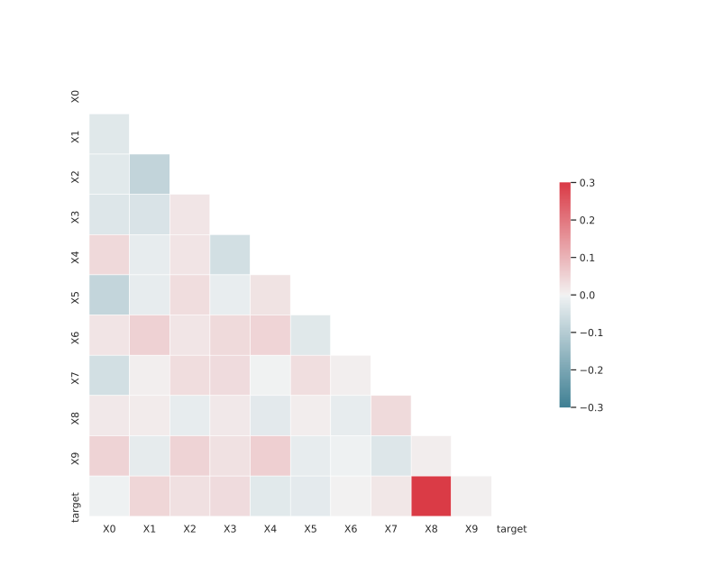

# Dataset: digen5
**Random seed: 6949**<br/>
Order of the methods: F-GLDXKSR<br/>
Mean performance: 0.897<br/>
Standard deviation: 0.085<br/>


|    | classifier                 |   auroc |    auprc |   f1_score |   rank_auroc |   rank_auprc |   rank_f1 |
|---:|:---------------------------|--------:|---------:|-----------:|-------------:|-------------:|----------:|
|  0 | GradientBoostingClassifier | 0.9622  | 0.932335 |   0.942857 |            1 |            2 |         2 |
|  1 | LGBMClassifier             | 0.9574  | 0.910336 |   0.956522 |            3 |            5 |         1 |
|  2 | XGBClassifier              | 0.93715 | 0.912881 |   0.942857 |            5 |            4 |         2 |
|  3 | DecisionTreeClassifier     | 0.9464  | 0.939308 |   0.942857 |            4 |            1 |         2 |
|  4 | LogisticRegression         | 0.7038  | 0.683776 |   0.732673 |            8 |            8 |         8 |
|  5 | KNeighborsClassifier       | 0.8689  | 0.872091 |   0.80203  |            6 |            6 |         6 |
|  6 | RandomForestClassifier     | 0.9625  | 0.914645 |   0.942857 |            1 |            3 |         2 |
|  7 | SVC                        | 0.8385  | 0.831106 |   0.753623 |            7 |            7 |         7 |


<details>
<summary>Parameters of tuned ML methods (based on 200 optimizations started from seed 6949)</summary>


```
GradientBoostingClassifier(learning_rate=0.03708331182264721,
                           loss='exponential', max_depth=4, min_samples_leaf=35,
                           n_iter_no_change=2, random_state=6949, tol=1e-07,
                           validation_fraction=0.04)
LGBMClassifier(boosting_type='goss', deterministic=True, force_row_wise=True,
               max_depth=3, metric='binary_logloss', n_estimators=11, n_jobs=1,
               num_leaves=86, objective='binary', random_state=6949)
XGBClassifier(alpha=0.0036044201842363273, base_score=0.5, booster='dart',
              colsample_bylevel=1, colsample_bynode=1, colsample_bytree=1,
              eta=0.0015613485601898764, eval_metric='logloss', gamma=0.4,
              gpu_id=-1, importance_type='gain', interaction_constraints='',
              learning_rate=0.00156134856, max_delta_step=0, max_depth=3,
              min_child_weight=1, missing=nan, monotone_constraints='()',
              n_estimators=63, n_jobs=1, nthread=1, num_parallel_tree=1,
              random_state=6949, reg_alpha=0.00360442023,
              reg_lambda=0.16755871657675284, scale_pos_weight=1, subsample=1,
              tree_method='exact', use_label_encoder=False,
              validate_parameters=1, ...)
DecisionTreeClassifier(criterion='entropy', max_depth=7, min_samples_leaf=13,
                       min_samples_split=11, random_state=6949)
LogisticRegression(C=0.04252829305377775, penalty='l1', random_state=6949,
                   solver='liblinear')
KNeighborsClassifier(n_neighbors=43, p=1, weights='distance')
RandomForestClassifier(max_depth=4, max_features=None, min_samples_leaf=17,
                       min_samples_split=10, n_estimators=30,
                       random_state=6949)
SVC(C=3.7501379414988123, class_weight='balanced', coef0=1.9000000000000001,
    degree=2, gamma='auto', kernel='poly', probability=True, random_state=6949,
    tol=0.004802584124916875)
```

</details>

<details>
<summary>Expected performance (based on 100 runs, each with 100 optimizations started from a different random seed)</summary>

</details>

<details>
<summary>Receiver Operating Characteristics (ROC) curve</summary>

</details>

<details>
<summary>Precision-Recall Curve</summary>

</details>

<details>
<summary>Model (GP-tree)</summary>

</details>

<details>
<summary>Endpoint histogram</summary>

</details>

<details>
<summary>Feature correlations</summary>

</details>

[**Pandas Profiling Report**](https://epistasislab.github.io/digen/profile/digen5_6949.html)