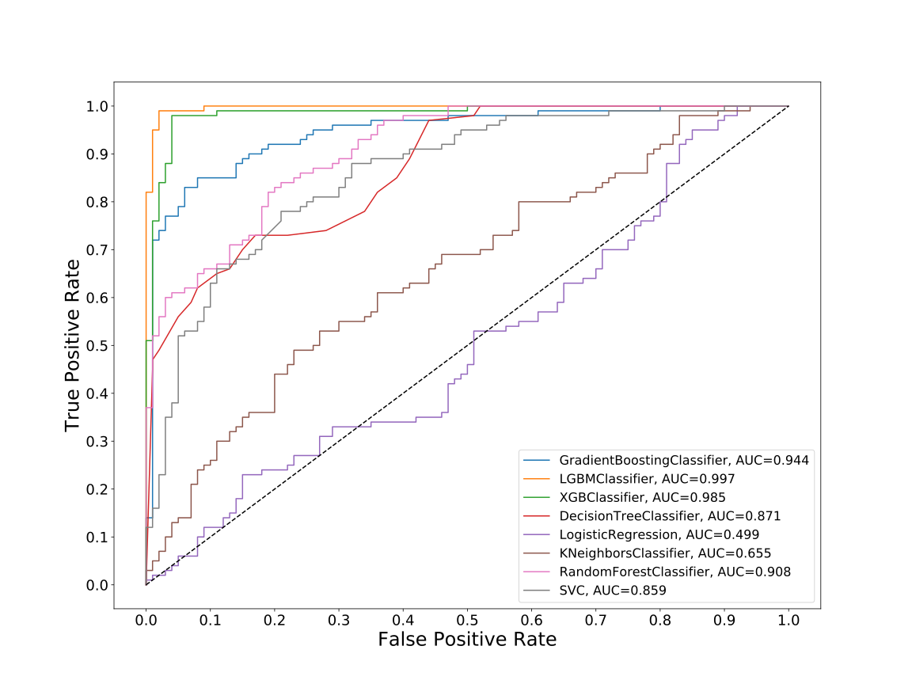
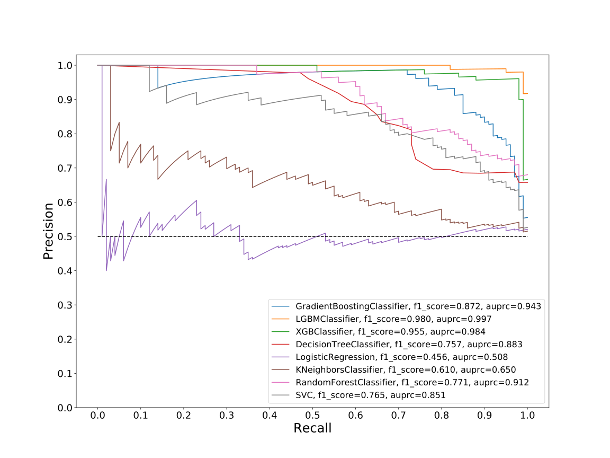

# Dataset: digen6
**Random seed: 466**<br/>
Order of the methods: LXGFDSKR<br/>
Mean performance: 0.84<br/>
Standard deviation: 0.163<br/>


|    | classifier                 |   auroc |    auprc |   f1_score |   rank_auroc |   rank_auprc |   rank_f1 |
|---:|:---------------------------|--------:|---------:|-----------:|-------------:|-------------:|----------:|
|  0 | GradientBoostingClassifier |  0.9442 | 0.943413 |   0.871795 |            3 |            3 |         3 |
|  1 | LGBMClassifier             |  0.997  | 0.996907 |   0.980198 |            1 |            1 |         1 |
|  2 | XGBClassifier              |  0.9846 | 0.984296 |   0.954774 |            2 |            2 |         2 |
|  3 | DecisionTreeClassifier     |  0.8711 | 0.882612 |   0.756757 |            5 |            5 |         6 |
|  4 | LogisticRegression         |  0.4991 | 0.508148 |   0.455959 |            8 |            8 |         8 |
|  5 | KNeighborsClassifier       |  0.6555 | 0.650222 |   0.61     |            7 |            7 |         7 |
|  6 | RandomForestClassifier     |  0.9082 | 0.912184 |   0.770833 |            4 |            4 |         4 |
|  7 | SVC                        |  0.859  | 0.850773 |   0.765306 |            6 |            6 |         5 |


<details>
<summary>Parameters of tuned ML methods (based on 200 optimizations started from seed 466)</summary>


```
GradientBoostingClassifier(learning_rate=0.8646915585885857, loss='exponential',
                           max_depth=9, n_iter_no_change=18, random_state=466,
                           tol=1e-07, validation_fraction=0.02)
LGBMClassifier(deterministic=True, force_row_wise=True, max_depth=8,
               metric='binary_logloss', n_estimators=90, n_jobs=1,
               num_leaves=256, objective='binary', random_state=466)
XGBClassifier(alpha=0.5379861341450971, base_score=0.5, booster='gbtree',
              colsample_bylevel=1, colsample_bynode=1, colsample_bytree=1,
              eta=0.38505150685703465, eval_metric='logloss', gamma=0.0,
              gpu_id=-1, importance_type='gain', interaction_constraints='',
              learning_rate=0.385051519, max_delta_step=0, max_depth=6,
              min_child_weight=1, missing=nan, monotone_constraints='()',
              n_estimators=62, n_jobs=1, nthread=1, num_parallel_tree=1,
              random_state=466, reg_alpha=0.537986159,
              reg_lambda=12.84531264162581, scale_pos_weight=1, subsample=1,
              tree_method='exact', use_label_encoder=False,
              validate_parameters=1, ...)
DecisionTreeClassifier(max_depth=10, max_features='log2', min_samples_leaf=15,
                       min_samples_split=17, random_state=466)
LogisticRegression(C=0.0032169908413391267, random_state=466,
                   solver='liblinear')
KNeighborsClassifier(metric='euclidean', n_neighbors=14, p=4,
                     weights='distance')
RandomForestClassifier(max_depth=10, max_features=None, min_samples_leaf=2,
                       min_samples_split=7, n_estimators=98, random_state=466)
SVC(C=346.9531614272966, coef0=3.9000000000000004, kernel='poly',
    probability=True, random_state=466, tol=0.00013373421846128855)
```

</details>

<details>
<summary>Expected performance (based on 100 runs, each with 100 optimizations started from a different random seed)</summary>

</details>

<details>
<summary>Receiver Operating Characteristics (ROC) curve</summary>

</details>

<details>
<summary>Precision-Recall Curve</summary>

</details>

<details>
<summary>Model (GP-tree)</summary>

</details>

<details>
<summary>Endpoint histogram</summary>

</details>

<details>
<summary>Feature correlations</summary>

</details>

[**Pandas Profiling Report**](https://epistasislab.github.io/digen/profile/digen6_466.html)